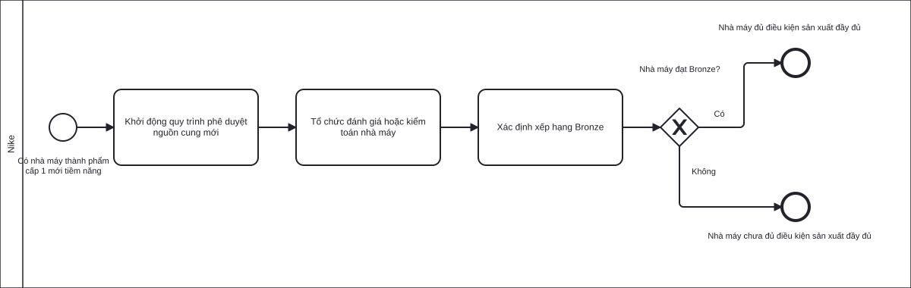
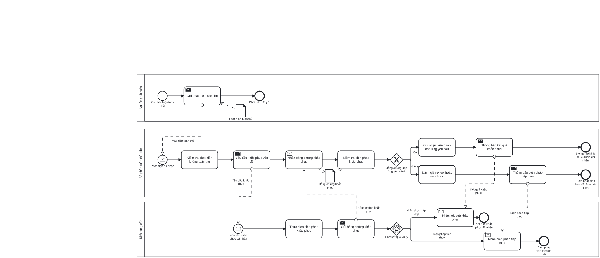
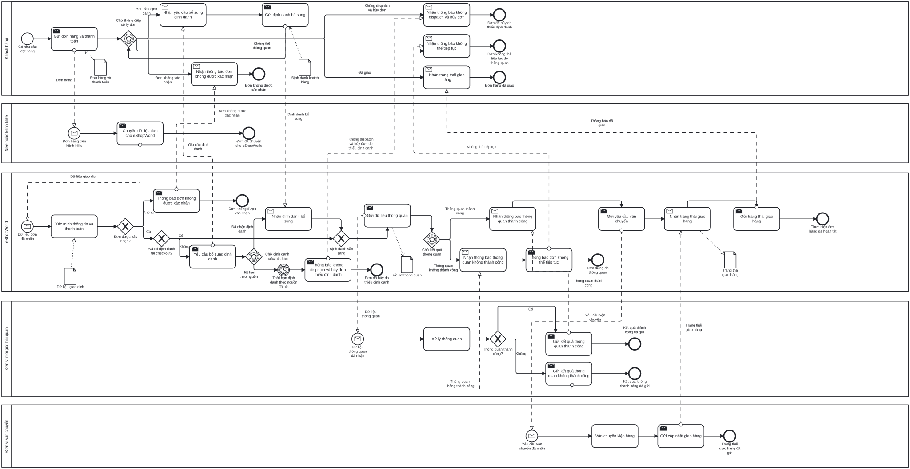
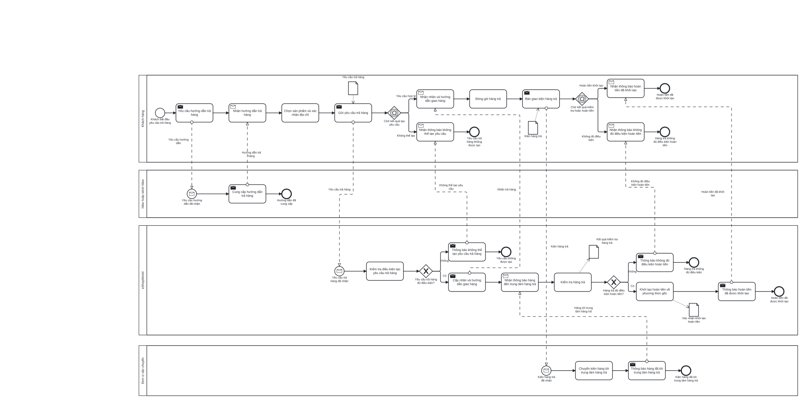
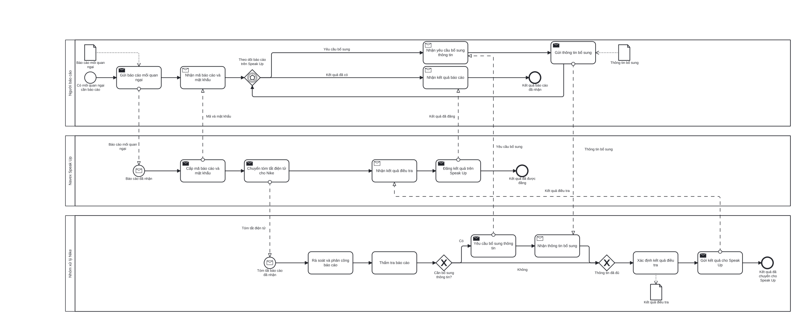
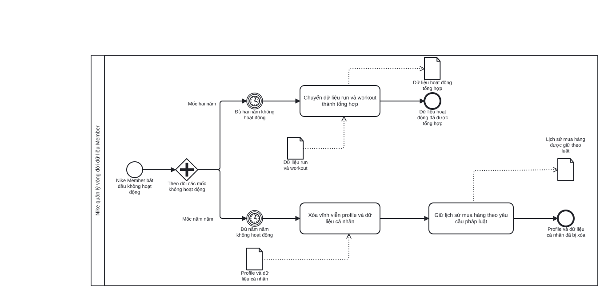

# Khám phá và mô hình hóa quy trình as-is

## 1. Phạm vi và nguyên tắc sử dụng bằng chứng

Bản nháp trình bày sáu quy trình thuộc ba nhóm quản lý, cốt lõi và hỗ trợ trong kiến trúc quy trình phục vụ thị trường Việt Nam. Phạm vi chỉ bao gồm phần có thể dựng lại từ tài liệu Nike, trang Nike Việt Nam, điều khoản eShopWorld và các bản chụp lưu vào tháng 07/2026. Dữ liệu vận hành như khối lượng, chi phí, nguồn lực và thời gian xử lý nội bộ đang được thu thập.

Nike Việt Nam là phạm vi thị trường của nghiên cứu. Nike toàn cầu cung cấp các chuẩn và cơ chế dùng chung về nguồn cung, tuân thủ và Speak Up. eShopWorld là bên giao dịch và thực hiện một số trách nhiệm được nêu trong điều khoản bán hàng đang được Nike Việt Nam liên kết. Nhà cung cấp, Navex, đơn vị đánh giá, đơn vị môi giới hải quan và đơn vị vận chuyển là các đối tác bên ngoài khi tham gia luồng nghiệp vụ.

Phần lớn mô hình là quy trình công khai có khả năng áp dụng cho hoạt động phục vụ thị trường Việt Nam, không phải quy trình nội bộ chính thức của Nike Việt Nam. Tác nhân, trình tự, điều kiện và kết quả chỉ được khẳng định trong giới hạn của nguồn. Chi tiết về phân công nội bộ, hệ thống xử lý phía sau, biểu mẫu, phê duyệt và phân luồng không được suy diễn khi chưa công bố.

*Nguồn: Nike, [Foundational Expectations and Code of Conduct](https://about.nike.com/en/mission/initiatives/foundational-expectations-and-code-of-conduct); Nike, [Human Rights and Labor Compliance Standards](https://about.nike.com/en/resources/human-rights-and-labor-compliance-standards); Nike Việt Nam, [Does My Nike Order Need To Clear Customs?](https://www.nike.com/vn/help/a/verify-passport); Nike Việt Nam, [Where Is My Refund?](https://www.nike.com/vn/help/a/refund-info); eShopWorld, [Terms and Conditions of Sale](https://www.eshopworld.com/wp-content/uploads/2021/07/Terms-and-Conditions-of-Sale-English-v1-30.06.2021.docx.pdf).*

## 2. Tiêu chí lựa chọn sáu quy trình

| Quy trình | Loại quy trình | Mức độ có bằng chứng | Tác nhân | Nhánh chính | Kết quả | Khả năng mô hình hóa |
|---|---|---|---|---|---|---|
| Đánh giá nhà máy nguồn cung mới | Quản lý | Nguồn Nike toàn cầu trực tiếp về quy trình phê duyệt nguồn cung mới, hoạt động đánh giá hoặc kiểm toán và ngưỡng Bronze | Nike, nhà máy cung ứng cấp 1 tiềm năng, đơn vị đánh giá | Đạt hoặc chưa đạt Bronze | Đủ điều kiện hoặc chưa đủ điều kiện sản xuất đầy đủ | Đủ căn cứ cho chuỗi công khai tối thiểu |
| Xử lý vấn đề tuân thủ nhà cung cấp | Quản lý | Nguồn Nike toàn cầu trực tiếp về điều tra, biện pháp khắc phục, xác minh và chế tài | Nike, nhà cung cấp, nguồn phát hiện | Khắc phục đáp ứng hoặc không đáp ứng | Biện pháp khắc phục được ghi nhận hoặc việc xem xét, áp dụng chế tài được tiến hành | Đủ căn cứ ở mức nguyên tắc, không đủ để mô tả kế hoạch khắc phục nội bộ |
| Xử lý đơn hàng và thông quan cho khách tại Việt Nam | Cốt lõi | Trang Nike Việt Nam trực tiếp và điều khoản của eShopWorld được Nike liên kết | Khách hàng, kênh Nike, eShopWorld, đơn vị môi giới hải quan, đơn vị vận chuyển | Xác nhận đơn, định danh, thông quan và giao hàng | Đơn đã giao hoặc dừng theo điều kiện công khai | Đủ căn cứ cho sơ đồ phối hợp hướng khách hàng |
| Trả hàng và khởi tạo hoàn tiền | Cốt lõi | Trang Nike Việt Nam trực tiếp và điều khoản của eShopWorld được Nike liên kết | Khách hàng, kênh Nike, eShopWorld, đơn vị vận chuyển | Tạo yêu cầu và kiểm tra điều kiện hoàn tiền | Hoàn tiền được khởi tạo hoặc yêu cầu không đủ điều kiện | Đủ căn cứ cho sơ đồ phối hợp đến thời điểm khởi tạo hoàn tiền |
| Tiếp nhận và xử lý báo cáo Speak Up | Hỗ trợ | Tài liệu Nike toàn cầu trực tiếp về Navex, thẩm tra, bổ sung thông tin và đăng kết quả | Người báo cáo, Navex Speak Up, nhóm xử lý Nike | Cần hoặc không cần bổ sung thông tin | Kết quả được đăng trên Speak Up | Đủ căn cứ cho một luồng kết quả, không đủ cho nhánh bác bỏ hoặc kỷ luật |
| Quản lý vòng đời dữ liệu Nike Member không hoạt động | Hỗ trợ | Trang Nike Việt Nam trực tiếp về hai mốc vòng đời dữ liệu | Nike, Nike Member | Mốc hai năm và mốc năm năm | Dữ liệu hoạt động được tổng hợp; hồ sơ và dữ liệu cá nhân bị xóa | Đủ căn cứ cho hai nhánh thời gian công khai |

*Nguồn: Nike, [Foundational Expectations and Code of Conduct](https://about.nike.com/en/mission/initiatives/foundational-expectations-and-code-of-conduct); Nike, [Human Rights and Labor Compliance Standards](https://about.nike.com/en/resources/human-rights-and-labor-compliance-standards); Nike Việt Nam, [Does My Nike Order Need To Clear Customs?](https://www.nike.com/vn/help/a/verify-passport), [How Do I Return My Nike Order?](https://www.nike.com/vn/help/a/how-to-return), [Where Is My Refund?](https://www.nike.com/vn/help/a/refund-info), [What Happened to My Nike Data?](https://www.nike.com/vn/help/a/nike-data-protection); Nike, [Complaint Procedure for Human Rights and Environmental Grievances](https://media.about.nike.com/files/d92ddbb2-2127-41cc-9a06-88d03619866b/23_12-28-NIKE-Complaint-Procedure-FINAL-ENGLISH%5B65%5D.pdf); eShopWorld, [Terms and Conditions of Sale](https://www.eshopworld.com/wp-content/uploads/2021/07/Terms-and-Conditions-of-Sale-English-v1-30.06.2021.docx.pdf).*

Sáu quy trình có đủ căn cứ để xác định ranh giới, tác nhân chính, chuỗi hoạt động hoặc mốc chuyển trạng thái và kết quả công khai. Mức chi tiết khác nhau theo nguồn: hai quy trình cốt lõi có bằng chứng trực tiếp về hành trình khách hàng; hai quy trình quản lý và Speak Up là mô hình toàn cầu; quy trình dữ liệu Nike Member chỉ thể hiện các mốc vòng đời được Nike Việt Nam công bố.

## 3. Mô hình hóa sáu quy trình as-is

### 3.1. Đánh giá nhà máy nguồn cung mới

#### Mục tiêu và phạm vi

Mục tiêu là xác định nhà máy thành phẩm cấp 1 mới có đạt ngưỡng Bronze để đủ điều kiện sản xuất đầy đủ hay không. Quy trình bắt đầu khi nhà máy thuộc phạm vi quy trình phê duyệt nguồn cung mới (NSAP) và kết thúc khi xếp hạng được đối chiếu với ngưỡng Bronze. Việc ký hợp đồng, tiếp nhận nhà cung cấp, phê duyệt thương mại và phân công nội bộ nằm ngoài phạm vi.

Đây là mô hình nguồn cung công khai toàn cầu của Nike, có khả năng liên quan đến nguồn cung phục vụ thị trường Việt Nam. Nguồn không xác nhận một luồng xử lý riêng của Nike Việt Nam.

*Nguồn: Nike, [Foundational Expectations and Code of Conduct](https://about.nike.com/en/mission/initiatives/foundational-expectations-and-code-of-conduct); Nike, [Supplier Code of Conduct](https://about.nike.com/en/resources/nike-supplier-code-of-conduct); Nike, [FY24 Sustainability Data, tr. 49](https://media.about.nike.com/files/f37dfe60-0341-4db1-8ab9-6156da717313/FY24-NIKE%2C-Inc.-Sustainability-Data.pdf).*

#### Điểm kích hoạt, đầu vào và đầu ra

| Thành phần | Nội dung |
|---|---|
| Điểm kích hoạt | Có nhà máy thành phẩm cấp 1 mới tiềm năng |
| Đầu vào | Thông tin nhà máy và yêu cầu nền tảng áp dụng |
| Đầu ra dương | Nhà máy đủ điều kiện sản xuất đầy đủ |
| Đầu ra âm | Nhà máy chưa đủ điều kiện sản xuất đầy đủ |

*Nguồn: Nike, [Foundational Expectations and Code of Conduct](https://about.nike.com/en/mission/initiatives/foundational-expectations-and-code-of-conduct).*

#### Tác nhân và khách hàng

Nike là chủ thể quản lý quy trình và tổ chức hoạt động đánh giá hoặc kiểm toán. Hoạt động này có thể được thực hiện nội bộ hoặc thông qua bên thứ ba. Tuy nhiên, nguồn không đủ chi tiết để mô hình hóa bên thứ ba thành participant riêng. Nhà máy cấp 1 tiềm năng là đối tượng được đánh giá. Khách hàng của quy trình là Nike và nhà máy cần kết quả xác định trạng thái đáp ứng ngưỡng.

Nguồn không công bố tên bộ phận, người chọn công cụ hoặc kênh thông báo.

*Nguồn: Nike, [Supplier Code of Conduct](https://about.nike.com/en/resources/nike-supplier-code-of-conduct); Nike, [Foundational Expectations and Code of Conduct](https://about.nike.com/en/mission/initiatives/foundational-expectations-and-code-of-conduct).*

#### Mô tả quy trình as-is bằng lời

Khi có nhà máy thành phẩm cấp 1 mới tiềm năng, Nike khởi động quy trình phê duyệt nguồn cung mới. Nike tổ chức đánh giá hoặc kiểm toán nhà máy. Kết quả được dùng để xác định xếp hạng Bronze tại cổng `Nhà máy đạt Bronze?`. Nhánh Có kết thúc với kết quả nhà máy đủ điều kiện sản xuất đầy đủ. Nhánh Không kết thúc với kết quả nhà máy chưa đủ điều kiện sản xuất đầy đủ. Chuỗi chỉ phản ánh ba điểm nghiệp vụ có bằng chứng: NSAP, hoạt động đánh giá hoặc kiểm toán và quyết định theo mức Bronze.

#### Bảng các bước của quy trình

| Bước | Người thực hiện | Hoạt động | Đầu vào | Đầu ra | Thời gian | Điều kiện |
|---:|---|---|---|---|---|---|
| 1 | Nike | Khởi động quy trình phê duyệt nguồn cung mới | Thông tin nhà máy tiềm năng | Nhà máy thuộc phạm vi đánh giá | Đang được thu thập | Nhà máy là cơ sở thành phẩm cấp 1 mới có tiềm năng |
| 2 | Nike | Tổ chức đánh giá hoặc kiểm toán nhà máy | Yêu cầu nền tảng và thông tin nhà máy | Kết quả đánh giá hoặc kiểm toán | Đang được thu thập | Thuộc phạm vi quy trình phê duyệt nguồn cung mới |
| 3 | Nike | Xác định xếp hạng Bronze | Kết quả đánh giá | Kết luận đạt hoặc chưa đạt Bronze | Đang được thu thập | Nhà máy đạt Bronze? |

*Nguồn: Nike, [Foundational Expectations and Code of Conduct](https://about.nike.com/en/mission/initiatives/foundational-expectations-and-code-of-conduct); Nike, [FY24 Sustainability Data, tr. 49](https://media.about.nike.com/files/f37dfe60-0341-4db1-8ab9-6156da717313/FY24-NIKE%2C-Inc.-Sustainability-Data.pdf). Số liệu 95% cơ sở cấp 1 được kiểm toán và 12% dưới mức Bronze là số liệu toàn cầu năm tài chính 2024, không phải thời gian hoặc xác suất của từng hồ sơ.*

#### Hệ thống và biểu mẫu

Nguồn chỉ nêu hoạt động đánh giá và kiểm toán; hệ thống, mẫu hồ sơ, lịch đánh giá và công cụ dùng cho từng trường hợp chưa được công bố.

#### Hình ảnh sơ đồ BPMN và nguồn

*Hình tạm 1. Đánh giá nhà máy nguồn cung mới.*

*Nguồn nghiệp vụ: Nike, [Foundational Expectations and Code of Conduct](https://about.nike.com/en/mission/initiatives/foundational-expectations-and-code-of-conduct); Nike, [FY24 Sustainability Data, tr. 49](https://media.about.nike.com/files/f37dfe60-0341-4db1-8ab9-6156da717313/FY24-NIKE%2C-Inc.-Sustainability-Data.pdf).*

### 3.2. Xử lý vấn đề tuân thủ nhà cung cấp

#### Mục tiêu và phạm vi

Mục tiêu là xử lý bằng chứng không tuân thủ của nhà cung cấp bằng điều tra, biện pháp khắc phục và quyết định tiếp theo. Quy trình bắt đầu khi hoạt động kiểm toán, đánh giá hoặc một cáo buộc tạo ra phát hiện và kết thúc khi biện pháp khắc phục được ghi nhận hoặc việc xem xét, áp dụng chế tài được tiến hành. Kế hoạch hành động khắc phục, mã vấn đề, cấp phê duyệt và thủ tục đóng vấn đề nằm ngoài phạm vi.

Đây là mô hình công khai toàn cầu, không phải quy trình nội bộ chính thức của Nike Việt Nam.

*Nguồn: Nike, [Human Rights and Labor Compliance Standards](https://about.nike.com/en/resources/human-rights-and-labor-compliance-standards); Nike, [FY25 Statement on Forced Labor, Child Labor, Human Trafficking and Modern Slavery, tr. 2](https://media.about.nike.com/files/d35297c7-89cf-4240-bd50-803af806ce4d/Nike---FY25-Statement-On-Forced-Labor-Child-Labor-Human-Trafficking-and-Modern-Slavery.pdf).*

#### Điểm kích hoạt, đầu vào và đầu ra

| Thành phần | Nội dung |
|---|---|
| Điểm kích hoạt | Có phát hiện không tuân thủ từ hoạt động kiểm toán, đánh giá hoặc cáo buộc |
| Đầu vào | Phát hiện không tuân thủ và biện pháp khắc phục của nhà cung cấp |
| Đầu ra dương | Biện pháp khắc phục đáp ứng yêu cầu được ghi nhận |
| Đầu ra thay thế | Việc xem xét hoặc áp dụng chế tài được tiến hành, có thể gồm chấm dứt quan hệ |

*Nguồn: Nike, [Human Rights and Labor Compliance Standards](https://about.nike.com/en/resources/human-rights-and-labor-compliance-standards).*

#### Tác nhân và khách hàng

Nguồn phát hiện có thể là hoạt động kiểm toán, đánh giá hoặc bên nêu cáo buộc. Nike điều tra và yêu cầu biện pháp khắc phục. Nhà cung cấp xác định, sửa và ngăn tái diễn vấn đề, đồng thời cung cấp căn cứ cho việc kiểm tra. Khách hàng của quy trình là Nike và nhà cung cấp cần một kết quả xử lý rõ ràng.

Tên "Bộ phận tuân thủ Nike" trong mô hình thể hiện trách nhiệm khái quát, không khẳng định tên đơn vị nội bộ.

*Nguồn: Nike, [FY25 Statement on Forced Labor, Child Labor, Human Trafficking and Modern Slavery, tr. 2](https://media.about.nike.com/files/d35297c7-89cf-4240-bd50-803af806ce4d/Nike---FY25-Statement-On-Forced-Labor-Child-Labor-Human-Trafficking-and-Modern-Slavery.pdf).*

#### Mô tả quy trình as-is bằng lời

Khi có bằng chứng không tuân thủ, Nike kiểm tra phát hiện và yêu cầu nhà cung cấp thực hiện biện pháp khắc phục. Nhà cung cấp sửa vấn đề, ngăn tái diễn và cung cấp bằng chứng. Nike kiểm tra biện pháp khắc phục. Nếu đáp ứng yêu cầu, kết quả được ghi nhận. Nếu không đáp ứng, Nike xem xét biện pháp tiếp theo hoặc áp dụng chế tài; chế tài được công bố có thể gồm chấm dứt quan hệ.

#### Bảng các bước của quy trình

| Bước | Người thực hiện | Hoạt động | Đầu vào | Đầu ra | Thời gian | Điều kiện |
|---:|---|---|---|---|---|---|
| 1 | Nguồn phát hiện | Gửi phát hiện tuân thủ | Kết quả kiểm toán, đánh giá hoặc cáo buộc | Phát hiện đã chuyển | Đang được thu thập | Có bằng chứng không tuân thủ |
| 2 | Bộ phận tuân thủ Nike | Kiểm tra phát hiện không tuân thủ | Phát hiện | Phát hiện cần xử lý | Đang được thu thập | Có bằng chứng không tuân thủ |
| 3 | Bộ phận tuân thủ Nike | Yêu cầu khắc phục vấn đề | Phát hiện cần xử lý | Yêu cầu thực hiện biện pháp khắc phục | Đang được thu thập | Không |
| 4 | Nhà cung cấp | Thực hiện biện pháp khắc phục | Yêu cầu khắc phục | Biện pháp khắc phục | Đang được thu thập | Không |
| 5 | Nhà cung cấp | Gửi bằng chứng khắc phục | Biện pháp khắc phục | Bằng chứng khắc phục | Đang được thu thập | Không |
| 6 | Bộ phận tuân thủ Nike | Nhận bằng chứng khắc phục | Bằng chứng khắc phục | Bằng chứng đã nhận | Đang được thu thập | Không |
| 7 | Bộ phận tuân thủ Nike | Kiểm tra biện pháp khắc phục | Bằng chứng đã nhận | Kết quả kiểm tra | Đang được thu thập | Bằng chứng đáp ứng yêu cầu? |
| 8a | Bộ phận tuân thủ Nike | Ghi nhận biện pháp đáp ứng yêu cầu | Kết quả đạt | Biện pháp được ghi nhận | Đang được thu thập | Có |
| 9a | Bộ phận tuân thủ Nike | Thông báo kết quả khắc phục | Biện pháp được ghi nhận | Kết quả đã thông báo | Đang được thu thập | Có |
| 8b | Bộ phận tuân thủ Nike | Xem xét hoặc áp dụng chế tài | Kết quả chưa đạt | Biện pháp tiếp theo | Đang được thu thập | Không |
| 9b | Bộ phận tuân thủ Nike | Thông báo biện pháp tiếp theo | Biện pháp tiếp theo | Kết quả đã thông báo | Đang được thu thập | Không |

*Nguồn: Nike, [Human Rights and Labor Compliance Standards](https://about.nike.com/en/resources/human-rights-and-labor-compliance-standards); Nike, [FY24 Sustainability Data, tr. 49](https://media.about.nike.com/files/f37dfe60-0341-4db1-8ab9-6156da717313/FY24-NIKE%2C-Inc.-Sustainability-Data.pdf). Mốc xác minh tại chỗ trong sáu tháng chỉ áp dụng cho nhóm cơ sở dưới chuẩn được báo cáo trong năm tài chính 2024, không phải thời hạn xử lý chung.*

#### Hệ thống và biểu mẫu

Phát hiện tuân thủ và bằng chứng khắc phục là dữ liệu của quy trình. Tên hệ thống quản lý biện pháp khắc phục, biểu mẫu, mã phân loại và luồng đóng vấn đề chưa được công bố.

#### Hình ảnh sơ đồ BPMN và nguồn

*Hình tạm 2. Xử lý vấn đề tuân thủ nhà cung cấp.*

*Nguồn nghiệp vụ: Nike, [Human Rights and Labor Compliance Standards](https://about.nike.com/en/resources/human-rights-and-labor-compliance-standards); Nike, [FY25 Statement on Forced Labor, Child Labor, Human Trafficking and Modern Slavery, tr. 2](https://media.about.nike.com/files/d35297c7-89cf-4240-bd50-803af806ce4d/Nike---FY25-Statement-On-Forced-Labor-Child-Labor-Human-Trafficking-and-Modern-Slavery.pdf).*

### 3.3. Xử lý đơn hàng và thông quan cho khách tại Việt Nam

#### Mục tiêu và phạm vi

Mục tiêu là mô tả phần giao dịch, định danh, thông quan và giao hàng có bằng chứng công khai. Quy trình bắt đầu khi khách gửi đơn trên kênh Nike và kết thúc khi đơn được giao hoặc dừng vì không được xác nhận, thiếu định danh đúng hạn hoặc không thể thông quan. Xử lý kho nội bộ và hệ thống phía sau nằm ngoài phạm vi.

Mô hình áp dụng trực tiếp cho hành trình khách trên Nike Việt Nam, kết hợp các trách nhiệm giao dịch trong điều khoản bán hàng phiên bản 1 ngày 30/06/2021. Tài liệu này chỉ hỗ trợ các điều khoản được trích, không chứng minh toàn bộ hệ thống xử lý phía sau vào năm 2026.

*Nguồn: Nike Việt Nam, [Does My Nike Order Need To Clear Customs?](https://www.nike.com/vn/help/a/verify-passport); eShopWorld, [Terms and Conditions of Sale](https://www.eshopworld.com/wp-content/uploads/2021/07/Terms-and-Conditions-of-Sale-English-v1-30.06.2021.docx.pdf).*

#### Điểm kích hoạt, đầu vào và đầu ra

| Thành phần | Nội dung |
|---|---|
| Điểm kích hoạt | Khách gửi đơn hàng và thanh toán trên kênh Nike |
| Đầu vào | Dữ liệu đơn hàng, thanh toán và định danh nếu có |
| Đầu ra dương | Đơn hàng đã giao |
| Đầu ra âm 1 | Đơn không được xác nhận |
| Đầu ra âm 2 | Đơn bị hủy do thiếu định danh đúng hạn |
| Đầu ra âm 3 | Đơn không thể tiếp tục do thông quan |

*Nguồn: Nike Việt Nam, [Does My Nike Order Need To Clear Customs?](https://www.nike.com/vn/help/a/verify-passport); eShopWorld, [Terms and Conditions of Sale, mục 2.7 và 2.12](https://www.eshopworld.com/wp-content/uploads/2021/07/Terms-and-Conditions-of-Sale-English-v1-30.06.2021.docx.pdf).*

#### Tác nhân và khách hàng

Khách hàng gửi đơn, cung cấp định danh và nhận trạng thái. Kênh Nike tiếp nhận đơn và chuyển dữ liệu giao dịch. eShopWorld là chủ thể giao kết theo điều khoản bán hàng, xác minh thông tin, xử lý thanh toán và chịu trách nhiệm thực hiện đơn hàng. Đơn vị môi giới hải quan xử lý thông quan; đơn vị vận chuyển giao kiện hàng. Khách hàng đặt hàng tại Việt Nam là khách hàng của quy trình.

*Nguồn: eShopWorld, [Terms and Conditions of Sale, mục 1.1, 2.2, 2.7 và 2.12](https://www.eshopworld.com/wp-content/uploads/2021/07/Terms-and-Conditions-of-Sale-English-v1-30.06.2021.docx.pdf).*

#### Mô tả quy trình as-is bằng lời

Khách gửi đơn và thanh toán. Kênh Nike chuyển dữ liệu cho eShopWorld để xác minh. Nếu đơn không được xác nhận, quy trình dừng. Với đơn đã xác nhận, eShopWorld kiểm tra định danh. Định danh có sẵn được chuyển sang thông quan; nếu chưa có, khách nhận yêu cầu bổ sung. Khi hết thời hạn công khai mà chưa nhận được định danh, đơn không được xuất đi và bị hủy. Đơn có đủ định danh được chuyển cho đơn vị môi giới hải quan. Thông quan không thành công làm đơn dừng; thông quan thành công dẫn tới vận chuyển và giao hàng.

#### Bảng các bước của quy trình

| Bước | Người thực hiện | Hoạt động | Đầu vào | Đầu ra | Thời gian | Điều kiện |
|---:|---|---|---|---|---|---|
| 1 | Khách hàng | Gửi đơn hàng và thanh toán | Dữ liệu đặt hàng | Đơn hàng | Đang được thu thập | Có thể kèm định danh |
| 2 | Nike hoặc kênh Nike | Chuyển dữ liệu đơn cho eShopWorld | Đơn hàng | Dữ liệu giao dịch | Đang được thu thập | Không |
| 3 | eShopWorld | Xác minh thông tin và thanh toán | Dữ liệu giao dịch | Kết quả xác minh | Đang được thu thập | Đơn được xác nhận? |
| 3a | eShopWorld | Thông báo đơn không được xác nhận | Kết quả không xác nhận | Thông báo cho khách | Đang được thu thập | Không |
| 4 | eShopWorld | Kiểm tra định danh khi thanh toán | Đơn đã xác nhận | Trạng thái định danh | Đang được thu thập | Đã có định danh khi thanh toán? |
| 5a | Khách hàng | Gửi định danh bổ sung | Yêu cầu bổ sung | Định danh | Trong thời hạn hiển thị tại nguồn | Chưa có định danh và còn thời hạn |
| 5b | eShopWorld | Thông báo không xuất hàng và hủy đơn thiếu định danh | Định danh chưa được cung cấp | Thông báo hủy | Nguồn dùng cả bốn ngày và bốn ngày làm việc | Hết thời hạn theo nguồn |
| 6 | eShopWorld | Gửi dữ liệu thông quan | Đơn và định danh | Hồ sơ thông quan | Đang được thu thập | Định danh sẵn sàng |
| 7 | Đơn vị môi giới hải quan | Xử lý thông quan | Hồ sơ thông quan | Kết quả thông quan | Đang được thu thập | Thông quan thành công? |
| 7a | eShopWorld | Thông báo đơn không thể tiếp tục | Kết quả thông quan không thành công | Thông báo cho khách | Đang được thu thập | Không |
| 8 | eShopWorld | Gửi yêu cầu vận chuyển | Kết quả thông quan thành công | Yêu cầu vận chuyển | Đang được thu thập | Có |
| 9 | Đơn vị vận chuyển | Vận chuyển kiện hàng | Kiện hàng | Trạng thái giao hàng | Đang được thu thập | Không |
| 10 | eShopWorld | Gửi trạng thái giao hàng | Trạng thái vận chuyển | Thông báo cho khách | Đang được thu thập | Không |

*Nguồn: Nike Việt Nam, [Does My Nike Order Need To Clear Customs?](https://www.nike.com/vn/help/a/verify-passport); eShopWorld, [Terms and Conditions of Sale](https://www.eshopworld.com/wp-content/uploads/2021/07/Terms-and-Conditions-of-Sale-English-v1-30.06.2021.docx.pdf). Không chuyển hai cách diễn đạt thời hạn thành một khoảng thời gian thực thi cố định.*

#### Hệ thống và biểu mẫu

Nguồn xác nhận kênh Nike, liên kết cung cấp định danh và vai trò giao dịch của eShopWorld. Tên hệ thống xử lý phía sau, mẫu hải quan, hệ thống kho và hệ thống của đơn vị vận chuyển chưa được công bố.

#### Hình ảnh sơ đồ BPMN và nguồn

*Hình tạm 3. Xử lý đơn hàng và thông quan cho khách tại Việt Nam.*

*Nguồn nghiệp vụ: Nike Việt Nam, [Does My Nike Order Need To Clear Customs?](https://www.nike.com/vn/help/a/verify-passport); eShopWorld, [Terms and Conditions of Sale](https://www.eshopworld.com/wp-content/uploads/2021/07/Terms-and-Conditions-of-Sale-English-v1-30.06.2021.docx.pdf).*

### 3.4. Trả hàng và khởi tạo hoàn tiền

#### Mục tiêu và phạm vi

Mục tiêu là mô tả yêu cầu trả hàng từ lúc khách bắt đầu đến khi hoàn tiền được khởi tạo. Quy trình kết thúc ở kết quả khởi tạo hoàn tiền hoặc tại một trong hai điều kiện: không thể tạo yêu cầu hoặc hàng không đủ điều kiện hoàn tiền. Thời gian ngân hàng ghi nhận khoản tiền, đơn vị cung cấp dịch vụ thanh toán độc lập và phần xử lý nội bộ chưa công bố nằm ngoài phạm vi.

Mô hình áp dụng cho hành trình khách trên Nike Việt Nam và dùng điều khoản của eShopWorld phiên bản 1 ngày 30/06/2021 để xác định trung tâm tiếp nhận hàng trả, hoạt động kiểm tra và trách nhiệm hoàn tiền trong giới hạn văn bản.

*Nguồn: Nike Việt Nam, [How Do I Return My Nike Order?](https://www.nike.com/vn/help/a/how-to-return), [Where Is My Refund?](https://www.nike.com/vn/help/a/refund-info); eShopWorld, [Terms and Conditions of Sale](https://www.eshopworld.com/wp-content/uploads/2021/07/Terms-and-Conditions-of-Sale-English-v1-30.06.2021.docx.pdf).*

#### Điểm kích hoạt, đầu vào và đầu ra

| Thành phần | Nội dung |
|---|---|
| Điểm kích hoạt | Khách bắt đầu yêu cầu trả hàng |
| Đầu vào | Sản phẩm, lý do trả, địa chỉ và kiện hàng trả |
| Đầu ra dương | Hoàn tiền đã được khởi tạo về phương thức thanh toán gốc |
| Đầu ra âm 1 | Yêu cầu trả hàng không được tạo |
| Đầu ra âm 2 | Hàng trả không đủ điều kiện hoàn tiền |

*Nguồn: Nike Việt Nam, [How Do I Return My Nike Order?](https://www.nike.com/vn/help/a/how-to-return); eShopWorld, [Terms and Conditions of Sale, mục 6.4 đến 6.6](https://www.eshopworld.com/wp-content/uploads/2021/07/Terms-and-Conditions-of-Sale-English-v1-30.06.2021.docx.pdf).*

#### Tác nhân và khách hàng

Khách hàng chọn sản phẩm, lý do và địa chỉ, gửi yêu cầu, đóng gói và bàn giao kiện hàng. Kênh Nike cung cấp hướng dẫn. eShopWorld vận hành cổng trả hàng và trung tâm tiếp nhận hàng trả, kiểm tra hàng và khởi tạo hoàn tiền theo điều khoản bán hàng. Đơn vị vận chuyển đưa kiện hàng tới trung tâm tiếp nhận hàng trả. Khách yêu cầu trả hàng là khách hàng của quy trình.

*Nguồn: Nike Việt Nam, [How Do I Return My Nike Order?](https://www.nike.com/vn/help/a/how-to-return); eShopWorld, [Terms and Conditions of Sale, mục 6](https://www.eshopworld.com/wp-content/uploads/2021/07/Terms-and-Conditions-of-Sale-English-v1-30.06.2021.docx.pdf).*

#### Mô tả quy trình as-is bằng lời

Khách yêu cầu và nhận hướng dẫn trả hàng, chọn sản phẩm, lý do, địa chỉ rồi gửi yêu cầu. eShopWorld kiểm tra điều kiện tạo yêu cầu. Yêu cầu không đủ điều kiện kết thúc bằng thông báo không thể tạo; yêu cầu đủ điều kiện nhận nhãn và hướng dẫn giao hàng. Khách đóng gói, bàn giao kiện hàng cho đơn vị vận chuyển và kiện hàng được đưa tới trung tâm tiếp nhận hàng trả. eShopWorld kiểm tra hàng trả. Hàng không đủ điều kiện kết thúc bằng thông báo; hàng đủ điều kiện dẫn tới khởi tạo hoàn tiền về phương thức thanh toán gốc.

#### Bảng các bước của quy trình

| Bước | Người thực hiện | Hoạt động | Đầu vào | Đầu ra | Thời gian | Điều kiện |
|---:|---|---|---|---|---|---|
| 1 | Khách hàng | Yêu cầu hướng dẫn trả hàng | Ý định trả hàng | Yêu cầu hướng dẫn | Đang được thu thập | Không |
| 2 | Nike hoặc kênh Nike | Cung cấp hướng dẫn trả hàng | Yêu cầu | Hướng dẫn | Đang được thu thập | Không |
| 3 | Khách hàng | Chọn sản phẩm và xác nhận địa chỉ | Hướng dẫn | Dữ liệu yêu cầu | Đang được thu thập | Chọn lý do trả hàng |
| 4 | Khách hàng | Gửi yêu cầu trả hàng | Dữ liệu yêu cầu | Yêu cầu trên cổng trả hàng | Đang được thu thập | Không |
| 5 | eShopWorld | Kiểm tra điều kiện tạo yêu cầu trả hàng | Yêu cầu | Kết quả điều kiện | Đang được thu thập | Yêu cầu trả hàng đủ điều kiện? |
| 5a | eShopWorld | Thông báo không thể tạo yêu cầu trả hàng | Kết quả không đủ điều kiện | Thông báo cho khách | Đang được thu thập | Không |
| 6 | eShopWorld | Cấp nhãn và hướng dẫn giao hàng | Yêu cầu hợp lệ | Nhãn trả hàng | Đang được thu thập | Có |
| 7 | Khách hàng | Đóng gói hàng trả | Sản phẩm và nhãn | Kiện hàng | Đang được thu thập | Không |
| 8 | Khách hàng | Bàn giao kiện hàng trả | Kiện hàng | Kiện đã bàn giao | Đang được thu thập | Không |
| 9 | Đơn vị vận chuyển | Chuyển kiện hàng tới trung tâm hàng trả | Kiện hàng | Thông báo hàng đã tới | Đang được thu thập | Không |
| 10 | eShopWorld | Kiểm tra hàng trả | Hàng tại trung tâm tiếp nhận hàng trả | Kết quả kiểm tra | Trung tâm trợ giúp Nike: thường bốn ngày làm việc sau khi nhận hàng | Hàng trả đủ điều kiện hoàn tiền? |
| 10a | eShopWorld | Thông báo không đủ điều kiện hoàn tiền | Kết quả không đủ điều kiện | Thông báo cho khách | Đang được thu thập | Không |
| 11 | eShopWorld | Khởi tạo hoàn tiền về phương thức gốc | Kết quả đủ điều kiện | Xác nhận khởi tạo | Trong 14 ngày làm việc theo điều khoản bán hàng | Có |
| 12 | eShopWorld | Thông báo hoàn tiền đã được khởi tạo | Xác nhận khởi tạo | Thông báo cho khách | Ngân hàng có thể cần thêm tối đa 10 ngày làm việc | Không |

*Nguồn: Nike Việt Nam, [Where Is My Refund?](https://www.nike.com/vn/help/a/refund-info); eShopWorld, [Terms and Conditions of Sale, mục 6.4 đến 6.6](https://www.eshopworld.com/wp-content/uploads/2021/07/Terms-and-Conditions-of-Sale-English-v1-30.06.2021.docx.pdf). Mốc bốn ngày và 14 ngày có điểm bắt đầu và chức năng khác nhau, không được gộp thành một sự kiện thời gian.*

#### Hệ thống và biểu mẫu

Nguồn nêu kênh Nike, cổng trả hàng, trung tâm tiếp nhận hàng trả và nhãn trả hàng. Hệ thống xử lý phía sau, đơn vị cung cấp dịch vụ thanh toán độc lập và biểu mẫu nội bộ chưa được công bố.

#### Hình ảnh sơ đồ BPMN và nguồn

*Hình tạm 4. Trả hàng và khởi tạo hoàn tiền.*

*Nguồn nghiệp vụ: Nike Việt Nam, [How Do I Return My Nike Order?](https://www.nike.com/vn/help/a/how-to-return), [Where Is My Refund?](https://www.nike.com/vn/help/a/refund-info); eShopWorld, [Terms and Conditions of Sale](https://www.eshopworld.com/wp-content/uploads/2021/07/Terms-and-Conditions-of-Sale-English-v1-30.06.2021.docx.pdf).*

### 3.5. Tiếp nhận và xử lý báo cáo Speak Up

#### Mục tiêu và phạm vi

Mục tiêu là tiếp nhận mối quan ngại, chuyển tới nhóm xử lý Nike, thu thập thông tin cần thiết và đăng kết quả qua Speak Up. Quy trình bắt đầu khi người báo cáo gửi mối quan ngại và kết thúc khi kết quả được đăng để người báo cáo truy cập. Hình thức kỷ luật, nhánh bác bỏ, từ chối báo cáo và thời hạn xử lý cam kết nằm ngoài phạm vi vì nguồn không công bố luồng xử lý đó.

Đây là cơ chế công khai toàn cầu, có cổng trực tuyến và điện thoại bằng 39 ngôn ngữ tại 98 quốc gia. Nguồn không liệt kê riêng Việt Nam nên không được gọi là quy trình nội bộ chính thức của Nike Việt Nam.

*Nguồn: Nike, [Human Rights Statement](https://media.about.nike.com/files/981b5b62-6e44-4bad-8186-cd1a077f698d/Nike-Human-Rights-Statement-Final-English.pdf); Nike, [Complaint Procedure for Human Rights and Environmental Grievances](https://media.about.nike.com/files/d92ddbb2-2127-41cc-9a06-88d03619866b/23_12-28-NIKE-Complaint-Procedure-FINAL-ENGLISH%5B65%5D.pdf).*

#### Điểm kích hoạt, đầu vào và đầu ra

| Thành phần | Nội dung |
|---|---|
| Điểm kích hoạt | Người báo cáo gửi mối quan ngại qua cổng Speak Up hoặc điện thoại |
| Đầu vào | Nội dung báo cáo và thông tin bổ sung khi được yêu cầu |
| Đầu ra | Kết quả điều tra được đăng trên Speak Up |
| Đầu ra âm | Không thiết lập vì nguồn không công bố một nhánh xử lý âm độc lập |

*Nguồn: Nike, [Complaint Procedure for Human Rights and Environmental Grievances](https://media.about.nike.com/files/d92ddbb2-2127-41cc-9a06-88d03619866b/23_12-28-NIKE-Complaint-Procedure-FINAL-ENGLISH%5B65%5D.pdf).*

#### Tác nhân và khách hàng

Người báo cáo gửi nội dung, giữ mã báo cáo và mật khẩu, theo dõi trạng thái và bổ sung thông tin. Navex vận hành Speak Up, cấp thông tin truy cập, chuyển tóm tắt điện tử và đăng kết quả. Nhóm xử lý Nike rà soát, phân công, thẩm tra và xác định kết quả. Khách hàng của quy trình là người báo cáo và Nike cần một kênh tiếp nhận mối quan ngại.

*Nguồn: Nike, [Complaint Procedure for Human Rights and Environmental Grievances](https://media.about.nike.com/files/d92ddbb2-2127-41cc-9a06-88d03619866b/23_12-28-NIKE-Complaint-Procedure-FINAL-ENGLISH%5B65%5D.pdf).*

#### Mô tả quy trình as-is bằng lời

Người báo cáo gửi mối quan ngại. Navex cấp mã báo cáo và mật khẩu, sau đó chuyển tóm tắt điện tử cho nhóm Nike phù hợp. Nhóm Nike rà soát, phân công và thẩm tra. Nếu cần thêm thông tin, nhóm gửi yêu cầu qua Speak Up và người báo cáo bổ sung; nhánh này nhập lại luồng chính khi thông tin đã đủ. Nike xác định kết quả, Navex đăng kết quả và người báo cáo truy cập bằng thông tin đã được cấp. Nguồn chỉ hỗ trợ việc tiếp nhận, thẩm tra, bổ sung thông tin và đăng kết quả.

#### Bảng các bước của quy trình

| Bước | Người thực hiện | Hoạt động | Đầu vào | Đầu ra | Thời gian | Điều kiện |
|---:|---|---|---|---|---|---|
| 1 | Người báo cáo | Gửi báo cáo mối quan ngại | Nội dung báo cáo | Báo cáo đã gửi | Đang được thu thập | Không |
| 2 | Navex Speak Up | Cấp mã báo cáo và mật khẩu | Báo cáo | Mã và mật khẩu | Đang được thu thập | Không |
| 3 | Navex Speak Up | Chuyển tóm tắt điện tử cho Nike | Báo cáo | Tóm tắt điện tử | Đang được thu thập | Không |
| 4 | Nhóm xử lý Nike | Rà soát và phân công báo cáo | Tóm tắt | Hồ sơ được phân công | Đang được thu thập | Không |
| 5 | Nhóm xử lý Nike | Thẩm tra báo cáo | Hồ sơ | Kết quả thẩm tra ban đầu | Phụ thuộc tính chất vụ việc | Cần bổ sung thông tin? |
| 6a | Nhóm xử lý Nike | Yêu cầu bổ sung thông tin | Kết quả ban đầu | Câu hỏi bổ sung | Đang được thu thập | Có |
| 6b | Người báo cáo | Gửi thông tin bổ sung | Câu hỏi | Thông tin bổ sung | Đang được thu thập | Có |
| 7 | Nhóm xử lý Nike | Xác định kết quả điều tra | Hồ sơ đủ thông tin | Kết quả điều tra | Phụ thuộc tính chất vụ việc | Thông tin đã đủ |
| 8 | Navex Speak Up | Đăng kết quả trên Speak Up | Kết quả điều tra | Kết quả đã đăng | Đang được thu thập | Không |
| 9 | Người báo cáo | Nhận kết quả báo cáo | Mã và mật khẩu | Kết quả đã nhận | Đang được thu thập | Kết quả đã có |

*Nguồn: Nike, [Complaint Procedure for Human Rights and Environmental Grievances](https://media.about.nike.com/files/d92ddbb2-2127-41cc-9a06-88d03619866b/23_12-28-NIKE-Complaint-Procedure-FINAL-ENGLISH%5B65%5D.pdf). Tài liệu nêu thời gian phụ thuộc vụ việc và không công bố thời hạn xử lý cố định.*

#### Hệ thống và biểu mẫu

Speak Up do Navex vận hành, mã báo cáo, mật khẩu, tóm tắt điện tử và kết quả điều tra được nguồn nêu trực tiếp. Case-management system và biểu mẫu điều tra nội bộ của Nike chưa được công bố.

#### Hình ảnh sơ đồ BPMN và nguồn

*Hình tạm 5. Tiếp nhận và xử lý báo cáo Speak Up.*

*Nguồn nghiệp vụ: Nike, [Human Rights Statement](https://media.about.nike.com/files/981b5b62-6e44-4bad-8186-cd1a077f698d/Nike-Human-Rights-Statement-Final-English.pdf); Nike, [Complaint Procedure for Human Rights and Environmental Grievances](https://media.about.nike.com/files/d92ddbb2-2127-41cc-9a06-88d03619866b/23_12-28-NIKE-Complaint-Procedure-FINAL-ENGLISH%5B65%5D.pdf).*

### 3.6. Quản lý vòng đời dữ liệu Nike Member không hoạt động

#### Mục tiêu và phạm vi

Mục tiêu là thể hiện hai mốc vòng đời dữ liệu Nike Member được Nike Việt Nam công bố. Quy trình bắt đầu khi Nike Member không hoạt động và kết thúc riêng ở nhánh tổng hợp dữ liệu hoạt động sau hai năm và nhánh xóa hồ sơ, dữ liệu cá nhân sau năm năm. Cảnh báo, phê duyệt, khôi phục, phân luồng và hệ thống nội bộ nằm ngoài phạm vi.

Đây là mô hình công khai trên trang Nike Việt Nam, không phải quy trình nội bộ chính thức của Nike.

*Nguồn: Nike Việt Nam, [What Happened to My Nike Data?](https://www.nike.com/vn/help/a/nike-data-protection).*

#### Điểm kích hoạt, đầu vào và đầu ra

| Thành phần | Nội dung |
|---|---|
| Điểm kích hoạt | Nike Member bắt đầu không hoạt động |
| Đầu vào | Dữ liệu chạy bộ và tập luyện; hồ sơ và dữ liệu cá nhân; lịch sử mua hàng |
| Đầu ra theo mốc hai năm | Dữ liệu chạy bộ và tập luyện được chuyển thành dữ liệu tổng hợp |
| Đầu ra theo mốc năm năm | Hồ sơ và dữ liệu cá nhân bị xóa vĩnh viễn; lịch sử mua hàng được giữ theo yêu cầu pháp luật |

*Nguồn: Nike Việt Nam, [What Happened to My Nike Data?](https://www.nike.com/vn/help/a/nike-data-protection).*

#### Tác nhân và khách hàng

Nike là chủ thể áp dụng các mốc vòng đời dữ liệu. Nike Member là chủ thể dữ liệu có trạng thái không hoạt động. Nguồn không công bố đơn vị, nhân sự hoặc hệ thống thực hiện. Khách hàng của quy trình là Nike Member và Nike với nhu cầu quản lý dữ liệu theo thời hạn công khai.

*Nguồn: Nike Việt Nam, [What Happened to My Nike Data?](https://www.nike.com/vn/help/a/nike-data-protection).*

#### Mô tả quy trình as-is bằng lời

Khi Nike Member bắt đầu không hoạt động, Nike theo dõi song song hai mốc công bố. Đủ hai năm không hoạt động, dữ liệu chạy bộ và tập luyện được chuyển thành dữ liệu tổng hợp. Đủ năm năm không hoạt động, hồ sơ và dữ liệu cá nhân liên quan bị xóa vĩnh viễn, trong khi lịch sử mua hàng được giữ theo yêu cầu pháp luật. Hai nhánh là các kết quả theo thời gian, không phải kết quả dương và âm.

#### Bảng các bước của quy trình

| Bước | Người thực hiện | Hoạt động | Đầu vào | Đầu ra | Thời gian | Điều kiện |
|---:|---|---|---|---|---|---|
| 1 | Nike (vai trò thực hiện không được công bố) | Theo dõi các mốc không hoạt động | Trạng thái Nike Member không hoạt động | Hai nhánh thời gian | Từ khi bắt đầu không hoạt động | Điểm kích hoạt đã xảy ra |
| 2 | Nike (vai trò thực hiện không được công bố) | Chuyển dữ liệu chạy bộ và tập luyện thành dữ liệu tổng hợp | Dữ liệu chạy bộ và tập luyện | Dữ liệu hoạt động tổng hợp | Đủ hai năm không hoạt động | Mốc hai năm |
| 3 | Nike (vai trò thực hiện không được công bố) | Xóa vĩnh viễn hồ sơ và dữ liệu cá nhân | Hồ sơ và dữ liệu cá nhân | Dữ liệu cá nhân đã bị xóa | Đủ năm năm không hoạt động | Mốc năm năm |
| 4 | Nike (vai trò thực hiện không được công bố) | Giữ lịch sử mua hàng theo yêu cầu pháp luật | Lịch sử mua hàng | Lịch sử mua hàng được giữ theo luật | Theo yêu cầu pháp luật | Sau mốc năm năm |

*Nguồn: Nike Việt Nam, [What Happened to My Nike Data?](https://www.nike.com/vn/help/a/nike-data-protection). Hai năm và năm năm là mốc vòng đời được công bố, không phải chỉ số đánh giá thời gian xử lý.*

#### Hệ thống và biểu mẫu

Không có biểu mẫu hoặc tên hệ thống công khai phù hợp để mô hình hóa. Các đối tượng dữ liệu gồm dữ liệu chạy bộ và tập luyện, dữ liệu hoạt động tổng hợp, hồ sơ và dữ liệu cá nhân, cùng lịch sử mua hàng được giữ theo luật.

#### Hình ảnh sơ đồ BPMN và nguồn

*Hình tạm 6. Quản lý vòng đời dữ liệu Nike Member không hoạt động.*

*Nguồn nghiệp vụ: Nike Việt Nam, [What Happened to My Nike Data?](https://www.nike.com/vn/help/a/nike-data-protection).*
