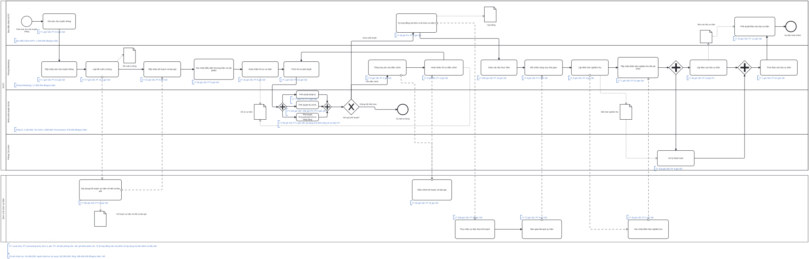

# Phân tích định lượng quy trình tổ chức sự kiện truyền thông sản phẩm

Phân tích định lượng cho thấy cycle time của quy trình chịu ảnh hưởng chủ yếu từ hai yếu tố: thời gian chờ tại cụm phê duyệt nội bộ và khả năng hồ sơ phải quay lại điều chỉnh. Do các nhánh phê duyệt chạy song song, thời gian của cụm được xác định theo nhánh hoàn thành chậm nhất, hiện là Tài chính với tối đa 336 giờ theo lịch. Khi phát sinh điều chỉnh, vòng lặp tiếp tục khuếch đại cycle time kỳ vọng. Trong khi đó, thời gian xử lý trực tiếp chỉ chiếm một phần của tổng thời gian, cho thấy dư địa giảm thời gian chờ và làm lại.

  

<em>Hình: BPMN định lượng thời gian và chi phí quy trình tổ chức sự kiện truyền thông sản phẩm</em>

Trên sơ đồ, nhãn màu nâu thể hiện CT, PT và xác suất; nhãn màu xanh thể hiện chi phí nguồn lực. Cụm phê duyệt nội bộ được tách thành ba nhánh xử lý song song gồm Pháp lý, Tài chính và Thu mua. Gateway AND chỉ cho phép quy trình tiếp tục sau khi cả ba nhánh áp dụng cho hồ sơ đã hoàn tất. Xác suất 80% của nhánh Thu mua thể hiện tỷ lệ sự kiện có hàng tặng theo dữ liệu phỏng vấn.

## Cơ sở số liệu

Dữ liệu phỏng vấn người tham gia quy trình là nguồn đầu vào chính của phân tích. Các giá trị này được trình bày theo đúng nội dung thu thập và không cần bổ sung tài liệu nội bộ, biểu mẫu, phiếu hoặc hợp đồng để xác nhận.

| Biến | Giá trị | Đơn vị | Nguồn | Ghi chú |
|---|---:|---|---|---|
| Lập đề xuất ý tưởng | 16 | giờ làm việc/sự kiện | Phỏng vấn nội bộ ACFC | Ước lượng của người tham gia |
| Lập kế hoạch và báo giá lần đầu | 80 | giờ trôi qua trong lịch làm việc/sự kiện | Phỏng vấn nội bộ ACFC và đơn vị tổ chức sự kiện | Dữ liệu phỏng vấn |
| Phản hồi pháp lý một lượt | 72 | giờ theo lịch/lượt | Phỏng vấn nội bộ ACFC | Dữ liệu phỏng vấn |
| Phản hồi tài chính | Tối đa 336 | giờ theo lịch/hồ sơ | Phỏng vấn nội bộ ACFC | Giá trị tối đa, không phải giá trị trung bình |
| Hợp đồng bị yêu cầu sửa lần đầu | 80 | phần trăm hồ sơ | Phỏng vấn nội bộ ACFC | Tỷ lệ ước lượng từ phỏng vấn |
| Sự kiện có xuất hàng làm quà và cần Thu mua duyệt | 80 | phần trăm sự kiện | Phỏng vấn nội bộ ACFC | Tỷ lệ ước lượng từ phỏng vấn |
| Lập báo cáo hậu sự kiện | 16 | giờ làm việc/sự kiện | Phỏng vấn nội bộ ACFC | Ước lượng của người tham gia |

## Giả định tính toán

| Cụm hoạt động | Cycle time | Processing time | Nguồn | Ghi chú |
|---|---:|---:|---|---|
| Gửi và tiếp nhận yêu cầu | 2 giờ theo lịch/sự kiện | 1 giờ làm việc/sự kiện | Giả định phân tích | Giả định |
| Tiếp nhận và lập đề xuất ý tưởng | 48 giờ theo lịch/sự kiện | 16 giờ làm việc/sự kiện | Phỏng vấn nội bộ ACFC | Dữ liệu phỏng vấn |
| Xây dựng kế hoạch và báo giá | 240 giờ theo lịch/sự kiện | 24 giờ làm việc/sự kiện | Quy đổi và giả định phân tích từ dữ liệu phỏng vấn | CT 240 giờ và PT 24 giờ là giả định; dữ liệu gốc là 80 giờ trong lịch làm việc |
| Xem xét kế hoạch và xác nhận điều kiện | 72 giờ theo lịch/sự kiện | 16 giờ làm việc/sự kiện | Phỏng vấn nội bộ ACFC | Dữ liệu phỏng vấn |
| Hoàn thiện và trình hồ sơ | 17 giờ theo lịch/hồ sơ | 8,5 giờ làm việc/hồ sơ | Giả định phân tích | Giả định |
| Phản hồi Pháp lý một lượt | 72 giờ theo lịch/hồ sơ | 4 giờ làm việc/hồ sơ | CT từ phỏng vấn nội bộ ACFC; PT từ giả định phân tích | Chỉ PT 4 giờ là giả định |
| Phản hồi Tài chính điển hình | 120 giờ theo lịch/hồ sơ | 4 giờ làm việc/hồ sơ | Giả định phân tích | Giả định |
| Phản hồi Thu mua khi có hàng tặng | 96 giờ theo lịch/hồ sơ | 2 giờ làm việc/hồ sơ | Giả định phân tích | Giả định |
| Một lượt điều chỉnh hồ sơ | 64 giờ theo lịch/lượt | 24 giờ làm việc/lượt | Giả định phân tích | Giả định |
| Ký hợp đồng | 48 giờ theo lịch/hợp đồng | 2 giờ làm việc/hợp đồng | CT từ phỏng vấn nội bộ ACFC; PT từ giả định phân tích | Chỉ PT 2 giờ là giả định |
| Chuẩn bị, thực hiện và giám sát sự kiện | 336 giờ theo lịch/sự kiện | 96 giờ làm việc/sự kiện | Giả định phân tích | Giả định |
| Bàn giao và nghiệm thu | 137 giờ theo lịch/sự kiện | 18,5 giờ làm việc/sự kiện | Giả định phân tích | Giả định |
| Thanh toán | 120 giờ theo lịch/hồ sơ | 4 giờ làm việc/hồ sơ | Giả định phân tích | Giả định |
| Lập Báo cáo hậu sự kiện | 48 giờ theo lịch/báo cáo | 16 giờ làm việc/báo cáo | PT từ phỏng vấn nội bộ ACFC; CT từ giả định quy đổi | Chỉ CT 48 giờ là giả định |
| Phê duyệt báo cáo | 24 giờ theo lịch/báo cáo | 2 giờ làm việc/báo cáo | Giả định phân tích | Giả định |

Tại XOR phê duyệt hồ sơ, xác suất `Cần điều chỉnh` là 80% số hồ sơ theo phỏng vấn nội bộ ACFC trong kỳ từ năm 2025 đến giữa năm 2026, chưa xác định số trường hợp khảo sát. Mô hình giả định xác suất `Được phê duyệt` là 15% số hồ sơ và xác suất `Không thể triển khai` là 5% số hồ sơ trong cùng kỳ; số trường hợp khảo sát không áp dụng cho hai giả định này. Tổng xác suất ba nhánh bằng 100%.

### Chuẩn hóa đơn vị thời gian

Cycle time được quy đổi về giờ theo lịch. Thời gian lập kế hoạch và báo giá lần đầu là 80 giờ trong lịch làm việc, tương đương 10 ngày làm việc theo dữ liệu phỏng vấn. Mô hình quy đổi 10 ngày làm việc thành 240 giờ theo lịch và chưa cộng ngày nghỉ cuối tuần. Cách quy đổi này là giả định phân tích áp dụng cho kỳ từ năm 2025 đến giữa năm 2026.

## Tính cycle time

### Phần tuần tự trước phê duyệt

Thời gian trước phê duyệt được cộng theo công thức tuần tự:

`CT_trước = 2 + 48 + 240 + 72 + 17 = 379 giờ theo lịch/sự kiện`.

Trong đó, 48 giờ cho tiếp nhận và lập đề xuất, cùng 72 giờ cho xem xét kế hoạch và xác nhận điều kiện, là dữ liệu phỏng vấn áp dụng cho kỳ từ năm 2025 đến giữa năm 2026, chưa xác định số trường hợp khảo sát.

### Cụm phê duyệt nội bộ

Pháp lý, Tài chính và Thu mua xử lý song song, nên cycle time của cụm bằng thời gian của nhánh chậm nhất:

- Kịch bản điển hình: `CT_AND = max(72, 120, 96) = 120 giờ theo lịch/hồ sơ`.
- Kịch bản biên trên: `CT_AND = max(72, 336, 96) = 336 giờ theo lịch/hồ sơ`.

Sau mỗi lượt phê duyệt, chỉ nhánh `Cần điều chỉnh` phát sinh thêm thời gian. Cycle time kỳ vọng của XOR là:

`CT_XOR = 80% × 64 + 15% × 0 + 5% × 0 = 51,2 giờ theo lịch/lượt`.

Với xác suất quay lại là `r = 80%`, cycle time của vòng lặp được tính như sau:

- Kịch bản điển hình: `T = 120 + 51,2 = 171,2 giờ`; `CT_vòng_lặp = 171,2 / (1 - 80%) = 856 giờ theo lịch/hồ sơ`.
- Kịch bản biên trên: `T = 336 + 51,2 = 387,2 giờ`; `CT_vòng_lặp = 387,2 / (1 - 80%) = 1.936 giờ theo lịch/hồ sơ`.

### Phần tuần tự sau phê duyệt

Sau khi hồ sơ được duyệt, hai nhánh thanh toán và lập báo cáo chạy song song. Thời gian của phần còn lại là:

`CT_sau = 48 + 336 + 137 + max(120, 48) + 24 = 665 giờ theo lịch/sự kiện`.

### Cycle time toàn quy trình

Kết quả áp dụng cho trường hợp đi đến kết quả `Sự kiện hoàn thành`:

- Kịch bản điển hình: `CT = 379 + 856 + 665 = 1.900 giờ`, tương đương `79,2 ngày theo lịch/sự kiện`.
- Kịch bản biên trên: `CT = 379 + 1.936 + 665 = 2.980 giờ`, tương đương `124,2 ngày theo lịch/sự kiện`.

Khoảng cách giữa hai kịch bản phát sinh từ thời gian phản hồi Tài chính. Kết quả biên trên không phải thời gian trung bình thực tế; đây là phép tính sử dụng mức tối đa 336 giờ theo lịch từ dữ liệu phỏng vấn.

## Hiệu suất thời gian

Processing time được hiểu là tổng giờ làm việc trực tiếp của các nguồn lực. Đối với hoạt động song song, giờ công của các nhánh được cộng vì mỗi nhánh đều sử dụng nguồn lực; cycle time vẫn được xác định theo nhánh hoàn thành chậm nhất.

Trước phê duyệt, processing time là:

`PT_trước = 1 + 16 + 24 + 16 + 8,5 = 65,5 giờ làm việc/sự kiện`.

Một lượt phê duyệt và điều chỉnh có processing time kỳ vọng:

`PT_một_lượt = 4 + 4 + 80% × 2 + 80% × 24 = 28,8 giờ làm việc/hồ sơ`.

Processing time của vòng lặp là:

`PT_vòng_lặp = 28,8 / (1 - 80%) = 144 giờ làm việc/hồ sơ`.

Sau phê duyệt, processing time là:

`PT_sau = 2 + 96 + 18,5 + 4 + 16 + 2 = 138,5 giờ làm việc/sự kiện`.

Tổng processing time của trường hợp hoàn thành là:

`PT = 65,5 + 144 + 138,5 = 348 giờ làm việc/sự kiện`.

Hiệu suất thời gian theo hai kịch bản:

- Kịch bản điển hình: `348 / 1.900 × 100% = 18,3%`.
- Kịch bản biên trên: `348 / 2.980 × 100% = 11,7%`.

Như vậy, thời gian xử lý trực tiếp chiếm dưới một phần năm cycle time trong cả hai kịch bản. Phần còn lại chủ yếu là thời gian chờ phản hồi, chờ bàn giao và thời gian phát sinh do hồ sơ quay lại điều chỉnh.

## Chi phí quy trình

Chi phí được tính theo tổng giờ làm việc của từng nguồn lực nhân với đơn giá, sau đó cộng chi phí vật tư và hệ thống. Do phỏng vấn chưa cung cấp đơn giá và các khoản chi này, toàn bộ số liệu chi phí được ghi là giả định phân tích.

| Nguồn lực | Thời gian | Đơn giá | Chi phí | Nguồn | Ghi chú |
|---|---:|---:|---:|---|---|
| Ban điều hành ACFC | 4,5 giờ làm việc/sự kiện | 500.000 đồng/giờ | 2.250.000 đồng/sự kiện | Giả định phân tích | Giả định |
| Phòng Marketing | 113,5 giờ làm việc/sự kiện | 200.000 đồng/giờ | 22.700.000 đồng/sự kiện | Giả định phân tích | Giả định |
| Đơn vị tổ chức sự kiện | 178 giờ làm việc/sự kiện | 300.000 đồng/giờ | 53.400.000 đồng/sự kiện | Giả định phân tích | Giả định |
| Phòng Pháp lý | 20 giờ làm việc/sự kiện | 300.000 đồng/giờ | 6.000.000 đồng/sự kiện | Giả định phân tích | Giả định |
| Phòng Tài chính | 24 giờ làm việc/sự kiện | 250.000 đồng/giờ | 6.000.000 đồng/sự kiện | Giả định phân tích | Giả định |
| Phòng Thu mua | 8 giờ làm việc/sự kiện | 200.000 đồng/giờ | 1.600.000 đồng/sự kiện | Giả định phân tích | Giả định |

`Chi phí nhân lực = 2.250.000 + 22.700.000 + 53.400.000 + 6.000.000 + 6.000.000 + 1.600.000 = 91.950.000 đồng/sự kiện`.

| Khoản chi | Giá trị | Đơn vị | Nguồn | Ghi chú |
|---|---:|---|---|---|
| Sản xuất, địa điểm và vận hành sự kiện | 300.000.000 | đồng/sự kiện | Giả định phân tích | Giả định |
| Ngân sách hàng tặng khi có xuất hàng | 50.000.000 | đồng/sự kiện có hàng tặng | Giả định phân tích | Giả định |
| Hệ thống và công cụ hỗ trợ | 5.000.000 | đồng/sự kiện | Giả định phân tích | Giả định |

Với xác suất có hàng tặng là 80% số sự kiện theo phỏng vấn nội bộ ACFC trong kỳ từ năm 2025 đến giữa năm 2026, chưa xác định số trường hợp khảo sát, chi phí hàng tặng kỳ vọng là:

`Chi phí_hàng_tặng = 80% × 50.000.000 = 40.000.000 đồng/sự kiện`.

Tổng chi phí quy trình là:

`Chi phí = 91.950.000 + 300.000.000 + 40.000.000 + 5.000.000 = 436.950.000 đồng/sự kiện`.

## Kết luận định lượng

Kết quả cho thấy vòng phê duyệt là điểm tác động lớn nhất đến cycle time. Xác suất điều chỉnh 80% làm thời gian kỳ vọng của cụm này tăng lên 856 giờ trong kịch bản điển hình và 1.936 giờ trong kịch bản biên trên. Hiệu suất thời gian chỉ đạt 18,3% và 11,7%. Vì vậy, hướng cải tiến nên ưu tiên giảm tỷ lệ hồ sơ bị trả lại và rút ngắn thời gian phản hồi Tài chính trước khi tối ưu các hoạt động còn lại.
