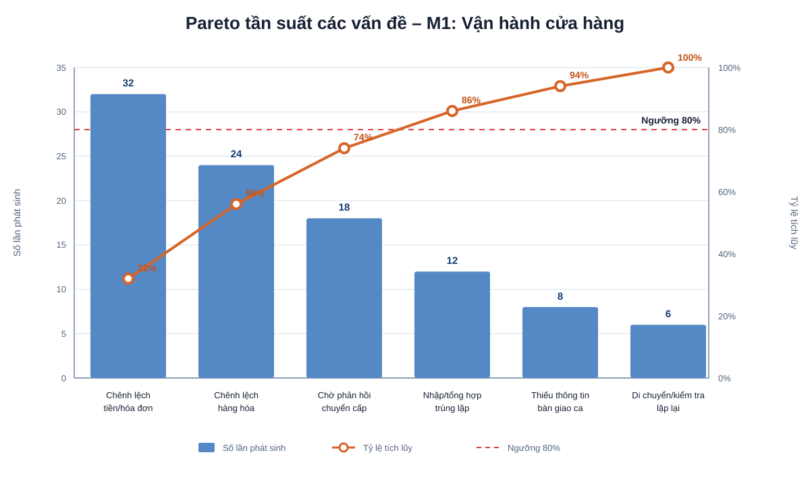

# M1 – Quản lý vận hành cửa hàng – Phân tích định tính

## 1. Phân tích giá trị gia tăng

> Phân loại sử dụng:
> - **VA (Value Added):** Hoạt động tạo giá trị trực tiếp cho khách hàng.
> - **BVA/VBA (Business Value Added):** Hoạt động không tạo giá trị trực tiếp cho khách hàng nhưng cần thiết cho quản lý, kiểm soát hoặc vận hành doanh nghiệp.
> - **NVA (Non-Value Added):** Hoạt động không tạo giá trị và nên được giảm thiểu hoặc loại bỏ nếu có thể.

| Hoạt động | Phân loại | Nhận xét |
|---|---|---|
| Chuẩn bị khu vực bán hàng/trưng bày | **VA** | Giúp cửa hàng sẵn sàng phục vụ và tác động trực tiếp đến trải nghiệm mua sắm của khách hàng. |
| Phục vụ và hỗ trợ hoạt động bán hàng trong ca | **VA** | Tạo giá trị trực tiếp cho khách hàng trong quá trình mua sắm. |
| Xử lý sự cố ảnh hưởng đến khách hàng | **VA** | Hạn chế gián đoạn và giảm ảnh hưởng tiêu cực đến trải nghiệm của khách hàng. |
| Phân công nhân sự đầu ca | **BVA/VBA** | Không tạo giá trị trực tiếp cho khách hàng nhưng cần thiết để tổ chức cửa hàng. |
| Kiểm tra tình trạng hàng hóa | **BVA/VBA** | Cần thiết để bảo đảm cửa hàng có đủ thông tin và hàng hóa phục vụ bán hàng. |
| Theo dõi hoạt động trong ca | **BVA/VBA** | Giúp quản lý phát hiện và xử lý vấn đề kịp thời. |
| Đối soát tiền/hóa đơn cuối ca | **BVA/VBA** | Cần thiết cho kiểm soát doanh thu và giao dịch. |
| Kiểm tra hàng hóa cuối ca | **BVA/VBA** | Cần thiết để phát hiện chênh lệch và kiểm soát hàng hóa. |
| Tổng hợp kết quả bán hàng | **BVA/VBA** | Phục vụ quản trị và theo dõi tình hình hoạt động cửa hàng. |
| Lập báo cáo vận hành | **BVA/VBA** | Cần thiết cho quản lý và kiểm soát nội bộ. |
| Chờ bổ sung hoặc xác nhận thông tin | **NVA** | Là thời gian chờ, không tạo thêm giá trị cho khách hàng hoặc doanh nghiệp. |
| Kiểm tra lại nhiều lần khi phát sinh chênh lệch | **NVA** | Là hoạt động làm lại; cần giảm bằng cách chuẩn hóa dữ liệu và kiểm soát sớm. |
| Nhập hoặc tổng hợp lại cùng một thông tin ở nhiều nơi | **NVA** | Nếu tồn tại trong thực tế thì đây là thao tác dư thừa, cần được xác nhận khi phỏng vấn. |
| Chờ đơn vị khác phản hồi khi chuyển cấp | **NVA** | Thời gian chờ không tạo giá trị; có thể giảm bằng SLA và quy định trách nhiệm rõ ràng. |

## 2. Phân tích lãng phí

### 2.1. Move – Di chuyển không cần thiết

**Biểu hiện có thể phát sinh:**
- Nhân viên phải di chuyển nhiều lần giữa khu vực bán hàng, kho và vị trí kiểm tra để lấy thông tin hoặc kiểm tra hàng hóa.
- Khi thông tin hàng hóa không tập trung, nhân viên có thể phải kiểm tra trực tiếp nhiều lần.

**Ảnh hưởng:**
- Tăng thời gian thực hiện công việc.
- Giảm thời gian nhân viên có thể dành cho khách hàng.
- Dễ phát sinh thao tác lặp lại.

**Hướng cải thiện:**
- Chuẩn hóa vị trí và cách lưu trữ thông tin cần kiểm tra.
- Sử dụng checklist đầu ca/cuối ca.
- Tập trung thông tin hàng hóa và trạng thái xử lý trên cùng một nguồn dữ liệu nếu hệ thống cho phép.

### 2.2. Hold – Chờ đợi

**Biểu hiện có thể phát sinh:**
- Chờ bổ sung hoặc xác nhận thông tin trước khi bắt đầu ca.
- Chờ phản hồi từ Retail Operations hoặc đơn vị liên quan khi có vấn đề vượt thẩm quyền.
- Chờ xác định nguyên nhân khi có chênh lệch cuối ca.

**Ảnh hưởng:**
- Kéo dài thời gian chuẩn bị hoặc đóng ca.
- Vấn đề không được xử lý ngay.
- Có thể làm gián đoạn hoạt động vận hành.

**Hướng cải thiện:**
- Xác định rõ đầu mối tiếp nhận từng loại vấn đề.
- Quy định thời gian phản hồi/SLA cho các trường hợp chuyển cấp.
- Chuẩn hóa checklist thông tin cần có trước khi bắt đầu ca.

### 2.3. Overdo – Thực hiện quá mức/lặp lại

**Biểu hiện có thể phát sinh:**
- Kiểm tra lại nhiều lần cùng một giao dịch hoặc chứng từ khi phát hiện chênh lệch.
- Nhập lại hoặc tổng hợp lại cùng một dữ liệu ở nhiều biểu mẫu/hệ thống.
- Thực hiện nhiều bước xác nhận cho cùng một vấn đề.

**Ảnh hưởng:**
- Tăng khối lượng công việc.
- Tăng nguy cơ nhập sai dữ liệu.
- Làm kéo dài thời gian hoàn tất báo cáo cuối ca.

**Hướng cải thiện:**
- Sử dụng một nguồn dữ liệu thống nhất.
- Giảm nhập liệu lặp lại.
- Chuẩn hóa nguyên tắc kiểm tra và ngưỡng chuyển cấp.

## 2.4. Defects – Sai lỗi

### Biểu hiện

Các sai lỗi có thể phát sinh trong quy trình quản lý vận hành cửa hàng gồm:

- Chênh lệch tiền, phương thức thanh toán hoặc hóa đơn khi đối soát cuối ca.
- Sai lệch giữa hàng hóa thực tế và dữ liệu hàng hóa/tồn kho.
- Thông tin vận hành được ghi nhận thiếu hoặc chưa chính xác.
- Báo cáo cuối ca thiếu dữ liệu hoặc phải điều chỉnh lại.
- Ghi nhận sự cố hoặc kết quả xử lý chưa đầy đủ.
- Sai sót trong quá trình kiểm tra, tổng hợp hoặc bàn giao thông tin giữa các actor.

### Ảnh hưởng

- Phát sinh hoạt động kiểm tra và xử lý lại (rework).
- Kéo dài thời gian đóng ca.
- Tăng thời gian của Quản lý cửa hàng, Thu ngân và nhân sự phụ trách hàng hóa.
- Có thể làm phát sinh việc chuyển cấp cho Retail Operations.
- Làm giảm độ tin cậy của dữ liệu vận hành và báo cáo.

### Hướng cải thiện

- Chuẩn hóa checklist mở ca và đóng ca.
- Xác định rõ dữ liệu nào do từng actor chịu trách nhiệm kiểm tra.
- Thực hiện kiểm tra chênh lệch sớm thay vì chỉ phát hiện vào cuối ca.
- Giảm nhập liệu lặp lại giữa các biểu mẫu/hệ thống.
- Theo dõi nguyên nhân sai lỗi theo nhóm để phát hiện lỗi lặp lại.
- Quy định rõ trách nhiệm xử lý và chuyển cấp khi phát hiện sai lệch.

## 3. Các vấn đề định tính nổi bật

### Vấn đề 1 – Chênh lệch cuối ca làm phát sinh rework

Khi số liệu bán hàng, tiền/hóa đơn hoặc hàng hóa không khớp, cửa hàng phải kiểm tra lại giao dịch, chứng từ hoặc tình trạng hàng hóa.

**Hệ quả:**
- Phát sinh hoạt động làm lại.
- Kéo dài thời gian đóng ca.
- Có thể phải chuyển cấp nếu không xác định được nguyên nhân.

**Cần xác nhận thêm:**
- Loại chênh lệch thường gặp nhất.
- Tần suất phát sinh.
- Thời gian trung bình để xử lý.

### Vấn đề 2 – Phụ thuộc vào phản hồi khi chuyển cấp

Những vấn đề vượt phạm vi cửa hàng phải được chuyển cho đơn vị liên quan.

**Hệ quả:**
- Có thể phát sinh thời gian chờ.
- Trách nhiệm xử lý có thể không rõ nếu chưa có quy tắc chuyển cấp cụ thể.
- Việc đóng vấn đề có thể kéo dài sang ca hoặc ngày tiếp theo.

**Cần xác nhận thêm:**
- Danh sách loại sự cố cần chuyển cấp.
- Đơn vị nhận từng loại sự cố.
- Thời gian phản hồi hiện tại.

### Vấn đề 3 – Nguy cơ trùng lặp trong kiểm tra và tổng hợp thông tin

Nếu các thông tin về bán hàng, tiền/hóa đơn và hàng hóa nằm ở nhiều nguồn khác nhau, nhân viên có thể phải tổng hợp hoặc kiểm tra lại nhiều lần.

**Hệ quả:**
- Tăng thời gian thao tác.
- Tăng nguy cơ sai lệch dữ liệu.
- Khó xác định nguồn thông tin chính xác khi có chênh lệch.

**Lưu ý:** Nội dung này cần được xác nhận bằng phỏng vấn hoặc biểu mẫu/hệ thống thực tế của ACFC trước khi kết luận là vấn đề hiện hữu.

## 4. Phân tích nguyên nhân – Fishbone

### Vấn đề được chọn

**Chênh lệch số liệu cuối ca / thời gian đóng ca kéo dài**

### Nhóm nguyên nhân có thể xem xét

| Nhóm nguyên nhân | Nguyên nhân cần kiểm tra |
|---|---|
| **Con người (People)** | Nhập sai thông tin; bỏ sót bước kiểm tra; bàn giao ca chưa đầy đủ; chưa thống nhất cách xử lý chênh lệch. |
| **Quy trình (Process)** | Checklist chưa thống nhất; trách nhiệm kiểm tra chưa rõ; nhiều bước kiểm tra lặp lại; quy tắc chuyển cấp chưa rõ. |
| **Hệ thống (System)** | Dữ liệu nằm ở nhiều nguồn; chưa tự động đối soát; dữ liệu cập nhật chậm hoặc không đồng bộ. |
| **Dữ liệu/Chứng từ (Data/Documents)** | Thiếu hóa đơn/chứng từ; thông tin giao dịch chưa đầy đủ; mã hàng hoặc số liệu không khớp. |
| **Hàng hóa (Goods)** | Hàng hóa thực tế khác dữ liệu; điều chuyển/chuyển vị trí chưa cập nhật; sai lệch khi kiểm đếm. |
| **Quản lý (Management)** | Chưa có ngưỡng chuyển cấp rõ; thiếu SLA phản hồi; chưa theo dõi nguyên nhân chênh lệch theo nhóm. |

> Các nguyên nhân trên là **giả thuyết phân tích cần kiểm chứng**, không được xem là kết luận thực tế của ACFC nếu chưa có dữ liệu hoặc phỏng vấn xác nhận.

## 5. Phân tích Pareto

> **Lưu ý:** Dữ liệu trong phân tích Pareto dưới đây là dữ liệu giả lập nhằm minh họa phương pháp phân tích. Đây không phải số liệu vận hành thực tế của ACFC.

Để xác định các nhóm nguyên nhân cần ưu tiên cải thiện, nhóm giả lập 50 vấn đề phát sinh trong quá trình vận hành cửa hàng.

| Thứ tự | Nhóm nguyên nhân | Số lần | Tỷ lệ | Tỷ lệ tích lũy |
|---:|---|---:|---:|---:|
| 1 | Chênh lệch tiền / thanh toán / hóa đơn | 15 | 30% | 30% |
| 2 | Sai lệch hàng hóa / tồn kho | 12 | 24% | 54% |
| 3 | Thiếu hoặc chậm cập nhật thông tin | 8 | 16% | 70% |
| 4 | Sự cố hệ thống / POS | 6 | 12% | 82% |
| 5 | Thiếu nhân sự / phân công chưa phù hợp | 5 | 10% | 92% |
| 6 | Nguyên nhân khác | 4 | 8% | 100% |
| **Tổng** |  | **50** | **100%** |  |

### Biểu đồ Pareto

### Nhận xét

Biểu đồ Pareto giả lập cho thấy bốn nhóm nguyên nhân đầu tiên chiếm khoảng **82% tổng số vấn đề**, gồm:

1. Chênh lệch tiền / thanh toán / hóa đơn.
2. Sai lệch hàng hóa / tồn kho.
3. Thiếu hoặc chậm cập nhật thông tin.
4. Sự cố hệ thống / POS.

Theo nguyên tắc Pareto, đây là các nhóm nguyên nhân nên được ưu tiên xem xét trước khi thực hiện cải tiến.

Trong đó, hai nhóm có tỷ trọng cao nhất là **chênh lệch tiền/thanh toán/hóa đơn (30%)** và **sai lệch hàng hóa/tồn kho (24%)**, tổng cộng chiếm **54%** số vấn đề giả lập.

Do đó, các hoạt động đối soát cuối ca, kiểm soát hàng hóa và chất lượng dữ liệu là những khu vực cần được ưu tiên theo dõi.

### Hướng cải thiện từ kết quả Pareto

- Chuẩn hóa hoạt động đối soát tiền, thanh toán và hóa đơn cuối ca.
- Tăng kiểm soát dữ liệu hàng hóa và cập nhật tồn kho kịp thời.
- Chuẩn hóa thông tin cần có trước và trong ca vận hành.
- Theo dõi lỗi hệ thống/POS và thời gian xử lý sự cố.
- Thu thập dữ liệu thực tế theo từng nhóm nguyên nhân để thay thế dữ liệu giả lập trong các lần phân tích sau.

## 6. Hướng cải thiện đề xuất

1. Chuẩn hóa **checklist mở ca và đóng ca**.
2. Xác định rõ **người chịu trách nhiệm** cho từng nhóm kiểm tra.
3. Thiết lập **ma trận chuyển cấp** theo loại sự cố/chênh lệch.
4. Quy định **SLA phản hồi** đối với vấn đề chuyển sang đơn vị khác.
5. Giảm nhập liệu lặp lại và ưu tiên sử dụng **một nguồn dữ liệu thống nhất**.
6. Thiết lập cảnh báo sớm cho các chênh lệch có thể phát hiện trước cuối ca.
7. Theo dõi nguyên nhân chênh lệch theo nhóm để xác định vấn đề lặp lại.

