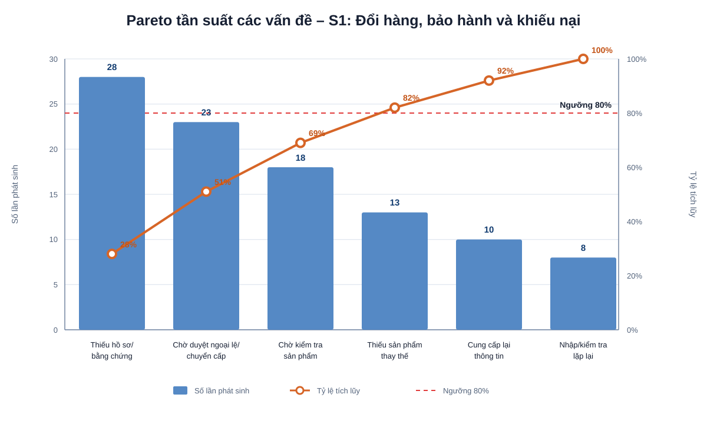

# S1 – Đổi hàng, bảo hành và xử lý khiếu nại – Phân tích định tính

## 1. Phân tích giá trị gia tăng

> Phân loại sử dụng:
> - **VA (Value Added):** Hoạt động tạo giá trị trực tiếp cho khách hàng.
> - **BVA/VBA (Business Value Added):** Hoạt động không tạo giá trị trực tiếp cho khách hàng nhưng cần thiết cho kiểm soát, tuân thủ chính sách hoặc vận hành doanh nghiệp.
> - **NVA (Non-Value Added):** Hoạt động không tạo giá trị và nên được giảm thiểu hoặc loại bỏ nếu có thể.

| Hoạt động | Phân loại | Nhận xét |
|---|---|---|
| Tiếp nhận yêu cầu của khách hàng | **VA** | Là điểm bắt đầu để khách hàng được hỗ trợ sau bán hàng. |
| Hướng dẫn khách hàng cung cấp thông tin cần thiết | **VA** | Giúp khách hàng hiểu rõ yêu cầu cần bổ sung để tiếp tục xử lý. |
| Kiểm tra sản phẩm/bằng chứng để xác định phương án xử lý | **BVA/VBA** | Không trực tiếp tạo giá trị cho khách hàng nhưng cần thiết để bảo đảm yêu cầu được xử lý đúng chính sách. |
| Xác định yêu cầu đủ điều kiện hay không | **BVA/VBA** | Cần để kiểm soát việc đổi hàng, bảo hành hoặc xử lý khiếu nại đúng quy định. |
| Thực hiện đổi hàng | **VA** | Tạo kết quả trực tiếp cho khách hàng khi yêu cầu đủ điều kiện. |
| Thực hiện bảo hành hoặc phương án xử lý phù hợp | **VA** | Giải quyết trực tiếp vấn đề sau bán hàng của khách hàng. |
| Thông báo kết quả xử lý | **VA** | Giúp khách hàng biết trạng thái và kết quả cuối cùng của yêu cầu. |
| Kiểm tra giao dịch/hóa đơn | **BVA/VBA** | Cần để xác minh yêu cầu và tránh xử lý sai giao dịch. |
| Kiểm tra thời hạn và điều kiện chính sách | **BVA/VBA** | Cần thiết để bảo đảm yêu cầu phù hợp với chính sách áp dụng. |
| Kiểm tra sản phẩm thay thế | **BVA/VBA** | Cần để xác định khả năng thực hiện đổi hàng. |
| Chuyển cấp trường hợp ngoại lệ | **BVA/VBA** | Cần thiết khi trường hợp vượt quyền xử lý thông thường. |
| Chờ khách hàng bổ sung thông tin | **NVA** | Là thời gian chờ, không tạo thêm giá trị. |
| Yêu cầu khách hàng cung cấp lại cùng một thông tin nhiều lần | **NVA** | Gây phiền hà cho khách và kéo dài thời gian xử lý nếu xảy ra trong thực tế. |
| Kiểm tra lại nhiều lần cùng một hồ sơ/bằng chứng | **NVA** | Là hoạt động lặp lại, cần giảm nếu không có lý do kiểm soát rõ ràng. |
| Chờ đơn vị khác phản hồi khi chuyển cấp | **NVA** | Là thời gian chờ và có thể kéo dài cycle time của yêu cầu. |

## 2. Phân tích lãng phí

### 2.1. Move – Di chuyển không cần thiết

**Biểu hiện có thể phát sinh:**
- Khách hàng phải mang sản phẩm qua nhiều điểm tiếp nhận/kiểm tra nếu quy trình không có đầu mối rõ ràng.
- Sản phẩm có thể phải di chuyển giữa cửa hàng, kho hoặc đơn vị xử lý nếu trách nhiệm kiểm tra không được xác định rõ.

**Ảnh hưởng:**
- Tăng thời gian xử lý.
- Tăng số lần bàn giao sản phẩm.
- Tăng nguy cơ thất lạc hoặc nhầm lẫn trạng thái xử lý.

**Hướng cải thiện:**
- Xác định một đầu mối tiếp nhận rõ ràng.
- Hạn chế số lần bàn giao sản phẩm.
- Theo dõi trạng thái yêu cầu và vị trí sản phẩm bằng một mã case thống nhất.

### 2.2. Hold – Chờ đợi

**Biểu hiện có thể phát sinh:**
- Chờ khách hàng bổ sung hóa đơn, hình ảnh hoặc bằng chứng.
- Chờ kiểm tra tình trạng sản phẩm.
- Chờ xác nhận sản phẩm thay thế.
- Chờ Quản lý/đơn vị có thẩm quyền xử lý ngoại lệ.

**Ảnh hưởng:**
- Kéo dài thời gian từ lúc tiếp nhận đến khi đóng yêu cầu.
- Khách hàng có thể phải liên hệ lại nhiều lần.
- Dễ phát sinh khiếu nại về thời gian phản hồi.

**Hướng cải thiện:**
- Cung cấp checklist hồ sơ ngay từ lần tiếp nhận đầu tiên.
- Quy định thời gian xử lý cho từng trạng thái.
- Thiết lập SLA cho các bước cần chuyển đơn vị khác.

### 2.3. Overdo – Thực hiện quá mức/lặp lại

**Biểu hiện có thể phát sinh:**
- Nhập lại thông tin giao dịch hoặc thông tin khách hàng ở nhiều nơi.
- Yêu cầu khách gửi lại ảnh/chứng từ đã cung cấp trước đó.
- Nhiều đơn vị cùng kiểm tra lại một nội dung mà không có tiêu chí phân quyền rõ ràng.

**Ảnh hưởng:**
- Tăng cycle time.
- Tăng nguy cơ sai sót.
- Làm trải nghiệm khách hàng kém hơn.
- Tăng khối lượng công việc nội bộ.

**Hướng cải thiện:**
- Sử dụng một mã case duy nhất.
- Lưu hồ sơ/bằng chứng tập trung.
- Quy định rõ đơn vị nào chịu trách nhiệm kiểm tra từng loại điều kiện.

## 2.4. Defects – Sai lỗi

### Biểu hiện

Các sai lỗi có thể phát sinh trong quy trình đổi hàng, bảo hành và xử lý khiếu nại gồm:

- Xác định sai giao dịch hoặc thông tin đơn hàng của khách hàng.
- Ghi nhận thiếu hoặc sai hóa đơn, chứng từ, hình ảnh hoặc bằng chứng liên quan.
- Đánh giá sai điều kiện đổi hàng/bảo hành theo chính sách.
- Xác định sai tình trạng sản phẩm.
- Chọn sai phương án xử lý cho yêu cầu của khách hàng.
- Cập nhật sai hoặc thiếu trạng thái xử lý của yêu cầu.
- Thông báo kết quả không đầy đủ hoặc không đúng với kết quả xử lý thực tế.

### Ảnh hưởng

- Khách hàng phải cung cấp lại thông tin hoặc bằng chứng.
- Phát sinh hoạt động kiểm tra và xử lý lại (rework).
- Làm tăng Cycle Time của yêu cầu.
- Tăng khối lượng công việc của CSKH/Cửa hàng và các đơn vị phối hợp.
- Có thể làm phát sinh khiếu nại tiếp theo từ khách hàng.
- Trường hợp xử lý sai có thể phải chuyển cấp cho Quản lý hoặc đơn vị có thẩm quyền.

### Hướng cải thiện

- Chuẩn hóa checklist thông tin/hồ sơ cần thu thập ngay từ lần tiếp nhận đầu tiên.
- Sử dụng một mã case duy nhất để theo dõi toàn bộ yêu cầu.
- Quy định rõ tiêu chí đủ điều kiện cho từng loại đổi hàng, bảo hành hoặc khiếu nại.
- Xác định rõ đơn vị chịu trách nhiệm kiểm tra tình trạng sản phẩm.
- Hạn chế nhập hoặc yêu cầu lại thông tin đã được khách hàng cung cấp.
- Theo dõi nguyên nhân sai lỗi và rework theo từng nhóm để xác định vấn đề lặp lại.
## 3. Các vấn đề định tính nổi bật

### Vấn đề 1 – Hồ sơ không đầy đủ làm kéo dài thời gian xử lý

Nếu khách hàng chưa cung cấp đủ thông tin giao dịch, hóa đơn hoặc bằng chứng cần thiết, yêu cầu phải dừng để bổ sung.

**Hệ quả:**
- Cycle time tăng.
- Khách hàng phải liên hệ nhiều lần.
- Nhân viên phải kiểm tra lại hồ sơ sau mỗi lần bổ sung.

**Cần xác nhận thêm:**
- Những loại thông tin nào thường bị thiếu nhất.
- Tỷ lệ case phải bổ sung hồ sơ.
- Số lần bổ sung trung bình của một case.

### Vấn đề 2 – Trường hợp ngoại lệ phụ thuộc vào việc chuyển cấp

Những yêu cầu không thể xử lý theo quy tắc thông thường phải chuyển cho Quản lý hoặc đơn vị có thẩm quyền.

**Hệ quả:**
- Phát sinh thời gian chờ.
- Có thể xảy ra cách xử lý không nhất quán nếu tiêu chí ngoại lệ chưa rõ.
- Khách hàng khó biết khi nào sẽ có kết quả.

**Cần xác nhận thêm:**
- Những trường hợp nào được xem là ngoại lệ.
- Ai có quyền quyết định cuối cùng.
- SLA phản hồi sau khi chuyển cấp.

### Vấn đề 3 – Nguy cơ khách hàng phải cung cấp lại thông tin nhiều lần

Nếu thông tin yêu cầu được ghi nhận ở nhiều kênh hoặc nhiều đơn vị khác nhau, khách hàng có thể phải lặp lại thông tin đã cung cấp.

**Hệ quả:**
- Tăng NVA.
- Làm giảm trải nghiệm khách hàng.
- Tăng nguy cơ dữ liệu không nhất quán giữa các bên.

**Lưu ý:** Cần phỏng vấn hoặc kiểm tra hệ thống/biểu mẫu thực tế của ACFC trước khi kết luận đây là vấn đề đang xảy ra.

## 4. Phân tích nguyên nhân – Fishbone

### Vấn đề được chọn

**Thời gian xử lý yêu cầu đổi hàng/bảo hành/khiếu nại kéo dài**

### Nhóm nguyên nhân có thể xem xét

| Nhóm nguyên nhân | Nguyên nhân cần kiểm tra |
|---|---|
| **Con người (People)** | Nhân viên hướng dẫn chưa đầy đủ; khách hàng thiếu thông tin; chưa rõ người chịu trách nhiệm xử lý; trường hợp ngoại lệ phụ thuộc cá nhân. |
| **Quy trình (Process)** | Checklist hồ sơ chưa rõ; nhiều bước xác nhận; tiêu chí đủ điều kiện chưa thống nhất; quy tắc chuyển cấp chưa rõ. |
| **Hệ thống (System)** | Dữ liệu giao dịch và hồ sơ yêu cầu không liên thông; chưa có mã case thống nhất; khó theo dõi trạng thái. |
| **Dữ liệu/Chứng từ (Data/Documents)** | Thiếu hóa đơn, mã đơn, ảnh hoặc bằng chứng; thông tin giao dịch không đầy đủ. |
| **Sản phẩm/Hàng hóa (Product/Goods)** | Khó xác định tình trạng sản phẩm; thiếu sản phẩm thay thế; cần chuyển sản phẩm đến nơi khác để kiểm tra. |
| **Quản lý (Management)** | Chưa có SLA; chưa có ma trận thẩm quyền; chưa theo dõi nguyên nhân chậm xử lý theo nhóm. |

> Các nguyên nhân trên là **giả thuyết phân tích cần kiểm chứng**, không được xem là kết luận thực tế của ACFC nếu chưa có dữ liệu hoặc phỏng vấn xác nhận.

## 5. Phân tích Pareto

> **Lưu ý:** Dữ liệu trong phân tích Pareto dưới đây là dữ liệu giả lập nhằm minh họa phương pháp phân tích. Đây không phải số liệu vận hành thực tế của ACFC.

Để xác định các nguyên nhân chính gây trở ngại trong quá trình đổi hàng, bảo hành và xử lý khiếu nại, nhóm giả lập 50 trường hợp phát sinh vấn đề.

| Thứ tự | Nhóm nguyên nhân | Số case | Tỷ lệ | Tỷ lệ tích lũy |
|---:|---|---:|---:|---:|
| 1 | Thiếu hóa đơn / chứng từ giao dịch | 14 | 28% | 28% |
| 2 | Thiếu ảnh / bằng chứng về sản phẩm | 11 | 22% | 50% |
| 3 | Sản phẩm không đáp ứng điều kiện hỗ trợ | 9 | 18% | 68% |
| 4 | Yêu cầu quá thời hạn đổi / bảo hành | 7 | 14% | 82% |
| 5 | Không có sản phẩm thay thế | 5 | 10% | 92% |
| 6 | Trường hợp ngoại lệ khác | 4 | 8% | 100% |
| **Tổng** |  | **50** | **100%** |  |

### Biểu đồ Pareto

### Nhận xét

Kết quả Pareto giả lập cho thấy bốn nhóm nguyên nhân đầu tiên chiếm khoảng **82% tổng số trường hợp phát sinh vấn đề**, bao gồm:

1. Thiếu hóa đơn / chứng từ giao dịch.
2. Thiếu ảnh / bằng chứng về sản phẩm.
3. Sản phẩm không đáp ứng điều kiện hỗ trợ.
4. Yêu cầu quá thời hạn đổi / bảo hành.

Trong đó, hai nguyên nhân có tỷ trọng cao nhất là:

- **Thiếu hóa đơn / chứng từ giao dịch: 28%**
- **Thiếu ảnh / bằng chứng sản phẩm: 22%**

Hai nhóm này chiếm tổng cộng **50% số trường hợp giả lập**.

Kết quả cho thấy các vấn đề tập trung nhiều ở **giai đoạn tiếp nhận và kiểm tra hồ sơ ban đầu**. Vì vậy, nếu dữ liệu thực tế có xu hướng tương tự, việc cải thiện chất lượng hồ sơ ngay từ lần tiếp nhận đầu tiên có thể giúp giảm đáng kể thời gian chờ và rework của S1.

### Hướng cải thiện từ kết quả Pareto

- Cung cấp checklist hồ sơ rõ ràng ngay khi khách hàng gửi yêu cầu.
- Hướng dẫn khách hàng cung cấp đầy đủ hóa đơn, mã giao dịch và bằng chứng sản phẩm trong lần đầu.
- Nếu hệ thống cho phép, tự động tra cứu giao dịch từ mã đơn hoặc thông tin khách hàng để giảm phụ thuộc vào chứng từ giấy.
- Giải thích rõ điều kiện đổi hàng/bảo hành và thời hạn áp dụng ngay từ đầu.
- Theo dõi nguyên nhân từ chối theo từng nhóm.
- Theo dõi tỷ lệ hồ sơ đầy đủ ngay lần đầu (First-Time-Complete).
- Khi có dữ liệu thực tế, thay thế bộ dữ liệu giả lập để xác định chính xác nhóm nguyên nhân cần ưu tiên.

## 6. Hướng cải thiện đề xuất

1. Chuẩn hóa **checklist hồ sơ** ngay từ lần tiếp nhận đầu tiên.
2. Tạo **mã case duy nhất** cho mỗi yêu cầu sau bán hàng.
3. Lưu thông tin giao dịch, ảnh/bằng chứng và trạng thái xử lý tại một nơi.
4. Quy định rõ **tiêu chí đủ điều kiện** cho từng loại yêu cầu.
5. Xây dựng **ma trận chuyển cấp** cho các trường hợp ngoại lệ.
6. Quy định **SLA** cho từng giai đoạn xử lý.
7. Cho phép CSKH/Cửa hàng theo dõi trạng thái để khách hàng không phải liên hệ nhiều lần.
8. Theo dõi nguyên nhân từ chối và nguyên nhân chậm xử lý để xác định vấn đề lặp lại.

## 7. Câu hỏi

1. Những loại yêu cầu sau bán hàng nào thường được khách hàng gửi đến cửa hàng hoặc CSKH?
Trả lời: Các yêu cầu chủ yếu gồm đổi hàng, bảo hành và khiếu nại liên quan đến sản phẩm hoặc giao dịch đã thực hiện.

2. Khi tiếp nhận yêu cầu, những thông tin nào thường cần kiểm tra đầu tiên?
Trả lời: Các thông tin cần kiểm tra gồm mã đơn hàng hoặc giao dịch, hóa đơn/chứng từ mua hàng, sản phẩm liên quan, lý do yêu cầu và thông tin khách hàng cần thiết để xác định giao dịch.

3. Những nguyên nhân nào khiến khách hàng thường phải bổ sung hồ sơ hoặc bằng chứng?
Trả lời: Nguyên nhân có thể là thiếu hóa đơn hoặc chứng từ giao dịch, thiếu hình ảnh/bằng chứng về tình trạng sản phẩm, thông tin giao dịch chưa đầy đủ hoặc chưa xác định được chính xác sản phẩm liên quan.

4. Bước nào trong quy trình thường dễ làm kéo dài thời gian xử lý nhất?
Trả lời: Các bước dễ kéo dài thời gian gồm chờ khách hàng bổ sung hồ sơ, kiểm tra sản phẩm và chờ phản hồi đối với các trường hợp phải chuyển cấp hoặc cần phê duyệt ngoại lệ.

5. Những nguyên nhân phổ biến nào khiến yêu cầu của khách hàng bị từ chối?
Trả lời: Yêu cầu có thể bị từ chối do quá thời hạn áp dụng, thiếu chứng từ cần thiết, tình trạng sản phẩm không đáp ứng điều kiện hỗ trợ hoặc trường hợp không thuộc phạm vi chính sách.

6. Khi khách hàng đủ điều kiện hỗ trợ, việc lựa chọn phương án xử lý được thực hiện như thế nào?
Trả lời: Đơn vị xử lý sẽ căn cứ vào tình trạng sản phẩm và chính sách áp dụng để xác định phương án như đổi hàng, bảo hành hoặc một phương án hỗ trợ khác.

7. Trường hợp nào cần chuyển cho Quản lý hoặc đơn vị có thẩm quyền?
Trả lời: Các trường hợp không thể xử lý theo quy tắc thông thường, cần phê duyệt ngoại lệ hoặc vượt phạm vi xử lý của CSKH/Cửa hàng sẽ được chuyển cấp. Điều kiện cụ thể cần được ACFC xác nhận.

8. Nếu không có sản phẩm thay thế phù hợp thì quy trình nên xử lý như thế nào?
Trả lời: Yêu cầu không nên tự động được xem là trường hợp ngoại lệ. Trước tiên cần xem xét bảo hành hoặc phương án hỗ trợ khác theo chính sách; chỉ chuyển cấp khi thực sự cần phê duyệt ngoại lệ.

9. Những hoạt động nào trong quy trình có thể phát sinh rework?
Trả lời: Rework có thể xảy ra khi phải yêu cầu khách hàng bổ sung lại thông tin, kiểm tra lại hồ sơ, kiểm tra lại sản phẩm hoặc điều chỉnh phương án xử lý do thông tin ban đầu chưa đầy đủ.

10. Theo anh/chị, bước nào cần được ưu tiên cải thiện nhất trong S1? Vì sao?
Trả lời: Nên ưu tiên cải thiện khâu tiếp nhận và kiểm tra hồ sơ ban đầu vì nếu thông tin được thu thập đầy đủ ngay từ đầu thì có thể giảm thời gian chờ, giảm số lần bổ sung và hạn chế rework ở các bước phía sau.