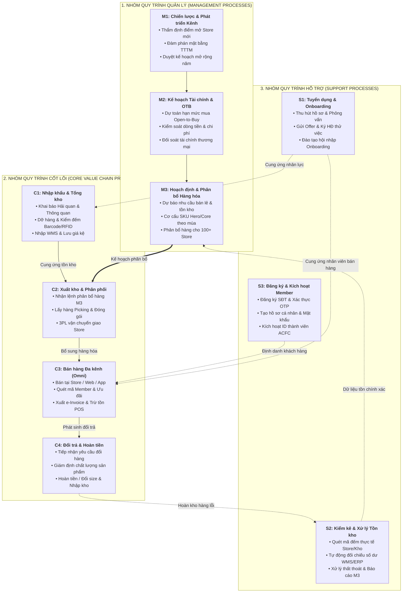

# BÁO CÁO CHUYÊN ĐỀ: KIẾN TRÚC QUY TRÌNH TỔNG THỂ DOANH NGHIỆP ACFC

**Học phần:** IE203.F31.CN1.CNTT – Hệ thống quản trị qui trình nghiệp vụ  
**Giảng viên hướng dẫn:** ThS. Hà Lê Hoài Trung  
**Đơn vị thực hiện:** Nhóm nghiên cứu Đề tài BPM ACFC Việt Nam  
**Ngày hoàn thiện:** 14/08/2026

---

## 1. Giới thiệu Doanh nghiệp Nghiên cứu: Công ty Cổ phần Thời trang và Mỹ phẩm Âu Châu (ACFC)

**Công ty Cổ phần Thời trang và Mỹ phẩm Âu Châu (ACFC)**, thành viên thuộc Tập đoàn Liên Thái Bình Dương (IPPG), là doanh nghiệp tiên phong hàng đầu tại Việt Nam trong lĩnh vực phân phối và bán lẻ thời trang quốc tế cao cấp. Với mạng lưới hơn 100 cửa hàng bán lẻ hiện đại tại các trung tâm thương mại trọng điểm trên toàn quốc cùng nền tảng thương mại điện tử đa kênh (*Omnichannel*) `acfc.com.vn` và Ứng dụng di động (ACFC App), ACFC quản lý chuỗi cung ứng thời trang quy mô lớn với hàng chục ngàn SKU biến đổi nhanh theo mùa.

Để duy trì vị thế dẫn đầu và trải nghiệm khách hàng vượt trội, ACFC triển khai hệ thống quản trị quy trình kinh doanh (BPM) tinh gọn nhằm liên kết chặt chẽ giữa các khâu hoạch định chiến lược, vận hành chuỗi cung ứng kho vận trung tâm, mạng lưới bán lẻ và các dịch vụ khách hàng số.

---

## 2. Danh mục 10 Quy trình Nghiệp vụ Chuẩn hóa (Theo 3 Cấp độ BPM)

*Bảng 2.1: Danh mục 10 quy trình nghiệp vụ chuẩn hóa tại ACFC theo khung chuẩn APQC.*

| STT | Mã quy trình | Tên quy trình nghiệp vụ | Cấp độ BPM | Bộ phận chủ trì | Khách hàng của quy trình |
| :---: | :---: | :--- | :---: | :--- | :--- |
| 1 | **M1** | Hoạch định chiến lược kinh doanh & phát triển mạng lưới kênh bán lẻ | Quản lý | Ban Tổng Giám đốc & BD | Ban Lãnh đạo, Cổ đông |
| 2 | **M2** | Lập kế hoạch tài chính, ngân sách thương mại & kiểm soát chi phí nhượng quyền | Quản lý | Phòng Tài chính - Kế toán | Ban Giám đốc, Đối tác thương hiệu |
| 3 | **M3** | Hoạch định hàng hóa, dự báo nhu cầu & phân bổ nguồn hàng theo mùa (*Merchandise Planning*) | Quản lý | Phòng Merchandise & Allocation | Hệ thống 100+ Cửa hàng, E-Com |
| 4 | **C1** | Nhập khẩu, thông quan & tiếp nhận hàng hóa về kho trung tâm (*Inbound Logistics*) | Cốt lõi | Phòng Logistics & Quản lý Kho | Tổng kho ACFC, Khối Cửa hàng |
| 5 | **C2** | Quản lý xuất kho, điều phối & bổ sung hàng hóa đến chuỗi cửa hàng (*Outbound Logistics*) | Cốt lõi | Bộ phận Vận hành Kho (Outbound) | Chuỗi cửa hàng bán lẻ ACFC |
| 6 | **C3** | Bán hàng đa kênh & thanh toán tại cửa hàng và sàn thương mại điện tử (*Omnichannel Sales*) | Cốt lõi | Khối Cửa hàng & E-Commerce | Khách hàng tiêu dùng cuối |
| 7 | **C4** | Tiếp nhận đổi trả, xử lý hàng lỗi & thực hiện hoàn tiền (*Reverse Logistics*) | Cốt lõi | CSKH, Khối Cửa hàng & Kế toán | Khách hàng mua sắm |
| 8 | **S1** | Tuyển dụng & tiếp nhận nhân sự chuỗi bán lẻ và kho vận (*Talent Acquisition*) | Hỗ trợ | Phòng Nhân sự (HR Department) | Cửa hàng trưởng, Trưởng kho, Ứng viên |
| 9 | **S2** | Kiểm kê, đối soát & xử lý chênh lệch tồn kho (*Stocktaking & Reconciliation*) | Hỗ trợ | Kiểm soát tồn kho, Kho & Kế toán | Phòng Kế toán, Ban Giám đốc, M3 |
| 10 | **S3** | Đăng ký, xác thực OTP & kích hoạt tài khoản thành viên (*Member Account Activation*) | Hỗ trợ | IT Vận hành, E-Commerce & CSKH | Khách hàng thành viên ACFC |

---

## 3. Sơ đồ Kiến trúc Quy trình Tổng thể Doanh nghiệp (*Process Architecture Diagram*)

Toàn bộ 10 quy trình được ánh xạ theo luồng giá trị khép kín, từ hoạch định định hướng cấp quản lý đến chuỗi vận hành cung ứng cốt lõi và các dịch vụ hỗ trợ nền tảng:

*Hình 2.1: Sơ đồ kiến trúc quy trình tổng thể doanh nghiệp ACFC.*

---

## 4. Mô tả Chi tiết 10 Quy trình Nghiệp vụ (Đầy đủ 4 Thành phần Bắt buộc)

### 4.1. Quy trình M1: Hoạch định chiến lược kinh doanh & phát triển mạng lưới kênh bán lẻ
* **Tác nhân (Actors):** Ban Tổng Giám đốc (BOD), Giám đốc Phát triển Kinh doanh (BD Director), Trưởng phòng Pháp chế.
* **Mô tả các bước thực hiện:**
  1. *Nghiên cứu & Khảo sát:* Thu thập dữ liệu tăng trưởng thị trường thời trang bán lẻ, mật độ dân cư và lưu lượng khách hàng tại các TTTM tiềm năng.
  2. *Thẩm định vị trí:* Khảo sát thực địa vị trí mặt bằng, diện tích, chi phí thuê và dự toán thời gian hoàn vốn (ROI).
  3. *Đàm phán & Phê duyệt:* Đàm phán hợp đồng thuê với chủ đầu tư TTTM (Vincom, Takashimaya, Aeon Mall, Lotte Mall); trình Ban Lãnh đạo phê duyệt.
  4. *Triển khai thi công:* Bàn giao mặt bằng cho bộ phận Thiết kế & Thi công nội thất cửa hàng theo tiêu chuẩn quốc tế; chuẩn bị khai trương.
* **Đối tượng khách hàng của quy trình:** Ban Lãnh đạo công ty, Cổ đông và Người tiêu dùng tại các thị trường mới.
* **Kết quả quy trình:**
  * *Tích cực (Success):* Điểm bán mới được khai trương đúng tiến độ, tối ưu chi phí thuê mặt bằng và đạt doanh thu mục tiêu trong 3 tháng đầu.
  * *Tiêu cực/Ngoại lệ (Failure):* Chậm tiến độ bàn giao mặt bằng; lưu lượng khách không đạt kỳ vọng; phát sinh tranh chấp pháp lý hợp đồng thuê.

---

### 4.2. Quy trình M2: Lập kế hoạch tài chính, ngân sách thương mại & OTB
* **Tác nhân (Actors):** Giám đốc Tài chính (CFO), Trưởng phòng Kế toán Quản trị, Giám đốc Thương mại (Commercial Director).
* **Mô tả các bước thực hiện:**
  1. *Xác lập mục tiêu doanh thu:* Tổng hợp chỉ tiêu doanh số năm, tỷ suất lợi nhuận gộp (*Gross Margin*) và tốc độ tăng trưởng từng ngành hàng thời trang.
  2. *Tính toán hạn mức OTB:* Phê duyệt ngân sách mua hàng (*Open-to-Buy*) theo từng mùa (Spring/Summer, Fall/Holiday) dựa trên tồn kho đầu kỳ và dự báo bán hàng.
  3. *Kiểm soát dòng tiền:* Cân đối dòng tiền thanh toán ngoại tệ cho các thương hiệu thời trang quốc tế đối tác và chi phí vận hành chuỗi.
  4. *Đối soát định kỳ:* Định kỳ hàng tháng đối soát doanh thu thực tế, biên độ chiết khấu và chi phí nhượng quyền thương mại.
* **Đối tượng khách hàng của quy trình:** Ban Giám đốc, Phòng Mua hàng/Merchandising và các đối tác thương hiệu quốc tế.
* **Kết quả quy trình:**
  * *Tích cực (Success):* Ngân sách OTB được phê duyệt chuẩn xác, dòng tiền ổn định, chi phí nhượng quyền được đối soát minh bạch.
  * *Tiêu cực/Ngoại lệ (Failure):* Bội chi ngân sách mua hàng; đọng vốn do hàng tồn kho luân chuyển chậm; rủi ro biến động tỷ giá ngoại tệ.

---

### 4.3. Quy trình M3: Hoạch định hàng hóa, dự báo nhu cầu & phân bổ nguồn hàng theo mùa
* **Tác nhân (Actors):** Chuyên viên Hoạch định Sản phẩm (*Senior Product Executive*), Chuyên viên Phân bổ (*Allocation Specialist*), Cửa hàng trưởng (*Store Manager*).
* **Mô tả các bước thực hiện:**
  1. *Phân tích doanh số lịch sử:* Đánh giá tốc độ bán (*Sell-through Rate*), số tuần cung ứng (*Weeks of Supply*) và các mã hàng chủ lực (*Hero Products*).
  2. *Xây dựng danh mục mua hàng:* Lựa chọn cơ cấu SKU, bảng size và dải màu sắc phù hợp với thể hình và thị hiếu tiêu dùng Việt Nam.
  3. *Lập bảng phân bổ ma trận:* Thiết lập định mức phân bổ hàng cho từng cửa hàng hạng A, B, C dựa trên quy mô trưng bày và doanh thu mục tiêu.
  4. *Phát hành Lệnh phân bổ:* Chuyển dữ liệu phân bổ (*Allocation Order*) sang hệ thống ERP/WMS để Tổng kho thực hiện xuất hàng.
* **Đối tượng khách hàng của quy trình:** Khối Cửa hàng bán lẻ, Kênh Thương mại Điện tử và Bộ phận Kho vận.
* **Kết quả quy trình:**
  * *Tích cực (Success):* Hàng hóa được phân bổ đúng cửa hàng, đúng thời điểm mùa vụ, tối ưu hóa tỷ lệ bán hết (*Sell-through* $\ge 75\%$).
  * *Tiêu cực/Ngoại lệ (Failure):* Sai lệch cơ cấu size (cháy size phổ thông, tồn đọng size ngoại cỡ); phân bổ lệch vùng miền; thiếu hàng cục bộ.

---

### 4.4. Quy trình C1: Nhập khẩu, thông quan & tiếp nhận hàng hóa về tổng kho
* **Tác nhân (Actors):** Chuyên viên Logistics Xuất Nhập khẩu, Đơn vị Vận chuyển Quốc tế/Forwarder, Đội Tiếp nhận Inbound Tổng kho, Chi cục Hải quan.
* **Mô tả các bước thực hiện:**
  1. *Tiếp nhận chứng từ:* Thu thập Vận đơn (B/L), Hóa đơn thương mại (Commercial Invoice), Phiếu đóng gói (Packing List) từ hãng tàu.
  2. *Khai báo Hải quan:* Truyền tờ khai điện tử trên hệ thống VNACCS, nộp thuế nhập khẩu và kiểm tra chuyên ngành (nếu có).
  3. *Tiếp nhận & Kiểm tra seal chì:* Xe container cập cầu nâng (Dock), nhân viên kho kiểm tra độ nguyên vẹn của niêm phong chì trước khi mở thùng xe.
  4. *Dỡ hàng & Quét mã:* Quét Barcode/RFID kiểm đếm số lượng, phân loại hàng hóa và nhập dữ liệu vào phần mềm WMS.
  5. *Định vị lưu kho (Putaway):* Vận chuyển pallet hàng vào đúng vị trí ô/kệ (*Bin Location*) đã được phần mềm chỉ định.
* **Đối tượng khách hàng của quy trình:** Tổng kho ACFC, Bộ phận Phân bổ Hàng hóa (M3) và Khối Cửa hàng.
* **Kết quả quy trình:**
  * *Tích cực (Success):* Hàng hóa thông quan đúng hạn, $100\%$ kiện hàng nguyên vẹn, số dư WMS cập nhật tức thì trong vòng 24 giờ.
  * *Tiêu cực/Ngoại lệ (Failure):* Tắc nghẽn thông quan do sai lệch mã HS; container bị rách seal/hư hỏng bao bì; phát sinh chênh lệch giữa Packing List và thực tế.

---

### 4.5. Quy trình C2: Quản lý xuất kho, điều phối & bổ sung hàng hóa đến chuỗi cửa hàng
* **Tác nhân (Actors):** Bộ phận Vận hành Outbound Tổng kho, Đơn vị Vận chuyển 3PL, Nhân viên Kho Cửa hàng.
* **Mô tả các bước thực hiện:**
  1. *Tiếp nhận Lệnh xuất hàng:* Nhận Lệnh phân bổ từ M3 hoặc Phiếu yêu cầu bổ sung hàng (*Replenishment Request*) từ Cửa hàng trưởng.
  2. *Lấy hàng (Picking):* Nhân viên dùng máy quét cầm tay lấy hàng theo lộ trình tối ưu do WMS đề xuất (Batch Picking).
  3. *Kiểm tra & Đóng gói (Packing):* Quét kiểm tra đối soát từng sản phẩm, đóng thùng carton và dán mã vận đơn (*Shipping Label*).
  4. *Bàn giao 3PL:* Bàn giao các kiện hàng kèm Phiếu xuất kho kiêm vận chuyển nội bộ cho đơn vị vận tải 3PL.
  5. *Giao nhận tại Store:* Nhân viên cửa hàng mở thùng, quét mã vạch nghiệm thu hàng và xác nhận e-POD hoàn tất.
* **Đối tượng khách hàng của quy trình:** Hệ thống các Cửa hàng bán lẻ ACFC trên toàn quốc.
* **Kết quả quy trình:**
  * *Tích cực (Success):* Cửa hàng nhận đủ số lượng, đúng chủng loại sản phẩm trong vòng 24–48 giờ, sẵn sàng lên kệ bán hàng.
  * *Tiêu cực/Ngoại lệ (Failure):* Giao thiếu/sai mã SKU; kiện hàng bị móp méo trong quá trình vận chuyển; 3PL giao trễ giờ mở bán chiến dịch.

---

### 4.6. Quy trình C3: Bán hàng đa kênh & thanh toán tại cửa hàng và sàn thương mại điện tử
* **Tác nhân (Actors):** Nhân viên Tư vấn Bán hàng (*Sales Associate*), Thu ngân (*Cashier*), Khách hàng mua sắm, Cổng thanh toán (POS/VNPAY/ShopeePay/Payoo).
* **Mô tả các bước thực hiện:**
  1. *Tư vấn & Lựa chọn:* Nhân viên tư vấn sản phẩm, kiểm tra tồn kho size/màu trên hệ thống POS/App bán hàng.
  2. *Quét mã thành viên:* Nhận diện số điện thoại khách hàng, quét mã ACFC Member để áp dụng quyền lợi tích lũy điểm thưởng và mã giảm giá.
  3. *Thực hiện thanh toán:* Thu tiền mặt hoặc quét mã QR/thẻ tín dụng qua máy POS; hệ thống gửi yêu cầu thanh toán sang cổng tài chính.
  4. *In hóa đơn & Trừ tồn:* POS xuất Hóa đơn điện tử (e-Invoice), tự động trừ số lượng tồn kho theo thời gian thực và đóng túi giao khách.
* **Đối tượng khách hàng của quy trình:** Người tiêu dùng cá nhân mua sắm thời trang.
* **Kết quả quy trình:**
  * *Tích cực (Success):* Giao dịch thanh toán hoàn tất nhanh chóng ($<60\text{ giây}$), khách hàng hài lòng, điểm tích lũy và doanh thu ghi nhận tức thì.
  * *Tiêu cực/Ngoại lệ (Failure):* Lỗi kết nối cổng thanh toán ngân hàng; hệ thống POS bị treo; quét nhầm mã vạch sản phẩm cùng loại.

---

### 4.7. Quy trình C4: Tiếp nhận đổi trả, xử lý hàng lỗi & thực hiện hoàn tiền
* **Tác nhân (Actors):** Nhân viên Cửa hàng/CSKH Online, Bộ phận Giám định Chất lượng, Kế toán Doanh thu, Khách hàng.
* **Mô tả các bước thực hiện:**
  1. *Tiếp nhận yêu cầu:* Tiếp nhận sản phẩm cần đổi/trả cùng Hóa đơn mua hàng hợp lệ trong thời hạn quy định (thường 15–30 ngày).
  2. *Giám định sản phẩm:* Kiểm tra điều kiện đổi trả: Tem mác còn nguyên vẹn, sản phẩm chưa qua sử dụng hoặc phát hiện lỗi kỹ thuật từ nhà sản xuất.
  3. *Xử lý nghiệp vụ:* 
     * Đổi sang size/sản phẩm khác có giá trị tương đương hoặc lớn hơn;
     * Hoặc lập Phiếu chi hoàn tiền cho khách hàng qua tài khoản ngân hàng gốc.
  4. *Hoàn kho Reverse:* Cập nhật trạng thái sản phẩm vào kho hàng chờ chuyển trả Tổng kho hoặc nhập lại giá kệ hàng bán.
* **Đối tượng khách hàng của quy trình:** Khách hàng có nhu cầu thay đổi kích cỡ hoặc khiếu nại sản phẩm lỗi.
* **Kết quả quy trình:**
  * *Tích cực (Success):* Yêu cầu đổi trả được giải quyết êm đẹp, giữ vững uy tín thương hiệu và tuân thủ đúng chính sách hậu mãi.
  * *Tiêu cực/Ngoại lệ (Failure):* Sản phẩm không đủ điều kiện đổi trả gây tranh cãi với khách; thời gian hoàn tiền trực tuyến bị kéo dài quá hạn SLA.

---

### 4.8. Quy trình S1: Tuyển dụng & tiếp nhận nhân sự chuỗi bán lẻ và kho vận
* **Tác nhân (Actors):** Cửa hàng trưởng (*Store Manager*), Trưởng bộ phận Kho, Chuyên viên Tuyển dụng (HR), Giám đốc Nhân sự (HRD), Ứng viên (*Candidate*).
* **Mô tả các bước thực hiện:**
  1. *Lập yêu cầu tuyển dụng:* Quản lý bộ phận lập phiếu đề xuất bổ sung nhân sự (Sales Associate, Cashier, Warehouse Operator).
  2. *Đăng tuyển & Sàng lọc:* Đăng tin trên cổng `tuyendung.acfc.com.vn` và các nền tảng việc làm; sàng lọc CV theo tiêu chuẩn.
  3. *Phỏng vấn & Đánh giá:* Tổ chức phỏng vấn chuyên môn Vòng 1 tại cửa hàng/kho và kiểm tra tính cách/ngoại ngữ.
  4. *Phát hành Offer & Ký hợp đồng:* Gửi Thư mời nhận việc (Offer Letter) điện tử; ứng viên nộp hồ sơ pháp lý và ký Hợp đồng thử việc.
  5. *Đào tạo hội nhập (Onboarding):* Cấp mã nhân viên HRIS, đồng phục, tài khoản POS và triển khai chương trình đào tạo dịch vụ khách hàng chuẩn quốc tế.
* **Đối tượng khách hàng của quy trình:** Khối Cửa hàng bán lẻ, Tổng kho vận hành và Ứng viên tìm việc.
* **Kết quả quy trình:**
  * *Tích cực (Success):* Tuyển đúng người, đủ số lượng trong thời gian $\le 14\text{ ngày}$, ứng viên hoàn thành tốt thời gian thử việc.
  * *Tiêu cực/Ngoại lệ (Failure):* Ứng viên bùng lịch phỏng vấn (No-show); từ chối nhận việc do thời gian phản hồi chậm; nhân viên nghỉ việc trong tháng đầu.

---

### 4.9. Quy trình S2: Kiểm kê, đối soát & xử lý chênh lệch tồn kho
* **Tác nhân (Actors):** Đội Kiểm kê Cửa hàng/Kho, Chuyên viên Kiểm soát Tồn kho, Kế toán Kho, Ban Giám đốc/CFO.
* **Mô tả các bước thực hiện:**
  1. *Khóa sổ & Quét kiểm đếm:* Khóa toàn bộ giao dịch xuất nhập; nhân viên dùng máy quét Barcode/RFID kiểm đếm $100\%$ sản phẩm thực tế.
  2. *Đối soát số dư:* Phần mềm tự động đối chiếu số lượng quét thực tế với số dư sổ sách trên ERP/WMS.
  3. *Tra soát chênh lệch:* Nếu phát sinh sai lệch vượt ngưỡng $\pm 0.5\%$, kích hoạt đếm chéo độc lập lần 2 và rà soát chứng từ nhập/xuất/trả.
  4. *Xử lý & Hạch toán:* Xác định nguyên nhân (lỗi nhập liệu hay thất thoát), lập biên bản trình CFO phê duyệt và hạch toán điều chỉnh sổ kho.
* **Đối tượng khách hàng của quy trình:** Ban Giám đốc, Phòng Kế toán Tài chính và Bộ phận Hoạch định Hàng hóa (M3).
* **Kết quả quy trình:**
  * *Tích cực (Success):* Số liệu tồn kho thực tế khớp với số sách trên hệ thống ERP ($\ge 99.5\%$), đảm bảo tính minh bạch tài chính.
  * *Tiêu cực/Ngoại lệ (Failure):* Tỷ lệ thất thoát vượt mức cho phép; thời gian đóng cửa kiểm kê kéo dài làm gián đoạn bán hàng.

---

### 4.10. Quy trình S3: Đăng ký, xác thực OTP & kích hoạt tài khoản thành viên
* **Tác nhân (Actors):** Khách hàng tiêu dùng (*Shopper*), Giao diện Frontend Web/App ACFC, Cổng tin nhắn OTP Gateway, Hệ thống Backend Core CRM, Bộ phận CSKH.
* **Mô tả các bước thực hiện:**
  1. *Nhập số điện thoại:* Khách hàng truy cập màn hình đăng ký trên App/Web và điền số điện thoại.
  2. *Xác thực mã OTP:* Cổng Gateway gửi mã xác thực ngẫu nhiên 6 chữ số qua SMS/Zalo; khách hàng nhập mã xác thực vào màn hình trong 120s.
  3. *Điền thông tin & Mật khẩu:* Khách hàng bổ sung Họ tên, Ngày sinh (nhận quà sinh nhật), thiết lập mật khẩu bảo mật và đồng ý Điều khoản bảo mật dữ liệu.
  4. *Kích hoạt & Tặng thưởng:* Hệ thống khởi tạo User ID trên CRM, tự động đăng nhập và áp dụng Voucher chào mừng thành viên mới vào giỏ hàng.
* **Đối tượng khách hàng của quy trình:** Khách hàng tiêu dùng mua sắm trực tuyến và tại cửa hàng.
* **Kết quả quy trình:**
  * *Tích cực (Success):* Tài khoản được tạo và kích hoạt tự động trong $<30\text{ giây}$, sẵn sàng mua sắm tích điểm.
  * *Tiêu cực/Ngoại lệ (Failure):* Trễ/không nhận được SMS OTP do nghẽn mạng viễn thông; tài khoản bị khóa tạm thời do nhập sai OTP quá 3 lần; khách hàng bỏ dở do biểu mẫu quá dài.

---
*Ghi chú: Toàn bộ sơ đồ BPMN AS-IS và kiến trúc quy trình được đồng bộ trong thư mục `diagrams/` phục vụ báo cáo đồ án.*
