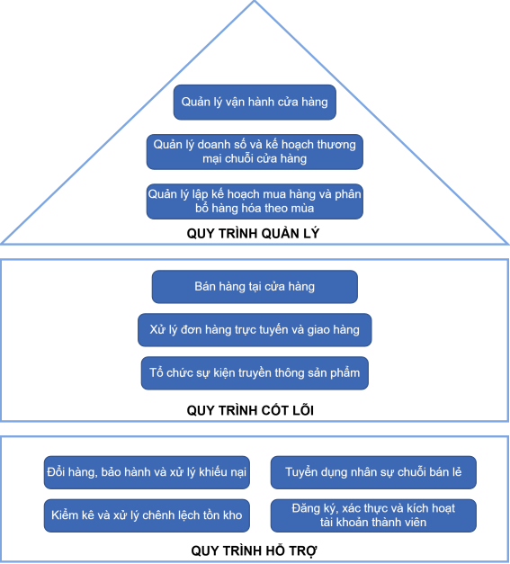

## Chương 1. Liệt kê quy trình nghiệp vụ

**Người thực hiện:** Nguyễn Thanh Thịnh (22730096)
**Ngày:** 20/08/2026
**Phạm vi:** toàn bộ Chương 1 theo cấu trúc báo cáo mới (xem [00-gioi-thieu-va-tom-tat.md](00-gioi-thieu-va-tom-tat.md) mục "Cấu trúc báo cáo"): phân loại quy trình theo 3 cấp, kiến trúc quy trình tổng quát và danh mục 10 quy trình chính thức. Nội dung dựa trực tiếp trên kết quả kiểm kê thực tế đã thực hiện với cả 4 thành viên (Khang, Bảo, Hưng, Thịnh) và các quyết định đã chốt: đổi mã S1 trùng của Hưng → S5; xếp "Tổ chức sự kiện truyền thông sản phẩm" vào cấp Cốt lõi, mã C3; giữ K1/K2/K3 ở cấp Hỗ trợ, đưa vào phần mở rộng, không tính vào 10 quy trình tối thiểu.

### 1.1. Phân loại quy trình

Theo khuôn phân loại BPM ba cấp (Quản lý — Cốt lõi — Hỗ trợ) mà báo cáo mẫu FUTA Bus Lines áp dụng, nhóm thống nhất định nghĩa từng cấp cho bối cảnh ACFC như sau:

- **Cấp Quản lý (Management):** các quy trình điều phối, hoạch định chiến lược và ra quyết định điều hành ở cấp chuỗi/khu vực — không trực tiếp giao dịch với khách hàng cuối, mà định hướng và kiểm soát cho các quy trình Cốt lõi và Hỗ trợ vận hành đúng mục tiêu kinh doanh. Ví dụ: hoạch định kế hoạch mua hàng theo mùa, quản lý vận hành cửa hàng, quản lý doanh số và kế hoạch thương mại.
- **Cấp Cốt lõi (Core):** các quy trình trực tiếp tạo ra giá trị cho khách hàng cuối, gắn liền với trải nghiệm hoặc giao dịch mà khách hàng thực sự tham gia hoặc thụ hưởng trực tiếp — không giới hạn ở hành vi mua–bán, mà bao gồm cả các điểm chạm tạo trải nghiệm thương hiệu trực tiếp với khách hàng. Đây là nguyên tắc phân loại được áp dụng nhất quán để xếp "Tổ chức sự kiện truyền thông sản phẩm" (C3) vào cấp Cốt lõi: khách hàng là bên trực tiếp nhận trải nghiệm và thông tin sản phẩm tại sự kiện, dù bản thân quy trình không kết thúc bằng một giao dịch mua–bán tức thời như C1/C2.
- **Cấp Hỗ trợ (Support):** các quy trình cung cấp nguồn lực, dữ liệu hoặc điều kiện nền tảng để cấp Quản lý và Cốt lõi vận hành, nhưng khách hàng cuối không trực tiếp tham gia hoặc không nhìn thấy quy trình diễn ra (ví dụ: kiểm kê tồn kho nội bộ, xác thực tài khoản, tuyển dụng nhân sự, xử lý khiếu nại sau bán). Cùng nguyên tắc "khách hàng không trực tiếp tham gia" này là căn cứ giữ cụm kho vận K1/K2/K3 ở cấp Hỗ trợ thay vì Cốt lõi — xem thêm mục 1.3.

> **Hình 1.1 — Sơ đồ kiến trúc quy trình tổng quát ACFC.**
>
> 
>
> Sơ đồ vẽ bằng draw.io (file nguồn: `so_do_quy_trinh.drawio`), thể hiện đúng ba lớp Quản lý — Cốt lõi — Hỗ trợ và danh mục 10 quy trình chính thức liệt kê ở mục 1.2.

### 1.2. Kiến trúc quy trình — Danh mục 10 quy trình chính thức

Danh mục dưới đây liệt kê đúng 10 quy trình tối thiểu theo yêu cầu rubric (mỗi cấp tối thiểu 3, cấp Hỗ trợ có 4). Mô tả mỗi quy trình chỉ ở mức 1–2 câu tóm tắt phạm vi; mô tả bằng lời đầy đủ (actor, trigger, outcome, các bước) thuộc phạm vi Chương 2 (mô hình hóa), không lặp lại ở đây.

#### 1.2.1. Cấp Quản lý (3 quy trình)

| Mã | Tên quy trình | Người phụ trách | Mô tả ngắn | Trạng thái BPMN |
|---|---|---|---|---|
| M1 | Quản lý vận hành cửa hàng | Lương Triệu Khang | Điều phối hoạt động vận hành hằng ngày tại các cửa hàng thuộc hệ thống ACFC. Đã có hồ sơ khám phá cùng phân tích định tính, định lượng đầy đủ. | Chưa vẽ — nằm trong nhóm 6 BPMN chính thức dự kiến (cần Khang bổ sung, xem mục 1.4) |
| M2 | Quản lý doanh số và kế hoạch thương mại chuỗi cửa hàng | **Chưa phân công** | Hoạch định mục tiêu doanh số và kế hoạch thương mại cho toàn chuỗi cửa hàng. Mô tả dự kiến theo tên quy trình — chưa có hồ sơ khám phá, cần xác thực khi phân công. | Chưa vẽ — không thuộc nhóm 6 chính thức, chỉ mô tả bằng lời |
| M3 | Lập kế hoạch mua hàng và phân bổ hàng hóa theo mùa | Nguyễn Công Hưng | Hoạch định kế hoạch mua hàng theo mùa vụ và phân bổ hàng hóa cho hệ thống kho/cửa hàng. Đã hoàn chỉnh AS-IS và phân tích định tính, định lượng. | Đã vẽ (mô hình collaboration 2 pool cùng S3, file `bpmn-kho-van-hanh-m3-s3.svg`) — thuộc nhóm 6 chính thức |

#### 1.2.2. Cấp Cốt lõi (3 quy trình)

| Mã | Tên quy trình | Người phụ trách | Mô tả ngắn | Trạng thái BPMN |
|---|---|---|---|---|
| C1 | Bán hàng tại cửa hàng | **Chưa phân công** | Giao dịch bán hàng trực tiếp giữa nhân viên bán hàng và khách hàng tại điểm bán. Mô tả dự kiến theo tên quy trình — chưa có hồ sơ khám phá, cần xác thực khi phân công. | Chưa vẽ — không thuộc nhóm 6 chính thức, chỉ mô tả bằng lời |
| C2 | Xử lý đơn hàng trực tuyến (và giao hàng) | Huỳnh Gia Bảo | Tiếp nhận, xử lý và giao đơn hàng đặt qua kênh thương mại điện tử của ACFC. Đã hoàn chỉnh AS-IS, phân tích định tính (kèm phân tích Pareto vấn đề) và định lượng. | Đã vẽ (draw.io, `xu-ly-don-hang-truc-tuyen.svg`) — thuộc nhóm 6 chính thức; **số cổng chưa kiểm đếm, cần Bảo xác nhận** |
| C3 | Tổ chức sự kiện truyền thông sản phẩm | Huỳnh Gia Bảo | Tổ chức các sự kiện truyền thông/trải nghiệm sản phẩm trực tiếp cho khách hàng, Process Owner là Phòng Marketing. Đã hoàn chỉnh AS-IS, phân tích định tính (kèm Pareto vấn đề) và định lượng. | Đã vẽ (bpmn-js, `to-chuc-su-kien-truyen-thong-san-pham.svg`) — thuộc nhóm 6 chính thức; **số cổng chưa kiểm đếm, cần Bảo xác nhận**; hiện chưa có mã chính thức trong file gốc của Bảo, cần cập nhật thành C3 |

#### 1.2.3. Cấp Hỗ trợ (4 quy trình)

| Mã | Tên quy trình | Người phụ trách | Mô tả ngắn | Trạng thái BPMN |
|---|---|---|---|---|
| S1 | Đổi hàng, bảo hành và xử lý khiếu nại | Lương Triệu Khang | Xử lý các yêu cầu đổi hàng, bảo hành và khiếu nại của khách hàng sau khi mua. Đã có phân tích định tính, định lượng đầy đủ. | Chưa vẽ — không thuộc nhóm 6 chính thức, chỉ mô tả bằng lời (có thể bổ sung BPMN sau nếu còn thời gian) |
| S2 | Xử lý yêu cầu quyền dữ liệu cá nhân | **Chưa phân công** | Tiếp nhận và xử lý yêu cầu của khách hàng liên quan đến quyền đối với dữ liệu cá nhân (truy cập, chỉnh sửa, xóa dữ liệu). Mô tả dự kiến theo tên quy trình — chưa có hồ sơ khám phá, cần xác thực khi phân công. | Chưa vẽ — không thuộc nhóm 6 chính thức, chỉ mô tả bằng lời |
| S3 | Kiểm kê và xử lý chênh lệch tồn kho | Nguyễn Công Hưng | Thực hiện kiểm kê định kỳ và xử lý chênh lệch giữa tồn kho hệ thống và tồn kho thực tế. Đã hoàn chỉnh AS-IS, phân tích định tính, định lượng. | Đã vẽ (cùng file collaboration 2 pool với M3) — ứng viên cho nhóm 6 chính thức |
| S4 | Đăng ký, xác thực OTP và kích hoạt tài khoản thành viên | Nguyễn Công Hưng | Xử lý quy trình đăng ký, xác thực OTP và kích hoạt tài khoản thành viên khách hàng thân thiết. Đã hoàn chỉnh AS-IS, phân tích định tính, định lượng. | Đã vẽ (8 cổng XOR, có split & join) — thuộc nhóm 6 chính thức (gợi ý) |

**Về việc chọn 2/3 quy trình Hỗ trợ cho nhóm 6 BPMN chính thức:** cả ba ứng viên đã hoàn thiện BPMN của Hưng — S3 (Kiểm kê tồn kho), S4 (Đăng ký/OTP/kích hoạt tài khoản) và S5 (Tuyển dụng nhân sự, xem mục 1.3) — đều đạt chất lượng tương đương (8–9 cổng). Gợi ý của báo cáo này là **chọn S4 và S5**, không chọn S3, vì lý do kỹ thuật: sơ đồ BPMN của S3 là *cùng một file collaboration 2 pool* với M3 (`bpmn-kho-van-hanh-m3-s3.svg`) — nếu tính cả M3 (cấp Quản lý) và S3 (cấp Hỗ trợ) vào nhóm 6 chính thức, thực chất chỉ có 5 sơ đồ BPMN độc lập chứ không phải 6, vì một file được đếm hai lần ở hai cấp khác nhau. Đây là **gợi ý, không phải quyết định cuối**; nhóm có thể đổi nếu có cách xử lý khác cho vấn đề "một file, hai quy trình, hai cấp" (ví dụ: tách S3 thành sơ đồ riêng, hoặc chấp nhận đếm M3+S3 là 2 quy trình dù chung 1 file collaboration).

### 1.3. Phần mở rộng (không bắt buộc)

Ngoài 10 quy trình chính thức, hai nhóm nội dung sau đã có tiến độ đáng kể nhưng nằm ngoài mức tối thiểu của rubric. Theo tinh thần ROADMAP của nhóm ("làm đúng tối thiểu trước, dư sức thì mở rộng"), đề xuất giữ lại làm phần mở rộng/phụ lục thay vì bỏ đi, để tận dụng công sức đã bỏ ra:

- **S5 — Tuyển dụng và tiếp nhận (onboarding) nhân sự (Nguyễn Công Hưng).** Đây là quy trình vốn mang mã S1 trùng với S1 của Khang, đã được đổi thành S5 theo quyết định xử lý xung đột mã. Đã hoàn chỉnh AS-IS, BPMN (8 cổng XOR) và phân tích định tính, định lượng. Nếu không được chọn vào nhóm 6 BPMN chính thức (xem gợi ý ở mục 1.2.3), quy trình này vẫn có thể trình bày như phần mở rộng đã hoàn thiện đầy đủ.
- **Cụm K1/K2/K3 — chuỗi vận hành kho (Nguyễn Công Hưng):** K1 (Nhận hàng, kiểm tra chất lượng và nhập kho từ chủ thương hiệu), K2 (Xuất kho và điều chuyển phân bổ tới chuỗi cửa hàng), K3 (Thu hồi và xử lý hàng trả về/hàng lỗi). Cả ba đều đã có AS-IS (bảng bước + kịch bản) và BPMN đầy đủ (9 cổng, có AND split/join mỗi quy trình) — chất lượng sơ đồ thuộc loại tốt nhất trong toàn bộ kho tài liệu hiện có. Tuy nhiên, khác với S3/S4/S5, cụm K1/K2/K3 **chưa có phân tích định tính và định lượng riêng**, nên chưa hoàn thiện toàn phần theo đúng nghĩa "đã xong" như các quy trình khác trong nhóm 6. Ngoài ba quy trình, còn có sơ đồ `bpmn-kho-van-hanh-k1-k2-k3.svg` — đây là **một view tổng hợp gộp cả ba pool K1+K2+K3 cùng khối liên kết M3↔S3 để minh họa dòng chảy chuỗi cung ứng**, không phải một quy trình thứ 15 độc lập, không tính riêng vào danh mục.
