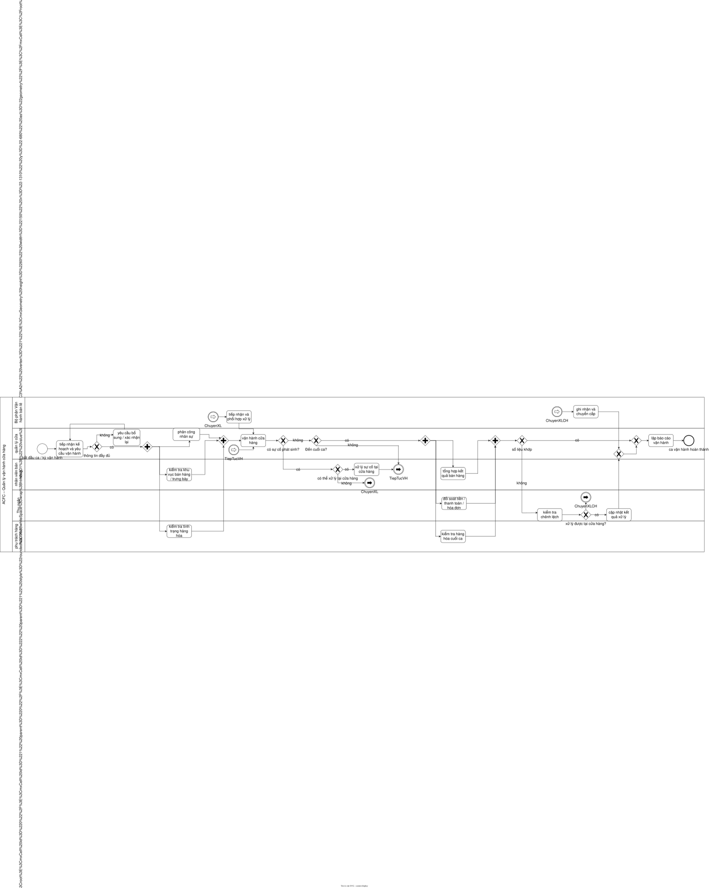
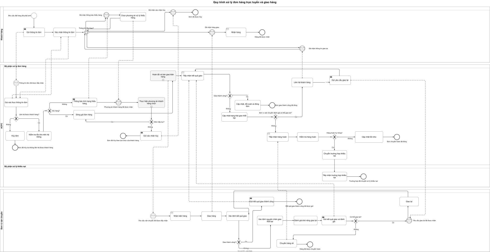
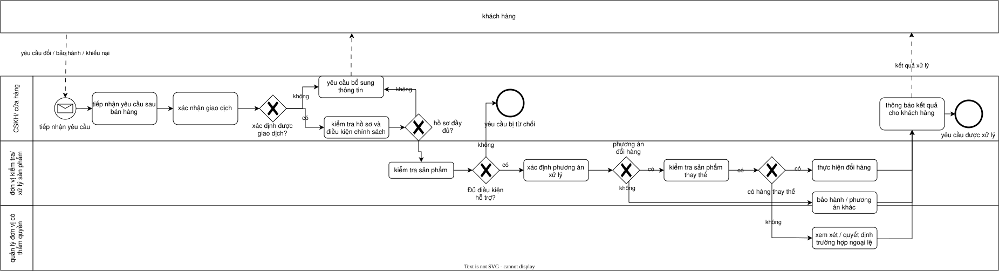
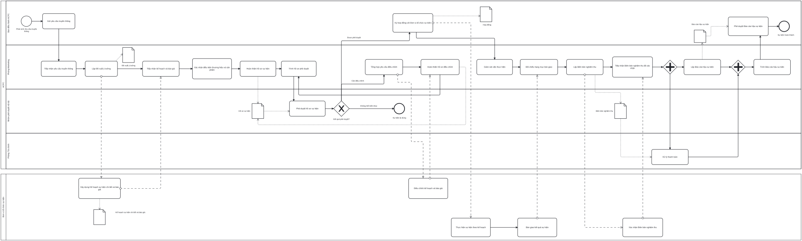
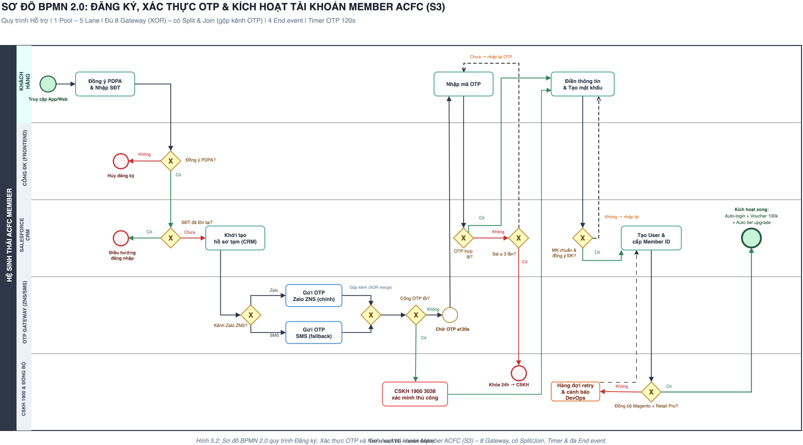

# Chương 2. Mô hình hóa quy trình nghiệp vụ

**Phạm vi:** trình bày 6 quy trình được nhóm chọn để mô hình hóa bằng BPMN 2.0, theo đúng cách FUTA Bus Lines tách bạch phần "khám phá & mô tả" (đầu vào cho mô hình hóa) và phần "mô hình hóa BPMN" — phân tích định tính/định lượng để dành Chương 3, không lặp lại ở đây.

---

## 2.1. M1 — Quản lý vận hành cửa hàng

### 2.1.1. Phương pháp thực hiện

#### 2.1.1.1. Dựa trên bằng chứng

##### a. Mô tả quy trình

**Bước 1 — Tiếp nhận kế hoạch và yêu cầu vận hành**
Mục tiêu: nắm đầy đủ thông tin cần thiết trước khi bắt đầu ca.
Thực hiện: quản lý cửa hàng tiếp nhận kế hoạch/mục tiêu vận hành, lịch làm việc và thông tin nhân sự cho ca sắp tới. Nếu thông tin nhận được chưa đầy đủ, quản lý cửa hàng yêu cầu bổ sung hoặc xác nhận lại trước khi tiếp tục; khi đã đầy đủ, chuyển sang bước 2.

**Bước 2 — Chuẩn bị cửa hàng**
Mục tiêu: đảm bảo nhân sự, khu vực bán hàng và hàng hóa sẵn sàng trước khi mở cửa.
Thực hiện: quản lý cửa hàng phân công nhân sự cho ca; song song, nhân viên bán hàng kiểm tra khu vực bán hàng/trưng bày và nhân sự phụ trách hàng hóa/kho kiểm tra tình trạng hàng hóa.

**Bước 3 — Vận hành trong ca**
Mục tiêu: phục vụ khách hàng và duy trì hoạt động cửa hàng theo đúng kế hoạch.
Thực hiện: nhân viên bán hàng và thu ngân thực hiện các nghiệp vụ bán hàng, thanh toán; quản lý cửa hàng theo dõi hoạt động chung. Nếu trong ca có sự cố phát sinh, chuyển sang bước 4; nếu không, ca tiếp tục đến giờ đóng cửa và chuyển sang bước 5.

**Bước 4 — Xử lý sự cố phát sinh**
Mục tiêu: hạn chế ảnh hưởng của sự cố đến hoạt động bán hàng và trải nghiệm khách hàng.
Thực hiện: quản lý cửa hàng đánh giá mức độ sự cố. Sự cố trong khả năng xử lý của cửa hàng thì xử lý ngay tại chỗ; sự cố vượt khả năng thì chuyển cho Retail Operations tiếp nhận và phối hợp xử lý. Sau khi xử lý xong, ca vận hành tiếp tục cho đến giờ đóng cửa.

**Bước 5 — Đối soát cuối ca**
Mục tiêu: tổng hợp đầy đủ kết quả bán hàng, tiền và hàng hóa khi kết thúc ca.
Thực hiện: thu ngân đối soát tiền/thanh toán/hóa đơn, nhân sự phụ trách hàng hóa/kho kiểm tra hàng hóa cuối ca, quản lý cửa hàng tổng hợp kết quả bán hàng — ba việc này thực hiện song song. Nếu số liệu khớp, chuyển sang bước 7; nếu phát hiện chênh lệch, chuyển sang bước 6.

**Bước 6 — Xử lý chênh lệch**
Mục tiêu: xác định nguyên nhân và xử lý chênh lệch trước khi đóng ca.
Thực hiện: quản lý cửa hàng kiểm tra chênh lệch giữa số liệu ghi nhận và thực tế. Chênh lệch xác định và xử lý được thì cập nhật kết quả xử lý rồi chuyển sang bước 7; chênh lệch không xử lý được tại cửa hàng thì được ghi nhận và chuyển cấp cho Retail Operations.

**Bước 7 — Lập báo cáo và đóng ca**
Mục tiêu: hoàn tất ca vận hành với đầy đủ thông tin được ghi nhận.
Thực hiện: quản lý cửa hàng lập báo cáo vận hành tổng hợp kết quả bán hàng, tình trạng hàng hóa và các vấn đề phát sinh trong ca; ca vận hành hoàn thành.

**Kịch bản kết thúc quy trình**

| Kịch bản | Mô tả |
|---|---|
| Hoàn thành bình thường | Ca kết thúc đúng kế hoạch, không phát sinh sự cố hay chênh lệch |
| Có sự cố nhưng xử lý được tại cửa hàng | Sự cố phát sinh trong ca nằm trong khả năng xử lý của cửa hàng, ca vẫn đóng bình thường |
| Có chênh lệch nhưng xác định và xử lý được | Chênh lệch được xác định nguyên nhân và xử lý trước khi lập báo cáo |
| Vấn đề phải chuyển cấp | Sự cố hoặc chênh lệch vượt khả năng xử lý, chuyển cho Retail Operations |

##### b. Sơ đồ tổ chức

**1. Quản lý cửa hàng**
- Tiếp nhận kế hoạch, phân công nhân sự
- Theo dõi vận hành trong ca, đánh giá và xử lý hoặc chuyển cấp sự cố
- Tổng hợp kết quả bán hàng, kiểm tra chênh lệch, lập báo cáo vận hành

**2. Nhân viên bán hàng**
- Kiểm tra khu vực bán hàng/trưng bày đầu ca
- Phục vụ khách hàng trong suốt ca

**3. Thu ngân**
- Thực hiện thanh toán, hóa đơn trong ca
- Đối soát tiền/thanh toán/hóa đơn cuối ca

**4. Nhân sự phụ trách hàng hóa/kho**
- Kiểm tra tình trạng hàng hóa đầu ca
- Kiểm tra hàng hóa cuối ca, hỗ trợ xác định chênh lệch

**5. Retail Operations**
- Tiếp nhận và phối hợp xử lý sự cố vượt khả năng của cửa hàng
- Tiếp nhận các trường hợp chênh lệch không xử lý được tại cửa hàng

| Bước | Actor chính |
|---|---|
| 1. Tiếp nhận kế hoạch | Quản lý cửa hàng |
| 2. Chuẩn bị cửa hàng | Quản lý cửa hàng, Nhân viên bán hàng, Phụ trách hàng hóa/kho |
| 3. Vận hành trong ca | Nhân viên bán hàng, Thu ngân, Quản lý cửa hàng |
| 4. Xử lý sự cố | Quản lý cửa hàng, Retail Operations |
| 5. Đối soát cuối ca | Thu ngân, Phụ trách hàng hóa/kho, Quản lý cửa hàng |
| 6. Xử lý chênh lệch | Quản lý cửa hàng, Retail Operations |
| 7. Lập báo cáo | Quản lý cửa hàng |

##### c. Kế hoạch làm việc `[giả định]`

Mục tiêu kế hoạch: phân bổ nhân sự hợp lý theo khung giờ cao điểm/thấp điểm trong ca, rút ngắn thời gian đóng ca và hạn chế chênh lệch.

| Ca | Người thực hiện | Công việc |
|---|---|---|
| Sáng (9h–14h) | Quản lý cửa hàng | Tiếp nhận kế hoạch, phân công nhân sự, kiểm tra khu vực bán hàng và hàng hóa đầu ca |
| | Nhân viên bán hàng, Thu ngân | Phục vụ khách hàng, thực hiện giao dịch bán hàng |
| Chiều (14h–18h) | Nhân viên bán hàng, Thu ngân | Phục vụ khách hàng, xử lý giao dịch giờ cao điểm |
| | Quản lý cửa hàng | Theo dõi vận hành, xử lý sự cố phát sinh nếu có |
| Tối (18h–22h) | Toàn bộ nhân sự ca | Phục vụ khách hàng đến giờ đóng cửa |
| | Thu ngân, Phụ trách hàng hóa/kho | Đối soát tiền/hóa đơn, kiểm tra hàng hóa cuối ca |
| | Quản lý cửa hàng | Xử lý chênh lệch nếu có, lập báo cáo vận hành |

| Ngày | Người thực hiện | Công việc |
|---|---|---|
| Thứ 2 | Quản lý cửa hàng | Họp đầu tuần với nhân viên, rà soát kế hoạch doanh số và lịch làm việc trong tuần |
| Thứ 3 – Thứ 6 | Toàn bộ nhân sự ca | Vận hành theo quy trình hằng ngày (bước 1–7) |
| Thứ 7, Chủ nhật | Toàn bộ nhân sự ca | Vận hành theo quy trình hằng ngày, tăng cường nhân sự do lượng khách cao điểm cuối tuần |
| Cuối tuần (định kỳ) | Quản lý cửa hàng, Phụ trách hàng hóa/kho | Kiểm kê định kỳ, đối chiếu với kết quả các ca trong tuần |

Vào cuối mỗi tháng, quản lý cửa hàng tổng hợp kết quả vận hành của cả tháng và cùng Retail Operations rà soát các trường hợp chuyển cấp lặp lại để đề xuất điều chỉnh quy trình hoặc bổ sung đào tạo nhân sự.

##### d. Công nghệ hỗ trợ

- **Retail Pro Prism** — hệ thống POS ghi nhận giao dịch bán hàng, thanh toán và tồn kho tại cửa hàng; đây là hệ thống cùng được nhắc đến khi đồng bộ dữ liệu tài khoản thành viên ở quy trình S4, dùng chung cho vận hành bán lẻ của ACFC.
- Kênh liên lạc nội bộ (điện thoại/ứng dụng nhắn tin nội bộ) để quản lý cửa hàng báo cáo và phối hợp với Retail Operations khi chuyển cấp sự cố hoặc chênh lệch `[giả định]`.

##### e. Rủi ro & giải pháp

| Rủi ro | Giải pháp |
|---|---|
| Chênh lệch số liệu cuối ca buộc phải kiểm tra lại nhiều lần, kéo dài thời gian đóng ca | Chuẩn hóa checklist đóng ca, thiết lập cảnh báo sớm cho các chênh lệch có thể phát hiện trước cuối ca |
| Sự cố chuyển cấp phải chờ phản hồi từ Retail Operations, làm gián đoạn xử lý | Xác định rõ đầu mối tiếp nhận từng loại sự cố, quy định thời gian phản hồi (SLA) cụ thể |
| Thông tin hàng hóa và bán hàng nằm ở nhiều nguồn khiến nhân viên phải kiểm tra, tổng hợp trùng lặp | Tập trung dữ liệu về một nguồn thống nhất, giảm nhập liệu lặp lại |

##### f. Thuật ngữ và sổ tay

| Thuật ngữ | Định nghĩa |
|---|---|
| Ca vận hành | Khoảng thời gian cửa hàng hoạt động liên tục dưới sự điều phối của một quản lý cửa hàng, từ lúc chuẩn bị đến khi đóng ca |
| Chuyển cấp | Việc chuyển một sự cố hoặc chênh lệch vượt khả năng xử lý của cửa hàng lên Retail Operations |
| Đối soát | Việc kiểm tra, so khớp số liệu tiền/hóa đơn ghi nhận trong ca với thực tế |
| Chênh lệch | Sự khác biệt giữa số liệu ghi nhận (tiền, hàng hóa) và số liệu thực tế khi kiểm tra |
| Retail Operations | Bộ phận vận hành bán lẻ cấp trên cửa hàng, tiếp nhận các vấn đề vượt thẩm quyền xử lý tại chỗ |
| POS (Point of Sale) | Hệ thống ghi nhận giao dịch bán hàng và thanh toán tại điểm bán |
| Rework | Công việc phải làm lại do phát sinh lỗi hoặc chênh lệch ở bước trước |

#### 2.1.1.2. Phỏng vấn

**Câu hỏi định tính**

> Nguồn: tổng hợp và biên tập từ mục "Các điểm cần xác nhận" trong `docs/workspaces/LuongTrieuKhang/Quy_Trinh/ho-so-kham-pha/M1-quan-ly-van-hanh-cua-hang-ho-so-kham-pha.md` và mục "6. Nội dung cần xác nhận bằng phỏng vấn/dữ liệu thực tế" trong `docs/workspaces/LuongTrieuKhang/Quy_Trinh/phan-tich-dinh-tinh/M1-quan-ly-van-hanh-cua-hang-phan-tich-dinh-tinh.md` (Lương Triệu Khang).

1. Process Owner chính thức của quy trình vận hành cửa hàng là quản lý cửa hàng hay một chức danh khác?
2. Quản lý cửa hàng nhận kế hoạch/mục tiêu vận hành trực tiếp từ Retail Operations hay từ một đơn vị khác?
3. Những hoạt động nào bắt buộc phải hoàn tất trước khi mở cửa cho khách?
4. Việc kiểm tra cuối ca hiện gồm chính xác những nội dung nào?
5. Cửa hàng có checklist mở ca/đóng ca chính thức hay đang thực hiện theo kinh nghiệm cá nhân của từng quản lý?
6. Những loại sự cố nào cửa hàng được phép tự xử lý, và loại nào bắt buộc phải chuyển cấp?
7. Khi phát sinh chênh lệch tiền hoặc hàng hóa, đơn vị nào chịu trách nhiệm xử lý tiếp nếu cửa hàng không tự giải quyết được?
8. ACFC đang dùng hệ thống hoặc biểu mẫu nào để ghi nhận kết quả vận hành mỗi ca?
9. Có tình trạng phải nhập hoặc tổng hợp lại cùng một thông tin ở nhiều nơi khác nhau hay không?
10. Có quy định thời gian phản hồi (SLA) khi cửa hàng chuyển sự cố lên Retail Operations hay không?

**Câu hỏi định lượng**

> Nguồn: chuyển thể từ bảng "6. Dữ liệu cần thu thập" và các công thức tại mục 2 (Phân tích thời gian) trong `docs/workspaces/LuongTrieuKhang/Quy_Trinh/phan-tich-dinh-luong/M1-quan-ly-van-hanh-cua-hang-phan-tich-dinh-luong.md` (Lương Triệu Khang).

1. Thời gian trung bình để hoàn tất chuẩn bị đầu ca là bao lâu?
2. Thời gian trung bình để xử lý một sự cố phát sinh trong ca là bao lâu, tính từ lúc phát hiện đến lúc xử lý xong hoặc chuyển cấp?
3. Thời gian trung bình để hoàn tất đối soát và đóng ca là bao lâu?
4. Trung bình mỗi ca phát sinh bao nhiêu sự cố, và bao nhiêu phần trăm trong số đó được xử lý ngay tại cửa hàng?
5. Tỷ lệ ca không phát sinh chênh lệch so với tổng số ca là bao nhiêu?
6. Khi có chênh lệch, thời gian trung bình để xác định nguyên nhân và xử lý là bao lâu?
7. Tỷ lệ sự cố phải chuyển cấp lên Retail Operations là bao nhiêu, và thời gian phản hồi trung bình từ Retail Operations là bao lâu?
8. Chi phí nhân công theo giờ cho các vị trí tham gia ca vận hành (quản lý cửa hàng, nhân viên bán hàng, thu ngân) hiện được tính như thế nào?
9. Giá trị tổn thất trung bình khi phát sinh chênh lệch tiền hoặc hàng hóa (nếu có dữ liệu) là bao nhiêu?
10. Tỷ lệ ca phải kiểm tra hoặc làm lại (rework) do chênh lệch là bao nhiêu trên tổng số ca?

### 2.1.2. Mô hình hóa quy trình

> **Hình 2.1 — Sơ đồ BPMN quy trình M1 (Quản lý vận hành cửa hàng).**
>
> 

Sơ đồ tổ chức theo các lane tương ứng bốn actor tham gia trực tiếp: **nhân viên bán hàng**, **thu ngân**, **phụ trách hàng hóa/kho** và **Retail Operations**, cùng dòng chảy chính do quản lý cửa hàng điều phối xuyên suốt.

---

## 2.2. Kho vận hành — Nhập kho, xuất kho & thu hồi hàng trả (K1 – K2 – K3)

### 2.2.1. Phương pháp thực hiện

#### 2.2.1.1. Dựa trên bằng chứng

##### a. Mô tả quy trình

Kho vận hành gồm ba quy trình nối tiếp tại Trung tâm phân phối (DC): **K1** nhận hàng từ chủ thương hiệu và tạo tồn đầu vào, **K2** xuất kho theo lệnh phân bổ của M3 tới cửa hàng, **K3** khép vòng bằng thu hồi và xử lý hàng trả về hoặc hàng lỗi. Cả ba đồng bộ dữ liệu tồn với S3/M3 qua message flow.

**K1 — Nhận hàng, kiểm tra chất lượng (QC) và nhập kho**

**Bước 1 — Tiếp nhận xe hàng và kiểm tra chứng từ**
Mục tiêu: xác nhận lô hàng cập dock đúng với thông báo giao hàng trước khi dỡ hàng.
Thực hiện: Kho nhận hàng/Dock tiếp nhận xe và dỡ hàng tại dock sau khi nhận ASN (Advance Shipping Notice) và lịch giao từ chủ thương hiệu; bộ phận Chứng từ & Ngoại lệ kiểm tra chứng từ có khớp PO/ASN hay không. Nếu khớp, chuyển sang bước 2; nếu không khớp, lập biên bản sai lệch chứng từ và từ chối nhận lô, quy trình kết thúc.

**Bước 2 — Đối chiếu số lượng thực nhận**
Mục tiêu: xác nhận số lượng hàng nhận đúng với chứng từ trước khi đưa vào kiểm tra chất lượng.
Thực hiện: Kho nhận hàng/Dock đếm và đối chiếu số lượng thực nhận với chứng từ. Nếu khớp, chuyển sang bước 3; nếu thiếu hoặc thừa, ghi nhận chênh lệch và thông báo cho nhà cung cấp, sau đó vẫn tiếp tục nhập phần hàng đã khớp sang bước 3.

**Bước 3 — Kiểm tra chất lượng (QC) và tách lô**
Mục tiêu: đảm bảo chỉ hàng đạt chuẩn được nhập kho.
Thực hiện: QC/Kiểm định lấy mẫu, đánh giá kết quả và mức lỗi. Nếu mẫu đạt toàn bộ, cả lô chuyển sang bước 4; nếu không đạt toàn bộ, lô bị trả lại nhà cung cấp và quy trình kết thúc; nếu chỉ lỗi một phần, Thủ kho/WMS tách lô — phần đạt QC chuyển sang bước 4, phần lỗi trả lại nhà cung cấp.

**Bước 4 — Dán nhãn, định vị và cập nhật tồn kho**
Mục tiêu: chuẩn bị hàng sẵn sàng lên kệ và đồng bộ dữ liệu tồn.
Thực hiện: Thủ kho/WMS thực hiện song song hai việc — dán nhãn SKU/định vị (slotting) và cập nhật dữ liệu tồn trên hệ thống WMS/ERP — trước khi cùng chuyển sang bước 5.

**Bước 5 — Cất hàng và kiểm tra nhu cầu cross-dock**
Mục tiêu: hoàn tất nhập kho hoặc chuyển thẳng hàng đến cửa hàng nếu có nhu cầu gấp.
Thực hiện: Thủ kho/WMS cất hàng lên vị trí (putaway), sau đó kiểm tra có nhu cầu cross-dock tới cửa hàng hay không. Nếu có, tạo yêu cầu cross-dock và chuyển thẳng sang quy trình K2; nếu không, cập nhật sổ tồn đầu vào và gửi thông tin tồn sang S3/M3, quy trình K1 kết thúc.

**K2 — Xuất kho và điều chuyển tới cửa hàng**

**Bước 1 — Kiểm tra tồn khả dụng theo lệnh phân bổ**
Mục tiêu: xác định lệnh phân bổ từ M3 có đủ hàng để thực hiện hay không.
Thực hiện: Điều phối phân bổ nhận lệnh phân bổ từ M3 và kiểm tra tồn khả dụng (ATP). Nếu đủ, chuyển sang bước 3; nếu không đủ, chuyển sang bước 2.

**Bước 2 — Xử lý khi tồn không đủ**
Mục tiêu: quyết định giao một phần hay hoãn cả lệnh phân bổ khi thiếu hàng.
Thực hiện: nếu được phép giao một phần, bộ phận Cửa hàng & Ngoại lệ thực hiện giao phần có sẵn và tạo backorder cho phần còn thiếu, sau đó chuyển sang bước 3; nếu không được giao một phần, lệnh phân bổ bị hoãn và thông báo về M3, quy trình kết thúc.

**Bước 3 — Lập phiếu xuất kho và soạn hàng**
Mục tiêu: chuẩn bị đúng và đủ hàng theo lệnh phân bổ.
Thực hiện: Điều phối phân bổ lập phiếu xuất kho (DO); Kho xuất – Picking soạn hàng theo phiếu và kiểm tra kết quả soạn có khớp DO hay không. Nếu khớp, chuyển sang bước 4; nếu không khớp, soạn lại trước khi tiếp tục.

**Bước 4 — Đóng gói, lập chứng từ và bàn giao vận chuyển**
Mục tiêu: đưa hàng vào luồng vận chuyển tới cửa hàng.
Thực hiện: Kho xuất – Packing thực hiện song song đóng gói/dán nhãn kiện và lập chứng từ xuất/kế hoạch tuyến, sau đó bàn giao cho đơn vị vận chuyển 3PL.

**Bước 5 — Vận chuyển và xác nhận kết quả giao**
Mục tiêu: đưa hàng đến cửa hàng và xác nhận kết quả.
Thực hiện: Vận chuyển/3PL vận chuyển tới cửa hàng và xác nhận giao thành công hay không. Nếu giao không thành công, kiện hàng được trả về DC, lập biên bản và chuyển sang quy trình K3 để thu hồi, quy trình K2 kết thúc tại đây. Nếu giao thành công, chuyển sang bước 6.

**Bước 6 — Cửa hàng nhận và cập nhật tồn**
Mục tiêu: xác nhận hàng đến đúng và đủ, hoàn tất điều chuyển.
Thực hiện: bộ phận Cửa hàng & Ngoại lệ nhận và kiểm đếm hàng; nếu khớp, hoặc sau khi đã ghi nhận thiếu/thừa và mở khiếu nại nếu không khớp, cửa hàng cập nhật tồn và gửi thông tin tồn sang S3/M3, đóng lệnh, quy trình kết thúc.

**K3 — Thu hồi và xử lý hàng trả về/hàng lỗi**

**Bước 1 — Tiếp nhận yêu cầu trả hàng**
Mục tiêu: xác nhận yêu cầu trả hàng hợp lệ trước khi xử lý tiếp.
Thực hiện: Tiếp nhận & RMA tiếp nhận yêu cầu trả hàng từ K2 hoặc từ cửa hàng, lập phiếu RMA và kiểm tra yêu cầu có đúng chính sách và còn trong thời hạn trả hay không. Nếu đúng, chuyển sang bước 2; nếu sai chính sách hoặc quá thời hạn, từ chối và phản hồi khách hàng, quy trình kết thúc.

**Bước 2 — Giám định và phân hạng**
Mục tiêu: xác định hướng xử lý phù hợp với tình trạng hàng trả.
Thực hiện: Giám định & Phân hạng kiểm tra tình trạng hàng, xác định có thể bán lại nguyên trạng hay không; nếu không, kiểm tra còn bảo hành nhà cung cấp hay không; nếu hết bảo hành, đánh giá tiếp khả năng tân trang.

**Bước 3 — Xử lý theo phân hạng**
Mục tiêu: đưa hàng trả về một trong ba hướng xử lý.
Thực hiện: nếu bán lại được nguyên trạng hoặc tân trang đạt, bộ phận Xử lý (Disposition) chuyển hàng sang bước 4; nếu còn bảo hành nhà cung cấp, gửi trả/đổi với nhà cung cấp, quy trình kết thúc; nếu không còn bảo hành và không tân trang được (hoặc tân trang không đạt), loại bỏ/hủy hàng (scrap) và ghi nhận hao hụt gửi về S3/M3, quy trình kết thúc.

**Bước 4 — Cất hàng và cập nhật tồn**
Mục tiêu: đưa hàng đã xử lý trở lại tồn kho và đồng bộ dữ liệu.
Thực hiện: Kế toán & Cập nhật tồn thực hiện song song cất hàng lên kệ (putaway) và cập nhật tồn kho, gửi thông tin tồn sang S3/M3.

**Bước 5 — Đóng phiếu RMA và đề nghị hoàn tiền**
Mục tiêu: hoàn tất hồ sơ trả hàng.
Thực hiện: Kế toán & Cập nhật tồn đóng phiếu RMA; nếu trường hợp cần hoàn tiền, lập đề nghị hoàn tiền chuyển sang C4/Tài chính. Quy trình kết thúc.

**Kịch bản kết thúc quy trình**

| Kịch bản | Mô tả |
|---|---|
| Lô hàng được nhập kho, tồn đầu vào cập nhật (K1) | Chứng từ khớp, số lượng khớp, QC đạt toàn bộ, không cần cross-dock |
| Từ chối nhận lô do chứng từ không khớp (K1) | Chứng từ không khớp PO/ASN ngay từ đầu |
| Trả lại nhà cung cấp do không đạt QC (K1) | Mẫu QC không đạt toàn bộ hoặc phần lỗi tách ra sau QC |
| Chuyển cross-dock sang cửa hàng (K1 → K2) | Có nhu cầu giao gấp, hàng chuyển thẳng không lưu kho |
| Hàng điều chuyển đến cửa hàng, tồn cửa hàng cập nhật (K2) | Giao thành công, cửa hàng kiểm đếm khớp |
| Hoãn lệnh phân bổ (K2) | Tồn không đủ và không được phép giao một phần |
| Chuyển K3 thu hồi do giao không thành công (K2 → K3) | Đơn vị vận chuyển không giao được, hàng trả về DC |
| Từ chối yêu cầu trả hàng (K3) | Yêu cầu trả sai chính sách hoặc quá thời hạn |
| Đã chuyển nhà cung cấp bảo hành (K3) | Hàng còn bảo hành, gửi trả/đổi với nhà cung cấp |
| Ghi nhận hao hụt (K3) | Hàng không còn bảo hành và không tân trang được, phải loại bỏ |
| Hoàn tất xử lý trả hàng, đóng phiếu RMA (K3) | Hàng bán lại được hoặc tân trang đạt, đã cập nhật tồn, đóng phiếu RMA (kèm đề nghị hoàn tiền nếu có) |

##### b. Sơ đồ tổ chức

**1. Kho nhận hàng/Dock (K1)**
- Tiếp nhận xe hàng, kiểm tra chứng từ và đối chiếu số lượng thực nhận

**2. QC/Kiểm định (K1)**
- Lấy mẫu, đánh giá chất lượng và mức lỗi của lô hàng

**3. Thủ kho/WMS (K1)**
- Tách lô theo kết quả QC, dán nhãn/định vị, cập nhật tồn kho và cất hàng lên kệ
- Kiểm tra nhu cầu cross-dock và cập nhật sổ tồn đầu vào

**4. Điều phối phân bổ (K2)**
- Kiểm tra tồn khả dụng theo lệnh phân bổ từ M3, lập phiếu xuất kho

**5. Kho xuất – Picking/Packing (K2)**
- Soạn hàng theo phiếu xuất, đóng gói, dán nhãn kiện và lập chứng từ xuất

**6. Vận chuyển/3PL (K2)**
- Nhận bàn giao, vận chuyển tới cửa hàng và xác nhận kết quả giao

**7. Cửa hàng & Ngoại lệ (K2)**
- Nhận và kiểm đếm hàng, cập nhật tồn cửa hàng; xử lý giao một phần/backorder khi thiếu hàng

**8. Tiếp nhận & RMA (K3)**
- Tiếp nhận yêu cầu trả hàng, lập phiếu RMA, kiểm tra chính sách và thời hạn trả

**9. Giám định & Phân hạng (K3)**
- Giám định tình trạng hàng, phân hạng khả năng bán lại, bảo hành hoặc tân trang

**10. Xử lý — Disposition (K3)**
- Gửi trả/đổi nhà cung cấp, tân trang hoặc loại bỏ hàng theo phân hạng

**11. Kế toán & Cập nhật tồn (K3)**
- Cất hàng, cập nhật tồn kho, đóng phiếu RMA và lập đề nghị hoàn tiền khi cần

**12. Bên ngoài liên quan**
- Chủ thương hiệu/nhà cung cấp: gửi ASN và lịch giao hàng cho K1; nhận lại hàng bảo hành từ K3
- S3/M3: nhận dữ liệu tồn đầu vào từ K1, phát lệnh phân bổ cho K2, nhận dữ liệu tồn/hao hụt từ K3
- C4/Tài chính: nhận đề nghị hoàn tiền từ K3

| Bước | Actor chính |
|---|---|
| K1.1 Tiếp nhận và kiểm tra chứng từ | Kho nhận hàng/Dock |
| K1.2 Đối chiếu số lượng thực nhận | Kho nhận hàng/Dock |
| K1.3 Kiểm tra QC và tách lô | QC/Kiểm định, Thủ kho/WMS |
| K1.4 Dán nhãn, định vị và cập nhật tồn | Thủ kho/WMS |
| K1.5 Cất hàng và kiểm tra cross-dock | Thủ kho/WMS |
| K2.1 Kiểm tra tồn khả dụng | Điều phối phân bổ |
| K2.2 Xử lý khi tồn không đủ | Điều phối phân bổ, Cửa hàng & Ngoại lệ |
| K2.3 Lập phiếu xuất và soạn hàng | Điều phối phân bổ, Kho xuất – Picking |
| K2.4 Đóng gói, lập chứng từ và bàn giao | Kho xuất – Packing |
| K2.5 Vận chuyển và xác nhận kết quả | Vận chuyển/3PL |
| K2.6 Cửa hàng nhận và cập nhật tồn | Cửa hàng & Ngoại lệ |
| K3.1 Tiếp nhận yêu cầu trả hàng | Tiếp nhận & RMA |
| K3.2 Giám định và phân hạng | Giám định & Phân hạng |
| K3.3 Xử lý theo phân hạng | Xử lý (Disposition) |
| K3.4 Cất hàng và cập nhật tồn | Kế toán & Cập nhật tồn |
| K3.5 Đóng phiếu RMA và đề nghị hoàn tiền | Kế toán & Cập nhật tồn |

##### c. Kế hoạch làm việc `[giả định]`

Mục tiêu kế hoạch: xử lý hết lượng hàng cập dock, xuất kho và hàng trả phát sinh trong ngày, tránh tồn đọng qua ca sau.

| Ca | Người thực hiện | Công việc |
|---|---|---|
| Sáng (6h–12h) | Kho nhận hàng/Dock, QC/Kiểm định | Tiếp nhận xe hàng cập dock, kiểm tra chứng từ, đếm và QC các lô hàng đến trong ca |
| | Kho xuất – Picking/Packing | Soạn hàng và đóng gói các lệnh phân bổ phát sinh từ hôm trước |
| Chiều (12h–18h) | Thủ kho/WMS | Dán nhãn, cất hàng và cập nhật tồn cho các lô đã qua QC trong ngày |
| | Vận chuyển/3PL | Nhận bàn giao và khởi hành các chuyến giao trong ngày |
| Tối (18h–22h) | Tiếp nhận & RMA, Giám định & Phân hạng | Xử lý các yêu cầu trả hàng và hàng giao không thành công được trả về trong ngày |

| Ngày | Người thực hiện | Công việc |
|---|---|---|
| Đầu tuần | Điều phối phân bổ | Nhận và ưu tiên xử lý các lệnh phân bổ mới từ M3 |
| Giữa tuần | Toàn bộ nhân sự DC | Vận hành theo quy trình hằng ngày (K1 – K2 – K3) |
| Cuối tuần | Kế toán & Cập nhật tồn | Tổng hợp phiếu RMA và đề nghị hoàn tiền trong tuần, đối chiếu với S3/M3 |

Vào cuối mỗi tháng, Kế toán & Cập nhật tồn cùng Điều phối phân bổ tổng hợp số liệu nhập kho, xuất kho và hàng trả trong tháng để đối chiếu với S3/M3 và làm cơ sở rà soát các nguyên nhân chuyển hoàn hoặc hao hụt lặp lại.

##### d. Công nghệ hỗ trợ

- Hệ thống WMS/ERP dùng để cập nhật tồn đầu vào, tồn xuất kho và tồn hàng trả, đồng bộ dữ liệu với S3/M3 — tên hệ thống cụ thể chưa xác định được từ nguồn hiện có.
- Đơn vị vận chuyển 3PL bên ngoài đảm nhận tuyến giao DC-to-store cho K2.
- Phiếu xuất kho (DO) và phiếu RMA là chứng từ nội bộ dùng xuyên suốt K2–K3; hình thức giấy hay điện tử cụ thể `[giả định]`.

##### e. Rủi ro & giải pháp

| Rủi ro | Giải pháp |
|---|---|
| Chứng từ hoặc số lượng thực nhận không khớp ASN/PO khi hàng cập dock (K1) | Đối chiếu chứng từ và số lượng trước khi đưa vào QC; ghi nhận và thông báo nhà cung cấp ngay khi phát hiện lệch |
| Lô hàng không đạt QC toàn bộ hoặc một phần, phải trả lại nhà cung cấp (K1) | Tách lô ngay sau QC để chỉ phần đạt chuẩn được nhập kho, không giữ chung với phần lỗi |
| Tồn không đủ theo lệnh phân bổ, phải giao một phần và tạo backorder hoặc hoãn cả lệnh (K2) | Kiểm tra tồn khả dụng sớm, quy định rõ điều kiện được phép giao một phần theo loại hàng/mức ưu tiên |
| Giao hàng đến cửa hàng không thành công, phải trả về DC và chuyển K3 xử lý (K2) | Phối hợp đơn vị vận chuyển 3PL xác nhận thông tin nhận hàng tại cửa hàng trước khi giao |
| Hàng trả không còn bảo hành và không tân trang được, phải loại bỏ và ghi nhận hao hụt (K3) | Giám định và phân hạng sớm ngay khi tiếp nhận để giảm hàng tồn đọng chờ xử lý, ưu tiên các phương án tân trang khi còn khả thi |

##### f. Thuật ngữ và sổ tay

| Thuật ngữ | Định nghĩa |
|---|---|
| ASN (Advance Shipping Notice) | Thông báo giao hàng trước từ chủ thương hiệu/nhà cung cấp, dùng để đối chiếu khi hàng cập dock |
| QC (Quality Control) | Việc lấy mẫu và kiểm tra chất lượng hàng nhập trước khi cho phép nhập kho |
| Cross-dock | Việc chuyển hàng thẳng từ khu nhận hàng sang cửa hàng mà không lưu kho |
| Putaway | Việc cất hàng đã qua kiểm tra lên vị trí lưu kho |
| ATP (Available to Promise) | Tồn kho khả dụng có thể cam kết phân bổ cho lệnh xuất |
| DO (Delivery Order) | Phiếu xuất kho, căn cứ để soạn và giao hàng |
| Backorder | Phần hàng còn thiếu của một lệnh phân bổ, được ghi nhận để xử lý bổ sung sau |
| RMA (Return Merchandise Authorization) | Phiếu xác nhận hàng trả được phép tiếp nhận và xử lý |
| 3PL (Third-Party Logistics) | Đơn vị vận chuyển bên ngoài đảm nhận việc giao hàng từ DC đến cửa hàng |

#### 2.2.1.2. Phỏng vấn

**Câu hỏi định tính**

> Nguồn: tổng hợp và biên tập từ các mục đánh dấu `C – cần xác thực` trong phần "Nguồn/trạng thái" của mục 4.5 (K1), 4.6 (K2) và 4.7 (K3), `docs/workspaces/NguyenCongHung/Bao cao ca nhan - M3 S3 S4 S1 (ACFC).md` (Nguyễn Công Hưng).

1. Ngưỡng chấp nhận chất lượng (AQL) và tỷ lệ lấy mẫu áp dụng khi QC hàng nhập tại K1 là gì?
2. Những trường hợp nào được phép chuyển thẳng cross-dock sang cửa hàng thay vì lưu kho ở K1, và ai phê duyệt?
3. Khi chứng từ không khớp PO/ASN hoặc số lượng thực nhận lệch, cấp nào có thẩm quyền quyết định từ chối nhận lô hay tiếp tục nhập một phần?
4. Chính sách giao một phần kèm backorder ở K2 áp dụng khi nào, và backorder được theo dõi/đóng lại như thế nào?
5. SLA cam kết với đơn vị vận chuyển 3PL cho tuyến DC-to-store là bao lâu?
6. Ngưỡng sai lệch kiểm đếm được chấp nhận khi cửa hàng nhận hàng ở K2 là bao nhiêu, vượt ngưỡng thì xử lý ra sao?
7. Chính sách và thời hạn chấp nhận yêu cầu trả hàng ở K3 (từ cửa hàng hoặc từ K2) được quy định cụ thể thế nào?
8. Tiêu chí phân hạng hàng trả (bán lại nguyên trạng / tân trang / loại bỏ) tại K3 dựa trên căn cứ nào?
9. Điều khoản bảo hành với từng nhà cung cấp/chủ thương hiệu khi trả hàng lỗi ở K3 áp dụng ra sao?
10. Quy trình hoàn tiền chuyển sang C4/Tài chính sau khi đóng phiếu RMA ở K3 diễn ra như thế nào và mất bao lâu?

**Câu hỏi định lượng**

> Nguồn: K1/K2/K3 hiện chưa có bảng phân tích định lượng riêng (mục 9 của tài liệu nguồn chỉ phân tích M3/S3/S4/S1); các câu hỏi dưới đây được xây dựng theo các mốc và tỷ lệ đã nêu trong mô tả AS-IS tại mục 4.5–4.7 của `docs/workspaces/NguyenCongHung/Bao cao ca nhan - M3 S3 S4 S1 (ACFC).md` (Nguyễn Công Hưng), làm cơ sở thu thập số liệu thật.

1. Thời gian trung bình từ khi xe hàng cập dock đến khi hoàn tất kiểm tra chứng từ và đối chiếu số lượng ở K1 là bao lâu?
2. Tỷ lệ lô hàng đạt QC toàn bộ, đạt một phần và không đạt tại K1 là bao nhiêu?
3. Tỷ lệ đơn phân bổ đủ tồn khả dụng (ATP) ngay khi kiểm tra ở K2 là bao nhiêu?
4. Tỷ lệ đơn phải giao một phần kèm backorder, và thời gian trung bình để đóng một backorder là bao lâu?
5. Thời gian trung bình từ lập phiếu xuất kho (DO) đến khi bàn giao đơn vị vận chuyển 3PL là bao lâu?
6. Tỷ lệ giao hàng thành công lần đầu (không phải trả về K3) trên tuyến DC-to-store là bao nhiêu?
7. Tỷ lệ yêu cầu trả hàng bị từ chối do sai chính sách/quá thời hạn ở K3 là bao nhiêu?
8. Trong số hàng trả được giám định, tỷ lệ bán lại nguyên trạng, tân trang thành công và loại bỏ (scrap) là bao nhiêu?
9. Thời gian trung bình để đóng một phiếu RMA, từ khi tiếp nhận đến khi cập nhật tồn kho, là bao lâu?
10. Chi phí xử lý trung bình cho một trường hợp hàng trả (giám định, tân trang hoặc scrap, vận chuyển) là bao nhiêu?

### 2.2.2. Mô hình hóa quy trình

> **Hình 2.2 — Sơ đồ BPMN quy trình Kho vận hành (K1 – K2 – K3).**
>
> 

Sơ đồ trình bày ba khối quy trình nối tiếp K1, K2, K3 trong một pool Trung tâm phân phối (DC), mỗi khối chia theo lane tương ứng các actor nội bộ tham gia trực tiếp — **Kho nhận hàng/Dock**, **QC/Kiểm định**, **Thủ kho/WMS** (K1); **Điều phối phân bổ**, **Kho xuất – Picking/Packing**, **Vận chuyển/3PL**, **Cửa hàng & Ngoại lệ** (K2); **Tiếp nhận & RMA**, **Giám định & Phân hạng**, **Xử lý (Disposition)**, **Kế toán & Cập nhật tồn** (K3) — kết nối với S3/M3 và C4 bằng message flow.

---

## 2.3. C2 — Xử lý đơn hàng trực tuyến

### 2.3.1. Phương pháp thực hiện

#### 2.3.1.1. Dựa trên bằng chứng

##### a. Mô tả quy trình

**Bước 1 — Tiếp nhận và xác thực đơn**
Mục tiêu: xác nhận thông tin khách hàng cung cấp trước khi xử lý tiếp.
Thực hiện: Bộ phận xử lý đơn hàng tiếp nhận thông tin đơn trực tuyến do khách hàng gửi, gọi vào số điện thoại khách hàng cung cấp để xác thực thông tin khách hàng, sản phẩm, số lượng, giá trị đơn, địa chỉ giao hàng, phương thức giao hàng và phương thức thanh toán. Nếu liên hệ được, thông tin đơn được xác thực và chuyển sang bước 2; nếu không liên hệ được, Bộ phận xử lý đơn hàng hủy đơn và quy trình kết thúc.

**Bước 2 — Kiểm tra khả năng đáp ứng**
Mục tiêu: xác định đơn có đủ hàng để xử lý tiếp hay cần chuyển hướng xử lý thiếu hàng.
Thực hiện: Bộ phận xử lý đơn hàng kiểm tra tồn kho hoặc khả năng đáp ứng trên hệ thống nội bộ. Nếu đủ hàng, chuyển sang bước 4; nếu không đủ hàng, chuyển sang bước 3.

**Bước 3 — Xử lý phương án khi thiếu hàng**
Mục tiêu: thống nhất với khách hàng cách xử lý phần hàng không đáp ứng được.
Thực hiện: Bộ phận xử lý đơn hàng thông báo tình trạng thiếu hàng, ghi nhận ý kiến và xác định phương án khách hàng lựa chọn. Nếu khách hàng chọn chờ hàng, bộ phận ghi nhận đơn chờ, cập nhật trạng thái và gửi xác nhận, theo dõi bổ sung hàng rồi chuyển sang đóng gói khi có hàng; nếu chọn thay thế sản phẩm, bộ phận kiểm tra hàng thay thế, điều chỉnh đơn và gửi xác nhận trước khi chuyển sang đóng gói; nếu chọn mua số lượng hiện có, bộ phận điều chỉnh số lượng và giá trị thanh toán rồi chuyển sang đóng gói; nếu khách hàng không đồng ý các phương án tiếp tục mua, bộ phận hủy toàn bộ đơn hoặc phần hàng thiếu theo lựa chọn, cập nhật hệ thống và hoàn tiền phần bị hủy nếu đã thanh toán — hủy toàn bộ đơn thì quy trình kết thúc, hủy phần hàng thiếu thì phần hàng còn lại chuyển sang đóng gói.

**Bước 4 — Đóng gói hàng hóa**
Mục tiêu: chuẩn bị hàng sẵn sàng bàn giao vận chuyển.
Thực hiện: Bộ phận xử lý đơn hàng đóng gói khi hàng đã sẵn sàng theo đơn ban đầu hoặc theo phương án khách hàng đã chọn. Với đơn có hàng sẵn, mục tiêu hoàn thành trong cùng ngày làm việc; phần việc chưa hoàn tất khi hết giờ được chuyển sang ngày làm việc tiếp theo.

**Bước 5 — Lập vận đơn và bàn giao vận chuyển**
Mục tiêu: đưa kiện hàng vào luồng vận chuyển.
Thực hiện: Bộ phận xử lý đơn hàng tạo hoặc cập nhật vận đơn, cập nhật trạng thái đơn và bàn giao kiện hàng cho Đơn vị vận chuyển — ba hoạt động này thuộc cùng một giai đoạn xử lý. Đơn vị vận chuyển tiếp nhận kiện hàng và tiến hành giao.

**Bước 6 — Nhận và xử lý kết quả giao lần đầu**
Mục tiêu: xác định đơn đã giao thành công hay cần xử lý tiếp khi giao thất bại.
Thực hiện: Đơn vị vận chuyển xác định kết quả giao và gửi cho Bộ phận xử lý đơn hàng. Nếu giao thành công, Bộ phận xử lý đơn hàng đối soát thanh toán và đóng đơn, quy trình kết thúc. Nếu giao thất bại, Đơn vị vận chuyển xác định nguyên nhân, đánh giá khả năng giao lại và gửi kết quả cho Bộ phận xử lý đơn hàng để cập nhật trạng thái, chuyển sang bước 7.

**Bước 7 — Giao lại hoặc chuyển hoàn**
Mục tiêu: xử lý tiếp đơn giao thất bại theo khả năng giao lại.
Thực hiện: nếu Đơn vị vận chuyển đánh giá còn khả năng giao lại, Bộ phận xử lý đơn hàng liên hệ khách hàng và gửi yêu cầu giao lại; Đơn vị vận chuyển giao lại rồi quay lại xác định kết quả giao như bước 6. Nếu Đơn vị vận chuyển đánh giá không thể tiếp tục giao, đơn vị tự chuyển hàng về mà không chờ yêu cầu chuyển hoàn, chuyển sang bước 8.

**Bước 8 — Xử lý hàng hoàn**
Mục tiêu: hoàn tất đơn khi hàng bị chuyển hoàn.
Thực hiện: Bộ phận xử lý đơn hàng tiếp nhận và kiểm tra hàng hoàn. Nếu không ghi nhận hư hỏng hoặc thất lạc, bộ phận cập nhật tồn kho, thanh toán và trạng thái rồi đóng đơn, quy trình kết thúc. Nếu hàng hoàn hư hỏng hoặc thất lạc, bộ phận chuyển trường hợp cho Bộ phận xử lý khiếu nại, quy trình kết thúc tại đây.

**Kịch bản kết thúc quy trình**

| Kịch bản | Mô tả |
|---|---|
| Đơn giao thành công đã đóng | Giao thành công ngay lần đầu hoặc sau một lượt giao lại, đối soát thanh toán xong |
| Đơn đã hủy do không liên hệ được khách hàng | Không liên hệ được khách hàng qua số điện thoại đã cung cấp ở bước xác thực |
| Đơn đã hủy theo lựa chọn của khách hàng | Khách hàng không đồng ý các phương án tiếp tục mua khi thiếu hàng, chọn hủy toàn bộ đơn |
| Đơn chuyển hoàn đã đóng | Đơn vị vận chuyển đánh giá không thể tiếp tục giao, hàng hoàn không hư hỏng hay thất lạc |
| Trường hợp đã chuyển xử lý khiếu nại | Hàng hoàn bị hư hỏng hoặc thất lạc, được chuyển cho Bộ phận xử lý khiếu nại |

##### b. Sơ đồ tổ chức

**1. Khách hàng**
- Gửi thông tin đơn hàng trực tuyến, xác nhận thông tin qua điện thoại
- Lựa chọn phương án xử lý khi thiếu hàng hoặc quyết định hủy đơn
- Nhận hàng khi giao thành công

**2. Bộ phận xử lý đơn hàng**
- Tiếp nhận, xác thực đơn và kiểm tra khả năng đáp ứng
- Thực hiện phương án khách hàng chọn khi thiếu hàng, đóng gói, lập vận đơn và bàn giao vận chuyển
- Xử lý kết quả giao, hàng hoàn và chuyển trường hợp khiếu nại khi cần

**3. Đơn vị vận chuyển**
- Nhận bàn giao và thực hiện giao hàng
- Xác định nguyên nhân và đánh giá khả năng giao lại khi giao thất bại; giao lại hoặc tự chuyển hoàn

**4. Bộ phận xử lý khiếu nại**
- Tiếp nhận trường hợp hàng hoàn hư hỏng hoặc thất lạc do Bộ phận xử lý đơn hàng chuyển sang

| Bước | Actor chính |
|---|---|
| 1. Tiếp nhận và xác thực đơn | Bộ phận xử lý đơn hàng |
| 2. Kiểm tra khả năng đáp ứng | Bộ phận xử lý đơn hàng |
| 3. Xử lý phương án thiếu hàng | Bộ phận xử lý đơn hàng, Khách hàng |
| 4. Đóng gói hàng hóa | Bộ phận xử lý đơn hàng |
| 5. Lập vận đơn và bàn giao | Bộ phận xử lý đơn hàng, Đơn vị vận chuyển |
| 6. Xử lý kết quả giao lần đầu | Đơn vị vận chuyển, Bộ phận xử lý đơn hàng |
| 7. Giao lại hoặc chuyển hoàn | Bộ phận xử lý đơn hàng, Đơn vị vận chuyển |
| 8. Xử lý hàng hoàn | Bộ phận xử lý đơn hàng, Bộ phận xử lý khiếu nại |

##### c. Kế hoạch làm việc `[giả định]`

Mục tiêu kế hoạch: xử lý đơn trong ngày làm việc theo cam kết giao hàng, hạn chế số đơn tồn đọng qua ngày hôm sau.

| Ca | Người thực hiện | Công việc |
|---|---|---|
| Sáng (8h–12h) | Bộ phận xử lý đơn hàng | Tiếp nhận và xác thực đơn phát sinh qua đêm và đầu ngày, kiểm tra khả năng đáp ứng, xử lý phương án thiếu hàng |
| | | Đóng gói và bàn giao các đơn đã đủ hàng từ sáng sớm |
| Chiều (13h–17h) | Bộ phận xử lý đơn hàng | Tiếp tục tiếp nhận đơn mới, ưu tiên đóng gói và bàn giao các đơn gần hết hạn xử lý trong ngày |
| | Đơn vị vận chuyển | Nhận bàn giao các lô hàng trong ngày |
| Tối (17h–19h) | Bộ phận xử lý đơn hàng | Rà soát đơn chưa hoàn tất, xác định đơn phải chuyển sang ngày làm việc tiếp theo |

| Ngày | Người thực hiện | Công việc |
|---|---|---|
| Đầu tuần | Bộ phận xử lý đơn hàng | Rà soát đơn tồn từ cuối tuần trước, ưu tiên xử lý đơn chờ hàng đã có hàng bổ sung |
| Giữa tuần | Bộ phận xử lý đơn hàng, Đơn vị vận chuyển | Vận hành theo quy trình hằng ngày (bước 1–8) |
| Cuối tuần | Bộ phận xử lý đơn hàng | Theo dõi các đơn giao thất bại phát sinh trong tuần, phối hợp Đơn vị vận chuyển xử lý giao lại hoặc chuyển hoàn |

Vào cuối mỗi tháng, Bộ phận xử lý đơn hàng tổng hợp số lượng đơn theo từng kết quả (giao thành công, hủy, chuyển hoàn, chuyển khiếu nại) để báo cáo và làm cơ sở rà soát các nguyên nhân lặp lại.

##### d. Công nghệ hỗ trợ

- Hệ thống nội bộ dùng để kiểm tra tồn kho/khả năng đáp ứng và cập nhật trạng thái đơn — tên hệ thống cụ thể chưa xác định được từ nguồn hiện có.
- Kênh gọi điện thoại trực tiếp để Bộ phận xử lý đơn hàng xác thực thông tin khách hàng và liên hệ khi cần giao lại `[giả định]`.
- Trang đặt hàng trực tuyến của ACFC (acfc.com.vn) là kênh phát sinh đơn, đồng thời công bố công khai chính sách thanh toán và chính sách giao hàng dùng làm căn cứ mô tả cho quy trình này.

##### e. Rủi ro & giải pháp

| Rủi ro | Giải pháp |
|---|---|
| Thiếu hàng buộc khách hàng phải chọn lại phương án, kéo dài thời gian xử lý đơn | Kiểm tra khả năng đáp ứng sớm, thông báo thời điểm bổ sung dự kiến và theo dõi riêng nhóm đơn chờ hàng |
| Đơn gần cuối ca làm việc chưa kịp đóng gói/bàn giao phải chuyển sang ngày hôm sau | Thiết lập quy tắc ưu tiên xử lý cuối ngày, theo dõi tuổi đơn và điều phối tải trước khi hết ca |
| Kết quả giao phải chuyển qua nhiều bước giữa Đơn vị vận chuyển và Bộ phận xử lý đơn hàng, dễ lệch trạng thái | Đồng bộ trạng thái giao giữa hai bên, kèm nhật ký cập nhật |
| Giao lần đầu thất bại phải giao lại hoặc chuyển hoàn, phát sinh thêm chi phí và thời gian xử lý | Xác nhận lại số điện thoại, địa chỉ và khả năng nhận hàng trước khi yêu cầu giao lại; phối hợp Đơn vị vận chuyển ghi nhận nguyên nhân thất bại |

##### f. Thuật ngữ và sổ tay

| Thuật ngữ | Định nghĩa |
|---|---|
| Vận đơn | Chứng từ đi kèm kiện hàng, dùng để theo dõi quá trình vận chuyển |
| Giao lại | Lượt giao hàng thực hiện sau khi lần giao trước thất bại nhưng Đơn vị vận chuyển đánh giá còn khả năng giao |
| Chuyển hoàn | Việc Đơn vị vận chuyển trả kiện hàng về khi đánh giá không thể tiếp tục giao |
| Hàng hoàn | Kiện hàng được Đơn vị vận chuyển chuyển trả về sau khi không giao được cho khách hàng |
| Đối soát | Việc kiểm tra, so khớp kết quả thanh toán trước khi đóng đơn |
| Đơn vị vận chuyển | Bên ngoài nhận bàn giao kiện hàng, thực hiện giao đến khách hàng và báo kết quả giao |
| Bộ phận xử lý khiếu nại | Đơn vị tiếp nhận các trường hợp hàng hoàn hư hỏng hoặc thất lạc do Bộ phận xử lý đơn hàng chuyển sang |

#### 2.3.1.2. Phỏng vấn

**Câu hỏi định tính**

> Nguồn: tổng hợp và biên tập từ các mục đánh dấu "Không rõ" trong bảng "3.1. Các bước theo thứ tự" và mục "1.3. Khách hàng, tác nhân, bộ phận liên quan" của `docs/workspaces/HuynhGiaBao/quy-trinh/ho-so-kham-pha/xu-ly-don-hang-truc-tuyen.md`, đối chiếu với `docs/workspaces/HuynhGiaBao/quy-trinh/mo-ta-as-is/xu-ly-don-hang-truc-tuyen.md` (Huỳnh Gia Bảo).

1. Tên hệ thống nội bộ dùng để kiểm tra tồn kho/khả năng đáp ứng khi xử lý đơn trực tuyến là gì?
2. Ba hoạt động lập vận đơn, cập nhật trạng thái và bàn giao vận chuyển ở bước 5 có thứ tự thực hiện cố định hay linh hoạt tùy đơn?
3. Bộ phận xử lý đơn hàng có bằng chứng bàn giao (biên bản, chữ ký, quét mã) với Đơn vị vận chuyển hay không?
4. Quy tắc cập nhật trạng thái đơn khi giao thất bại được quy định cụ thể như thế nào?
5. Điều kiện để xác nhận đối soát thanh toán và đóng đơn sau khi giao thành công gồm những gì?
6. Đơn vị vận chuyển đánh giá "còn khả năng giao lại" hay "không thể tiếp tục giao" dựa trên tiêu chí cụ thể nào?
7. Quy trình xử lý khiếu nại tiếp theo sau khi Bộ phận xử lý đơn hàng chuyển trường hợp hàng hoàn hư hỏng/thất lạc diễn ra như thế nào?
8. ACFC có quy định thời hạn xử lý nội bộ riêng cho từng bước, ngoài thời gian giao hàng công khai cho khách hàng, hay không?
9. Khi khách hàng chọn thay thế sản phẩm, việc kiểm tra hàng thay thế có giới hạn trong cùng danh mục/thương hiệu hay có thể khác thương hiệu?
10. Có Process Owner chính thức được chỉ định cho toàn bộ quy trình xử lý đơn trực tuyến hay trách nhiệm đang chia theo từng bước riêng lẻ?

**Câu hỏi định lượng**

> Nguồn: chuyển thể từ các giá trị đánh dấu "Giả định" (xác suất, thời gian, chi phí) trong `docs/workspaces/HuynhGiaBao/quy-trinh/phan-tich-dinh-luong/xu-ly-don-hang-truc-tuyen.md` (Huỳnh Gia Bảo).

1. Thời gian trung bình thực tế từ khi tiếp nhận đơn đến khi xác thực thành công qua điện thoại là bao lâu?
2. Tỷ lệ đơn liên hệ được khách hàng qua điện thoại trên tổng số đơn là bao nhiêu?
3. Tỷ lệ đơn đủ hàng ngay khi kiểm tra tồn kho là bao nhiêu?
4. Trong nhóm đơn thiếu hàng, tỷ lệ khách hàng chọn từng phương án (chờ hàng, thay thế, mua số lượng hiện có, hủy phần hàng thiếu, hủy toàn bộ đơn) thực tế là bao nhiêu?
5. Thời gian trung bình để hoàn tất đóng gói và bàn giao cho Đơn vị vận chuyển là bao lâu?
6. Tỷ lệ đơn phải chuyển sang ngày làm việc tiếp theo do chưa hoàn tất trong ngày là bao nhiêu?
7. Tỷ lệ giao thành công ngay lần đầu là bao nhiêu?
8. Trong nhóm giao thất bại, tỷ lệ đơn còn khả năng giao lại so với phải chuyển hoàn là bao nhiêu?
9. Chi phí nhân sự theo giờ của Bộ phận xử lý đơn hàng và Bộ phận xử lý khiếu nại hiện được tính như thế nào?
10. Chi phí giao hàng, giao lại và chuyển hoàn mỗi đơn/lượt theo Đơn vị vận chuyển hiện tại là bao nhiêu?

### 2.3.2. Mô hình hóa quy trình

> **Hình 2.3 — Sơ đồ BPMN quy trình C2 (Xử lý đơn hàng trực tuyến).**
>
> 

Sơ đồ gồm 2 pool: **Khách hàng** (bên ngoài) và **ACFC** — pool ACFC chia thành 3 lane theo actor nội bộ và đối tác trực tiếp tham gia xử lý: **Bộ phận xử lý đơn hàng**, **Đơn vị vận chuyển** và **Bộ phận xử lý khiếu nại**, kết nối với pool Khách hàng bằng message flow ở các điểm gửi/xác nhận thông tin đơn và nhận hàng.

---

## 2.4. S1 — Đổi hàng, bảo hành và xử lý khiếu nại

### 2.4.1. Phương pháp thực hiện

#### 2.4.1.1. Dựa trên bằng chứng

##### a. Mô tả quy trình

**Bước 1 — Tiếp nhận yêu cầu và xác định giao dịch**
Mục tiêu: xác nhận đúng giao dịch liên quan đến yêu cầu của khách hàng.
Thực hiện: CSKH/Cửa hàng tiếp nhận yêu cầu đổi hàng, bảo hành hoặc khiếu nại từ khách hàng và xác định giao dịch liên quan dựa trên mã đơn hàng/hóa đơn. Nếu xác định được giao dịch, chuyển sang bước 2; nếu chưa đủ thông tin để xác định, khách hàng được hướng dẫn bổ sung thông tin trước khi tiếp tục.

**Bước 2 — Kiểm tra hồ sơ và điều kiện chính sách**
Mục tiêu: xác nhận yêu cầu đủ hồ sơ và nằm trong điều kiện áp dụng trước khi kiểm tra sản phẩm.
Thực hiện: CSKH/Cửa hàng kiểm tra thời hạn, chứng từ mua hàng, nhóm sản phẩm và các điều kiện chính sách liên quan. Nếu hồ sơ đầy đủ, chuyển sang bước 3; nếu thiếu hồ sơ hoặc bằng chứng — có thể gồm ảnh hoặc video tình trạng sản phẩm — khách hàng được yêu cầu bổ sung trước khi tiếp tục.

**Bước 3 — Kiểm tra sản phẩm và xác định điều kiện hỗ trợ**
Mục tiêu: xác định yêu cầu có đáp ứng điều kiện được hỗ trợ hay không.
Thực hiện: Đơn vị kiểm tra/xử lý sản phẩm kiểm tra sản phẩm và các bằng chứng liên quan. Nếu không đủ điều kiện, CSKH/Cửa hàng thông báo từ chối kèm lý do cho khách hàng, quy trình kết thúc. Nếu đủ điều kiện, chuyển sang bước 4.

**Bước 4 — Xác định phương án xử lý**
Mục tiêu: chọn phương án phù hợp cho yêu cầu đủ điều kiện.
Thực hiện: đơn vị xử lý xác định phương án — đổi hàng, bảo hành hoặc hình thức xử lý khác tùy theo trường hợp và chính sách áp dụng. Nếu là đổi hàng, chuyển sang bước 5; nếu là bảo hành hoặc phương án khác, chuyển sang bước 7.

**Bước 5 — Kiểm tra sản phẩm thay thế**
Mục tiêu: xác định khả năng đổi hàng bằng sản phẩm thay thế phù hợp.
Thực hiện: đơn vị liên quan kiểm tra có sản phẩm thay thế phù hợp hay không. Nếu có, thực hiện đổi hàng — nếu sản phẩm thay thế có giá trị cao hơn, phần chênh lệch được xử lý theo chính sách áp dụng — rồi chuyển sang bước 7. Nếu không có sản phẩm thay thế, chuyển sang bước 6.

**Bước 6 — Xem xét trường hợp ngoại lệ**
Mục tiêu: quyết định hướng xử lý khi không có sản phẩm thay thế hoặc trường hợp không thể áp dụng quy tắc thông thường.
Thực hiện: Quản lý/đơn vị có thẩm quyền xem xét và quyết định phương án phù hợp, sau đó chuyển sang bước 7.

**Bước 7 — Thông báo kết quả và đóng yêu cầu**
Mục tiêu: hoàn tất yêu cầu với kết quả rõ ràng cho khách hàng.
Thực hiện: CSKH/Cửa hàng cập nhật trạng thái và thông báo kết quả cuối cùng cho khách hàng — đổi hàng, bảo hành, phương án xử lý khác hoặc từ chối có lý do — quy trình kết thúc.

**Kịch bản kết thúc quy trình**

| Kịch bản | Mô tả |
|---|---|
| Yêu cầu được xử lý thành công | Khách hàng đáp ứng điều kiện, nhận phương án đổi hàng, bảo hành hoặc xử lý khác phù hợp |
| Yêu cầu không đủ điều kiện | Không đáp ứng điều kiện về thời hạn, chứng từ, nhóm sản phẩm hoặc tình trạng sản phẩm; khách hàng nhận thông báo từ chối kèm lý do |
| Yêu cầu cần chuyển cấp xử lý ngoại lệ | Không có sản phẩm thay thế hoặc trường hợp không thể xử lý theo quy tắc thông thường, chuyển Quản lý/đơn vị có thẩm quyền xem xét |

##### b. Sơ đồ tổ chức

**1. Khách hàng**
- Gửi yêu cầu đổi hàng/bảo hành/khiếu nại, cung cấp thông tin và bằng chứng
- Bổ sung hồ sơ khi được yêu cầu
- Nhận kết quả xử lý cuối cùng

**2. CSKH/Cửa hàng**
- Tiếp nhận yêu cầu, xác định giao dịch, kiểm tra hồ sơ và điều kiện chính sách
- Thông báo từ chối hoặc kết quả xử lý cuối cùng cho khách hàng

**3. Đơn vị kiểm tra/xử lý sản phẩm**
- Kiểm tra sản phẩm, bằng chứng, xác định điều kiện hỗ trợ và khả năng có sản phẩm thay thế

**4. Quản lý/đơn vị có thẩm quyền**
- Xem xét và quyết định các trường hợp ngoại lệ hoặc không xử lý được theo quy tắc thông thường

| Bước | Actor chính |
|---|---|
| 1. Tiếp nhận và xác định giao dịch | CSKH/Cửa hàng |
| 2. Kiểm tra hồ sơ và điều kiện chính sách | CSKH/Cửa hàng |
| 3. Kiểm tra sản phẩm và điều kiện hỗ trợ | Đơn vị kiểm tra/xử lý sản phẩm, CSKH/Cửa hàng |
| 4. Xác định phương án xử lý | Đơn vị kiểm tra/xử lý sản phẩm |
| 5. Kiểm tra sản phẩm thay thế | Đơn vị kiểm tra/xử lý sản phẩm |
| 6. Xem xét trường hợp ngoại lệ | Quản lý/đơn vị có thẩm quyền |
| 7. Thông báo kết quả | CSKH/Cửa hàng |

##### c. Kế hoạch làm việc `[giả định]`

Mục tiêu kế hoạch: xử lý yêu cầu trong thời gian cam kết, hạn chế số case tồn đọng chờ bổ sung hồ sơ hoặc chờ chuyển cấp.

| Ca | Người thực hiện | Công việc |
|---|---|---|
| Sáng (9h–13h) | CSKH/Cửa hàng | Tiếp nhận yêu cầu mới, xác định giao dịch và kiểm tra hồ sơ ban đầu |
| Chiều (13h–18h) | Đơn vị kiểm tra/xử lý sản phẩm | Kiểm tra sản phẩm, bằng chứng và sản phẩm thay thế cho các case đã đủ hồ sơ trong ngày |
| | CSKH/Cửa hàng | Thông báo kết quả cho các case đã hoàn tất xử lý |
| Tối (18h–20h) | CSKH/Cửa hàng | Rà soát case đang chờ khách hàng bổ sung hồ sơ, nhắc lại nếu cần |

| Ngày | Người thực hiện | Công việc |
|---|---|---|
| Đầu tuần | Quản lý/đơn vị có thẩm quyền | Xem xét các case chuyển cấp còn tồn từ tuần trước |
| Giữa tuần | CSKH/Cửa hàng, Đơn vị kiểm tra/xử lý sản phẩm | Vận hành theo quy trình hằng ngày (bước 1–7) |
| Cuối tuần | CSKH/Cửa hàng | Tổng hợp case trong tuần theo kết quả (xử lý, từ chối, chuyển cấp) |

Vào cuối mỗi tháng, CSKH/Cửa hàng cùng Quản lý/đơn vị có thẩm quyền rà soát các nguyên nhân từ chối và chuyển cấp lặp lại để đề xuất điều chỉnh tiêu chí hoặc checklist hồ sơ.

##### d. Công nghệ hỗ trợ

- Hệ thống hoặc biểu mẫu dùng để ghi nhận và theo dõi yêu cầu — chưa xác định được tên cụ thể từ nguồn hiện có.
- Kênh tiếp nhận yêu cầu (trực tiếp tại cửa hàng, điện thoại, hoặc kênh khác) — hình thức cụ thể `[giả định cần xác nhận]`.

##### e. Rủi ro & giải pháp

| Rủi ro | Giải pháp |
|---|---|
| Hồ sơ không đầy đủ ngay từ lần tiếp nhận đầu tiên, phải dừng lại để bổ sung nhiều lần | Chuẩn hóa checklist hồ sơ ngay từ lần tiếp nhận đầu tiên |
| Trường hợp ngoại lệ phải chờ chuyển cấp cho Quản lý/đơn vị có thẩm quyền, kéo dài thời gian xử lý | Xây dựng ma trận chuyển cấp rõ ràng và quy định SLA phản hồi cho từng giai đoạn xử lý |
| Khách hàng có nguy cơ phải cung cấp lại cùng một thông tin nhiều lần nếu hồ sơ được ghi nhận rải rác ở nhiều kênh/đơn vị | Dùng một mã case duy nhất, lưu hồ sơ và bằng chứng tập trung tại một nơi |
| Sản phẩm có thể phải di chuyển giữa cửa hàng, kho hoặc đơn vị xử lý nếu trách nhiệm kiểm tra chưa rõ ràng | Xác định một đầu mối tiếp nhận và hạn chế số lần bàn giao sản phẩm |

##### f. Thuật ngữ và sổ tay

| Thuật ngữ | Định nghĩa |
|---|---|
| Case | Hồ sơ của một yêu cầu đổi hàng/bảo hành/khiếu nại, theo dõi xuyên suốt quá trình xử lý |
| Chuyển cấp | Việc chuyển một yêu cầu không thể xử lý theo quy tắc thông thường lên Quản lý/đơn vị có thẩm quyền |
| Sản phẩm thay thế | Sản phẩm được dùng để đổi cho khách hàng khi yêu cầu đổi hàng được chấp nhận |
| First-Time-Complete | Tình trạng hồ sơ đầy đủ ngay từ lần tiếp nhận đầu tiên, không cần yêu cầu bổ sung |
| Rework | Việc phải kiểm tra hoặc xử lý lại một case đã qua bước trước đó |

#### 2.4.1.2. Phỏng vấn

**Câu hỏi định tính**

> Nguồn: nguyên văn mục "Các điểm cần xác nhận" trong `docs/workspaces/LuongTrieuKhang/Quy_Trinh/ho-so-kham-pha/S1-doi-hang-bao-hanh-khieu-nai-ho-so-kham-pha.md` (Lương Triệu Khang).

1. Process Owner chính thức của S1 là CSKH, cửa hàng hay đơn vị nào khác?
2. Yêu cầu sau bán hàng được tiếp nhận qua những kênh nào?
3. Ai là người trực tiếp kiểm tra tình trạng sản phẩm?
4. Có bộ phận kiểm tra sản phẩm riêng hay việc kiểm tra do cửa hàng/kho thực hiện?
5. Các điều kiện bắt buộc để chấp nhận đổi hàng/bảo hành gồm chính xác những gì?
6. Trường hợp nào bắt buộc phải có ảnh hoặc video?
7. Khi không có sản phẩm thay thế, phương án ưu tiên là gì?
8. Trường hợp nào cần quản lý hoặc đơn vị khác phê duyệt ngoại lệ?
9. Có bước hoàn tiền trong quy trình S1 không; nếu có thì đơn vị nào thực hiện?
10. Hệ thống hoặc biểu mẫu nào đang được dùng để ghi nhận và theo dõi yêu cầu?

**Câu hỏi định lượng**

> Nguồn: chuyển thể từ bảng "5. Bộ chỉ số đề xuất" trong `docs/workspaces/LuongTrieuKhang/Quy_Trinh/phan-tich-dinh-luong/S1-doi-hang-bao-hanh-khieu-nai-phan-tich-dinh-luong.md` (Lương Triệu Khang).

1. Cycle time trung bình để xử lý một yêu cầu, từ lúc tiếp nhận đến khi đóng case, là bao lâu?
2. Tỷ lệ hồ sơ đầy đủ ngay lần tiếp nhận đầu tiên (First-Time-Complete) là bao nhiêu?
3. Trong số case phải bổ sung hồ sơ, số lần bổ sung trung bình mỗi case là bao nhiêu?
4. Thời gian kiểm tra sản phẩm/bằng chứng trung bình là bao lâu, và đây có phải bước chiếm nhiều thời gian nhất không?
5. Tỷ lệ yêu cầu được chấp nhận xử lý trên tổng số yêu cầu là bao nhiêu, phân theo đổi hàng/bảo hành/phương án khác?
6. Tỷ lệ yêu cầu bị từ chối là bao nhiêu, và nguyên nhân từ chối phổ biến nhất là gì?
7. Tỷ lệ case phải chuyển cấp cho Quản lý/đơn vị có thẩm quyền là bao nhiêu, và thời gian xử lý trung bình sau khi chuyển cấp là bao lâu?
8. Tỷ lệ case phải kiểm tra hoặc xử lý lại (rework) là bao nhiêu?
9. Chi phí nhân công trung bình để xử lý một case, theo thời gian của từng actor tham gia, là bao nhiêu?
10. Chi phí logistics phát sinh khi sản phẩm phải di chuyển giữa cửa hàng, kho hoặc đơn vị xử lý là bao nhiêu, nếu có?

### 2.4.2. Mô hình hóa quy trình

> **Hình 2.4 — Sơ đồ BPMN quy trình S1 (Đổi hàng, bảo hành và xử lý khiếu nại).**
>
> 

Sơ đồ tổ chức theo 4 làn tương ứng bốn actor: **khách hàng**, **CSKH/cửa hàng**, **đơn vị kiểm tra/xử lý sản phẩm** và **quản lý/đơn vị có thẩm quyền**. Luồng có 5 cổng quyết định (XOR): xác định được giao dịch hay chưa; hồ sơ đã đầy đủ hay chưa; sản phẩm có đủ điều kiện hỗ trợ hay không; có sản phẩm thay thế phù hợp hay không; và trường hợp ngoại lệ có thể xử lý theo quy tắc thông thường hay phải chuyển cho Quản lý/đơn vị có thẩm quyền quyết định.

---

## 2.5. C3 — Tổ chức sự kiện truyền thông sản phẩm

### 2.5.1. Phương pháp thực hiện

#### 2.5.1.1. Dựa trên bằng chứng

##### a. Mô tả quy trình

**Bước 1 — Tiếp nhận yêu cầu truyền thông**
Mục tiêu: xác định sản phẩm cần truyền thông làm cơ sở xây dựng ý tưởng.
Thực hiện: Ban điều hành ACFC gửi yêu cầu truyền thông cho sản phẩm mới hoặc đang kinh doanh; Phòng Marketing tiếp nhận yêu cầu.

**Bước 2 — Lập đề xuất ý tưởng**
Mục tiêu: chuyển yêu cầu truyền thông thành concept có thể triển khai.
Thực hiện: Phòng Marketing họp nội bộ, lập đề xuất ý tưởng gồm mục tiêu, khách hàng mục tiêu, thông điệp, hoạt động, hình ảnh định hướng, lịch dự kiến và dự toán ngân sách.

**Bước 3 — Xây dựng kế hoạch chi tiết và báo giá**
Mục tiêu: chuyển ý tưởng thành phương án thực thi cụ thể.
Thực hiện: Phòng Marketing gửi đề xuất ý tưởng cho Đơn vị tổ chức sự kiện; đơn vị này xây dựng kế hoạch sự kiện chi tiết và báo giá. Phòng Marketing tiếp nhận kế hoạch, đánh giá theo concept, chất lượng thực thi, lịch và ngân sách dự kiến rồi chọn phương án phù hợp.

**Bước 4 — Xác nhận điều kiện thương hiệu và sản phẩm**
Mục tiêu: bảo đảm hình ảnh và nội dung sản phẩm đúng chuẩn trước khi hoàn thiện hồ sơ.
Thực hiện: Phòng Marketing phối hợp xác nhận điều kiện thương hiệu và sản phẩm — hình ảnh và thông số chính quy do brand global duyệt, cách dùng nội dung và khả năng cung ứng hàng hóa do Phòng Product xác nhận — sau đó hoàn thiện hồ sơ sự kiện.

**Bước 5 — Phê duyệt hồ sơ sự kiện**
Mục tiêu: bảo đảm hồ sơ đáp ứng yêu cầu pháp lý, ngân sách và kiểm soát hàng xuất trước khi ký hợp đồng.
Thực hiện: Phòng Marketing trình hồ sơ cho Nhóm phê duyệt nội bộ xem xét song song — Phòng Pháp lý và Phòng Tài chính luôn tham gia, Phòng Procurement tham gia khi có xuất hàng làm quà. Nếu được phê duyệt, chuyển sang bước 6; nếu cần điều chỉnh (thường gặp nhất là Phòng Pháp lý yêu cầu sửa điều khoản hợp đồng), Phòng Marketing phối hợp Đơn vị tổ chức sự kiện điều chỉnh kế hoạch/hồ sơ rồi trình lại; nếu không thể triển khai vì lý do pháp lý, ngân sách hoặc nguồn lực khác, quy trình kết thúc.

**Bước 6 — Ký hợp đồng và triển khai sự kiện**
Mục tiêu: chính thức hóa cam kết và thực hiện sự kiện theo kế hoạch.
Thực hiện: khi đủ phê duyệt, Ban điều hành ACFC ký hợp đồng với Đơn vị tổ chức sự kiện; đơn vị này chuẩn bị và điều hành sự kiện theo proposal, Phòng Marketing giám sát việc thực hiện. Nếu phát sinh vấn đề về địa điểm, KOL, hàng hóa hoặc ngân sách trong quá trình triển khai mà không còn phương án khả thi, Phòng Marketing dừng trường hợp.

**Bước 7 — Nghiệm thu và thanh toán**
Mục tiêu: xác nhận kết quả thực hiện và hoàn tất nghĩa vụ tài chính.
Thực hiện: sau sự kiện, Phòng Marketing và Đơn vị tổ chức sự kiện đối chiếu hợp đồng, deliverables, ảnh, video và bằng chứng thực hiện để lập và xác nhận Biên bản nghiệm thu; Phòng Tài chính xử lý thanh toán dựa trên hợp đồng, hóa đơn và biên bản nghiệm thu.

**Bước 8 — Lập và phê duyệt báo cáo hậu sự kiện**
Mục tiêu: đóng vòng báo cáo và chính thức kết thúc quy trình.
Thực hiện: Phòng Marketing lập Báo cáo hậu sự kiện và trình Ban điều hành ACFC phê duyệt; quy trình kết thúc khi báo cáo được ký duyệt.

**Kịch bản kết thúc quy trình**

| Kịch bản | Mô tả |
|---|---|
| Sự kiện hoàn thành | Sự kiện đã diễn ra và Báo cáo hậu sự kiện được Ban điều hành ACFC ký duyệt |
| Sự kiện bị dừng do hồ sơ không được phê duyệt | Vòng phê duyệt nội bộ kết luận không thể triển khai vì pháp lý, ngân sách hoặc nguồn lực khác không thể bảo đảm |
| Sự kiện bị dừng trong quá trình triển khai | Địa điểm có vấn đề, không book được KOL, hàng hóa không sẵn sàng hoặc ngân sách vượt khả năng mà không còn phương án khả thi |

##### b. Sơ đồ tổ chức

**1. Ban điều hành ACFC**
- Khởi tạo yêu cầu truyền thông, chọn sản phẩm
- Ký hợp đồng với Đơn vị tổ chức sự kiện
- Phê duyệt Báo cáo hậu sự kiện

**2. Phòng Marketing (Process Owner)**
- Lập đề xuất ý tưởng, đánh giá và chọn phương án từ Đơn vị tổ chức sự kiện
- Xác nhận điều kiện thương hiệu/sản phẩm, hoàn thiện và trình hồ sơ phê duyệt
- Giám sát triển khai, đối chiếu nghiệm thu, lập báo cáo hậu sự kiện

**3. Nhóm phê duyệt nội bộ**
- Phòng Pháp lý và Phòng Tài chính kiểm tra điều kiện pháp lý và ngân sách; Phòng Procurement kiểm soát hàng xuất khi có quà tặng

**4. Phòng Tài chính**
- Kiểm tra ngân sách trong vòng phê duyệt nội bộ
- Xử lý thanh toán sau khi có Biên bản nghiệm thu

**5. Đơn vị tổ chức sự kiện (bên ngoài)**
- Xây dựng kế hoạch chi tiết và báo giá, điều chỉnh khi được yêu cầu
- Triển khai sự kiện theo kế hoạch, bàn giao kết quả và xác nhận nghiệm thu

| Bước | Actor chính |
|---|---|
| 1. Tiếp nhận yêu cầu truyền thông | Ban điều hành ACFC, Phòng Marketing |
| 2. Lập đề xuất ý tưởng | Phòng Marketing |
| 3. Xây dựng kế hoạch và báo giá | Đơn vị tổ chức sự kiện, Phòng Marketing |
| 4. Xác nhận điều kiện thương hiệu/sản phẩm | Phòng Marketing |
| 5. Phê duyệt hồ sơ sự kiện | Nhóm phê duyệt nội bộ, Phòng Marketing, Đơn vị tổ chức sự kiện |
| 6. Ký hợp đồng và triển khai | Ban điều hành ACFC, Đơn vị tổ chức sự kiện, Phòng Marketing |
| 7. Nghiệm thu và thanh toán | Phòng Marketing, Đơn vị tổ chức sự kiện, Phòng Tài chính |
| 8. Lập và phê duyệt báo cáo | Phòng Marketing, Ban điều hành ACFC |

##### c. Kế hoạch làm việc `[giả định]`

Mục tiêu kế hoạch: rút ngắn thời gian chờ giữa các khâu lập kế hoạch, phê duyệt và ký hợp đồng — vốn đang chiếm phần lớn cycle time theo phân tích Pareto của quy trình.

| Tuần | Người thực hiện | Công việc |
|---|---|---|
| Tuần 1 | Phòng Marketing | Tiếp nhận yêu cầu, lập đề xuất ý tưởng, gửi Đơn vị tổ chức sự kiện |
| | Đơn vị tổ chức sự kiện | Xây dựng kế hoạch chi tiết và báo giá |
| Tuần 2 | Phòng Marketing, Phòng Product, Brand global | Xác nhận điều kiện thương hiệu/sản phẩm, hoàn thiện hồ sơ |
| | Nhóm phê duyệt nội bộ | Xem xét hồ sơ song song (Pháp lý, Tài chính, Procurement nếu có) |
| Tuần 3 | Ban điều hành ACFC | Ký hợp đồng khi đủ phê duyệt |
| | Đơn vị tổ chức sự kiện, Phòng Marketing | Chuẩn bị và triển khai sự kiện |
| Tuần 4 | Phòng Marketing, Đơn vị tổ chức sự kiện, Phòng Tài chính | Nghiệm thu, thanh toán, lập và trình báo cáo hậu sự kiện |

Khung 4 tuần trên áp dụng cho một sự kiện quy mô trung bình; số tuần thực tế thay đổi theo độ phức tạp, số lượt hồ sơ phải sửa và thời gian phản hồi của từng nhánh phê duyệt.

##### d. Công nghệ hỗ trợ

- **Zalo** — kênh khởi tạo yêu cầu truyền thông và trao đổi nhanh giữa Ban điều hành và Phòng Marketing.
- **PowerPoint** — công cụ trình bày concept, proposal và báo cáo hậu sự kiện.
- **Email** — kênh trao đổi proposal và hồ sơ với Đơn vị tổ chức sự kiện.
- Hồ sơ giấy có chữ ký — hình thức xác nhận hợp đồng, đề nghị duyệt ngân sách, phiếu đề nghị xuất hàng và biên bản nghiệm thu.

##### e. Rủi ro & giải pháp

| Rủi ro | Giải pháp |
|---|---|
| Dự thảo hợp đồng phải sửa và trình phê duyệt lại nhiều lượt, chủ yếu do Phòng Pháp lý yêu cầu sửa điều khoản | Ghi nhận lý do sửa theo từng lượt, sau đó chuẩn hóa các điều khoản lặp lại và quản lý phiên bản hợp đồng tập trung |
| Đơn vị tổ chức sự kiện mất nhiều thời gian gửi kế hoạch chi tiết và báo giá đầu tiên | Quy định thời hạn phản hồi theo quy mô sự kiện, dùng mẫu kế hoạch chung và theo dõi trạng thái từng hạng mục |
| Nhánh phê duyệt của Phòng Tài chính phản hồi chậm nhất trong cụm phê duyệt song song | Quy định thời hạn phản hồi theo loại hồ sơ, hiển thị trạng thái và cảnh báo hồ sơ sắp quá hạn |
| Hồ sơ thanh toán bị trả lại do chứng từ sai, thiếu hoặc thông tin không khớp | Dùng danh mục kiểm tra, đối chiếu hợp đồng, hóa đơn và Biên bản nghiệm thu trước khi chuyển Phòng Tài chính |

##### f. Thuật ngữ và sổ tay

| Thuật ngữ | Định nghĩa |
|---|---|
| Concept proposal | Đề xuất ý tưởng ban đầu do Phòng Marketing lập, gồm mục tiêu, khách hàng mục tiêu, thông điệp và ngân sách dự kiến |
| Proposal sự kiện chi tiết | Kế hoạch thực thi cụ thể do Đơn vị tổ chức sự kiện xây dựng, kèm báo giá |
| Biên bản nghiệm thu | Chứng từ xác nhận kết quả đối chiếu hạng mục bàn giao giữa Phòng Marketing và Đơn vị tổ chức sự kiện |
| Đề nghị duyệt ngân sách | Hồ sơ Phòng Tài chính dùng để kiểm tra ngân sách, thuế và điều khoản thanh toán |
| Phiếu đề nghị xuất hàng | Hồ sơ Phòng Procurement dùng để duyệt số lượng, đối tượng nhận và mục đích khi sự kiện có hàng tặng |
| KOL | Người có sức ảnh hưởng được mời tham gia hoặc quảng bá sự kiện |

#### 2.5.1.2. Phỏng vấn

**Câu hỏi định tính**

> Nguồn: tổng hợp từ các nội dung chưa chuẩn hóa/chưa xác nhận nêu trong `docs/workspaces/HuynhGiaBao/quy-trinh/ho-so-kham-pha/to-chuc-su-kien-truyen-thong-san-pham.md` và mục "Hướng cải tiến" trong `docs/workspaces/HuynhGiaBao/quy-trinh/phan-tich-van-de/to-chuc-su-kien-truyen-thong-san-pham.md` (Huỳnh Gia Bảo).

1. ACFC có ngưỡng chính thức để phân loại quy mô sự kiện (số khách, ngân sách, độ phức tạp) hay vẫn đang đánh giá theo kinh nghiệm của Phòng Marketing?
2. Thời hạn phản hồi chính thức cho từng loại hồ sơ phê duyệt (Pháp lý, Tài chính, Procurement) hiện đã được quy định hay chưa?
3. ACFC đã có mẫu hợp đồng chuẩn hoặc danh mục điều khoản pháp lý dùng riêng cho sự kiện truyền thông hay chưa?
4. Có ngưỡng số lượt sửa hợp đồng tối đa trước khi Phòng Marketing phải đổi phương án hoặc dừng sự kiện không?
5. Đơn vị nào sẽ chịu trách nhiệm quản lý phiên bản hồ sơ và ngày hiệu lực nếu áp dụng mẫu hợp đồng/thư viện điều khoản chuẩn?
6. Ngưỡng hoặc điều kiện cụ thể khiến Phòng Procurement phải tham gia phê duyệt, ngoài "có xuất hàng làm quà", là gì?
7. Danh mục kiểm tra chứng từ trước khi chuyển hồ sơ thanh toán cho Phòng Tài chính hiện đã có hay chưa?
8. Có quy định chính thức nào về việc kiểm tra lịch khả dụng của KOL trước khi chốt phương án hay không?
9. Nhân sự cửa hàng tham gia vào những công việc cụ thể nào khi sự kiện diễn ra tại cửa hàng?
10. ACFC có đầu mối tiếp nhận yêu cầu truyền thông chính thức hay vẫn qua tin nhắn không cấu trúc từ Ban điều hành?

**Câu hỏi định lượng**

> Nguồn: chuyển thể từ bảng "Chỉ số đánh giá" và bảng Pareto trong `docs/workspaces/HuynhGiaBao/quy-trinh/phan-tich-van-de/to-chuc-su-kien-truyen-thong-san-pham.md` (Huỳnh Gia Bảo) — các số liệu trong tài liệu gốc dựa trên một trường hợp phỏng vấn, cần mở rộng sang nhiều sự kiện để có giá trị đại diện.

1. Tỷ lệ bản dự thảo hợp đồng đầu tiên bị yêu cầu sửa trên tổng số hợp đồng, tính trên nhiều sự kiện, là bao nhiêu?
2. Số lượt sửa trung bình trên mỗi hợp đồng là bao nhiêu?
3. Cycle time trung bình từ khi bắt đầu soạn hợp đồng đến khi đủ điều kiện ký là bao lâu?
4. Thời gian phản hồi trung bình (không phải giá trị tối đa) của Phòng Tài chính trong vòng phê duyệt là bao lâu?
5. Thời gian trung bình từ khi Đơn vị tổ chức sự kiện nhận đề xuất ý tưởng đến khi gửi kế hoạch chi tiết và báo giá đầu tiên là bao lâu?
6. Tỷ lệ sự kiện có xuất hàng làm quà cần Phòng Procurement phê duyệt là bao nhiêu?
7. Tỷ lệ hồ sơ thanh toán bị trả lại do chứng từ sai, thiếu hoặc không khớp là bao nhiêu?
8. Tỷ lệ KOL được đề xuất ban đầu phải thay đổi là bao nhiêu, và nguyên nhân phổ biến nhất là gì?
9. Chi phí trung bình cho một sự kiện truyền thông (Agency, hàng tặng, chi phí khác) là bao nhiêu?
10. Tỷ lệ sự kiện bị dừng, do không được phê duyệt hoặc do vấn đề phát sinh khi triển khai, trên tổng số trường hợp là bao nhiêu?

### 2.5.2. Mô hình hóa quy trình

> **Hình 2.5 — Sơ đồ BPMN quy trình C3 (Tổ chức sự kiện truyền thông sản phẩm).**
>
> 

Sơ đồ gồm pool **Đơn vị tổ chức sự kiện** (bên ngoài) và pool **ACFC** chia thành 4 lane: **Ban điều hành ACFC**, **Phòng Marketing**, **Nhóm phê duyệt nội bộ** và **Phòng Tài chính**, kết nối bằng message flow tại các điểm gửi/nhận kế hoạch, báo giá, hợp đồng và kết quả nghiệm thu. Cổng quyết định chính của luồng là **"Kết quả phê duyệt?"** — một cổng XOR ba nhánh: được phê duyệt (chuyển sang ký hợp đồng), cần điều chỉnh (quay lại Đơn vị tổ chức sự kiện và Phòng Marketing để sửa rồi trình lại) và không thể triển khai (kết thúc quy trình với sự kiện bị dừng).

---

## 2.6. S4 — Đăng ký, xác thực OTP và kích hoạt tài khoản thành viên

### 2.6.1. Phương pháp thực hiện

#### 2.6.1.1. Dựa trên bằng chứng

##### a. Mô tả quy trình

Tài khoản do S4 kích hoạt là cửa ngõ vào chương trình khách hàng thân thiết 5 bậc của ACFC — **Member → Silver → Gold → Platinum → Diamond** — với ưu đãi 5–10% theo hạng, ưu đãi sinh nhật 20–30% và tích điểm lũy tiến theo hạng.

**Bước 1 — Truy cập và đồng ý chính sách**
Mục tiêu: xác nhận khách hàng đồng ý chính sách bảo mật dữ liệu trước khi thu thập thông tin.
Thực hiện: khách hàng truy cập App/Web ACFC (hoặc tại Store POS), đồng ý chính sách PDPA và nhập số điện thoại. Nếu không đồng ý, quy trình kết thúc với việc hủy đăng ký; nếu đồng ý, chuyển sang bước 2.

**Bước 2 — Kiểm tra số điện thoại đã tồn tại**
Mục tiêu: tránh tạo trùng hồ sơ khách hàng.
Thực hiện: Salesforce CRM kiểm tra số điện thoại đã có hồ sơ hay chưa (duplicate profile check). Nếu số điện thoại đã tồn tại, khách hàng được điều hướng sang đăng nhập, quy trình kết thúc; nếu chưa tồn tại, hệ thống khởi tạo hồ sơ tạm trên CRM — gộp dữ liệu Legacy nếu có — và chuyển sang bước 3.

**Bước 3 — Gửi và xác thực OTP**
Mục tiêu: xác thực số điện thoại trước khi cho phép tạo tài khoản.
Thực hiện: OTP Gateway gửi mã OTP qua Zalo ZNS (kênh chính) hoặc SMS (kênh dự phòng); nếu cổng gửi OTP lỗi, CSKH xác minh thủ công qua hotline 1900 3038. Khách hàng có tối đa 120 giây để nhập mã OTP. Nếu nhập sai từ 3 lần trở lên, tài khoản bị khóa 24 giờ và chuyển CSKH, quy trình kết thúc; nếu nhập đúng trong thời hạn, chuyển sang bước 4.

**Bước 4 — Điền thông tin và tạo mật khẩu**
Mục tiêu: hoàn tất thông tin cá nhân và thiết lập bảo mật đăng nhập.
Thực hiện: khách hàng điền thông tin cá nhân và tạo mật khẩu. Nếu mật khẩu chưa đạt chuẩn hoặc chưa đồng ý điều khoản, khách hàng quay lại điền thông tin; nếu đạt, chuyển sang bước 5.

**Bước 5 — Tạo tài khoản và đồng bộ hệ thống**
Mục tiêu: chính thức hóa tài khoản trên toàn bộ hệ sinh thái ACFC.
Thực hiện: Salesforce CRM tạo User và cấp Member ID; hệ thống tích hợp đồng bộ hồ sơ sang Magento (Web/App) và Retail Pro Prism (POS). Nếu đồng bộ thất bại, hồ sơ vào hàng đợi retry kèm cảnh báo DevOps; nếu đồng bộ thành công, chuyển sang bước 6.

**Bước 6 — Kích hoạt tài khoản**
Mục tiêu: hoàn tất đăng ký với đầy đủ quyền lợi thành viên.
Thực hiện: hệ thống kích hoạt tài khoản, tự động đăng nhập, cấp voucher 100.000đ và tự động nâng hạng ban đầu theo chương trình thành viên; quy trình kết thúc.

**Kịch bản kết thúc quy trình**

| Kịch bản | Mô tả |
|---|---|
| Tài khoản được tạo và kích hoạt thành công | Đồng ý PDPA, số điện thoại chưa tồn tại, OTP xác thực đúng trong 120 giây, mật khẩu đạt chuẩn, đồng bộ Magento/Retail Pro Prism thành công |
| Hủy đăng ký | Khách hàng không đồng ý chính sách PDPA |
| Điều hướng sang đăng nhập | Số điện thoại đã có hồ sơ trên hệ thống |
| Khóa tài khoản tạm thời, chuyển CSKH | Nhập sai OTP từ 3 lần trở lên |

##### b. Sơ đồ tổ chức

**1. Khách hàng**
- Truy cập App/Web hoặc Store POS, đồng ý PDPA, nhập số điện thoại
- Nhập mã OTP, điền thông tin cá nhân và tạo mật khẩu

**2. Cổng ĐK (Frontend)**
- Khởi tạo hồ sơ tạm trên CRM, gộp dữ liệu Legacy nếu có

**3. Salesforce CRM**
- Kiểm tra trùng lặp số điện thoại
- Tạo User, cấp Member ID và kích hoạt tài khoản

**4. OTP Gateway (Zalo ZNS/SMS)**
- Gửi mã OTP qua kênh chính hoặc kênh dự phòng, kiểm tra trạng thái gửi

**5. CSKH & Đồng bộ**
- Xác minh thủ công qua hotline khi cổng OTP lỗi
- Đồng bộ hồ sơ sang Magento và Retail Pro Prism, xử lý hàng đợi retry khi đồng bộ thất bại

| Bước | Actor chính |
|---|---|
| 1. Truy cập và đồng ý chính sách | Khách hàng |
| 2. Kiểm tra số điện thoại | Salesforce CRM, Cổng ĐK (Frontend) |
| 3. Gửi và xác thực OTP | OTP Gateway, Khách hàng, CSKH & Đồng bộ |
| 4. Điền thông tin và tạo mật khẩu | Khách hàng |
| 5. Tạo tài khoản và đồng bộ | Salesforce CRM, CSKH & Đồng bộ |
| 6. Kích hoạt tài khoản | Salesforce CRM |

##### c. Kế hoạch làm việc `[giả định]`

Mục tiêu kế hoạch: bảo đảm kênh OTP và đồng bộ hệ thống luôn sẵn sàng, có nhân sự CSKH trực trong khung giờ khách hàng đăng ký nhiều nhất.

| Ca | Người thực hiện | Công việc |
|---|---|---|
| Giờ hành chính (8h–18h) | CSKH & Đồng bộ | Trực hotline 1900 3038 xác minh thủ công khi cổng OTP lỗi; theo dõi hàng đợi retry đồng bộ |
| Ngoài giờ hành chính | OTP Gateway, Salesforce CRM (tự động) | Hệ thống vận hành tự động; sự cố ngoài giờ được ghi nhận vào hàng đợi retry, xử lý lại vào giờ hành chính tiếp theo |

| Ngày | Người thực hiện | Công việc |
|---|---|---|
| Hằng ngày | CSKH & Đồng bộ | Rà soát các trường hợp khóa tài khoản 24h đã hết hạn và hàng đợi retry đồng bộ chưa xử lý |
| Cuối tuần | Salesforce CRM, IT vận hành | Kiểm tra tỷ lệ đồng bộ thành công giữa CRM, Magento và Retail Pro Prism trong tuần |

Vào cuối mỗi tháng, CSKH & Đồng bộ tổng hợp số lượt khóa tài khoản, số lượt chuyển xác minh thủ công và tỷ lệ đồng bộ thất bại để báo cáo và làm cơ sở rà soát cải tiến kênh OTP.

##### d. Công nghệ hỗ trợ

- **Salesforce CRM** — hệ thống trung tâm quản trị hồ sơ khách hàng, kiểm tra trùng lặp số điện thoại, tạo User và cấp Member ID.
- **Zalo ZNS** (kênh chính) và **SMS** (kênh dự phòng) — gửi mã OTP xác thực số điện thoại.
- **Adobe Magento Commerce** — nền tảng thương mại điện tử Web/App, nhận đồng bộ hồ sơ thành viên.
- **Retail Pro Prism** — hệ thống POS tại cửa hàng, cùng hệ thống được dùng để ghi nhận giao dịch bán hàng ở quy trình M1; nhận đồng bộ hồ sơ thành viên từ S4.
- Hotline CSKH 1900 3038 — kênh xác minh thủ công khi cổng gửi OTP lỗi.

##### e. Rủi ro & giải pháp

| Rủi ro | Giải pháp |
|---|---|
| Khách hàng bỏ dở đăng ký khi OTP đến chậm hoặc hết hạn, phải nhập lại toàn bộ thông tin từ đầu | Lưu tạm dữ liệu đã nhập trong phiên, chỉ yêu cầu gửi lại OTP thay vì đăng ký lại từ đầu |
| Khách hàng không tự xử lý được khi gặp lỗi đăng nhập vì thông báo lỗi chung chung | Chuẩn hóa thông báo lỗi theo từng nguyên nhân cụ thể (OTP sai, số điện thoại đã tồn tại, tài khoản bị khóa) kèm hướng dẫn bước tiếp theo |
| Khối lượng yêu cầu CSKH về tài khoản tăng do thiếu kênh tự phục vụ rõ ràng trên trang đăng ký/đăng nhập | Tích hợp chatbot hoặc hướng dẫn tự khắc phục ngay tại bước phát sinh lỗi trước khi chuyển CSKH |

##### f. Thuật ngữ và sổ tay

| Thuật ngữ | Định nghĩa |
|---|---|
| PDPA | Chính sách bảo mật dữ liệu cá nhân khách hàng phải đồng ý trước khi đăng ký (theo Nghị định 13/2023/NĐ-CP) |
| OTP (One-Time Password) | Mã xác thực dùng một lần gửi qua Zalo ZNS hoặc SMS để xác thực số điện thoại |
| Member ID | Mã định danh tài khoản thành viên do Salesforce CRM cấp sau khi tạo User |
| Duplicate profile check | Bước kiểm tra số điện thoại đã có hồ sơ trên CRM để tránh tạo trùng tài khoản |
| Auto tier upgrade | Việc hệ thống tự động nâng hạng thành viên ban đầu ngay khi kích hoạt tài khoản |
| Retry queue | Hàng đợi xử lý lại các trường hợp đồng bộ dữ liệu thất bại giữa CRM, Magento và Retail Pro Prism |

#### 2.6.1.2. Phỏng vấn

**Câu hỏi định tính**

> Nguồn: nguyên văn mục "6.3. S4 – Đăng ký và kích hoạt tài khoản thành viên" (phần định tính) trong `docs/workspaces/NguyenCongHung/Bao cao ca nhan - M3 S3 S4 S1 (ACFC).md` (Nguyễn Công Hưng).

1. Khách hàng bắt đầu đăng ký từ những kênh nào (website, app, tại quầy)?
2. Những thông tin bắt buộc để tạo tài khoản gồm những gì?
3. OTP được gửi qua kênh nào và hiệu lực bao lâu?
4. Khi OTP sai/hết hạn thì luồng xử lý ra sao (nhập lại hay đăng ký lại từ đầu)?
5. Số điện thoại đã tồn tại được xử lý và thông báo thế nào?
6. Khách quên mật khẩu được cấp lại theo cách nào?
7. Khi nào một yêu cầu được chuyển sang CSKH?
8. CSKH hỗ trợ qua những kênh nào và có đầu mối tập trung không?
9. Quyền lợi thành viên được kích hoạt ngay khi tạo tài khoản hay sau bước nào?
10. Điểm nghẽn lớn nhất khiến khách bỏ dở đăng ký là gì?

**Câu hỏi định lượng**

> Nguồn: nguyên văn mục "6.3. S4 – Đăng ký và kích hoạt tài khoản thành viên" (phần định lượng) trong `docs/workspaces/NguyenCongHung/Bao cao ca nhan - M3 S3 S4 S1 (ACFC).md` (Nguyễn Công Hưng).

1. Tỷ lệ đăng ký thành công là bao nhiêu phần trăm?
2. Tỷ lệ bỏ dở đăng ký là bao nhiêu phần trăm?
3. Thời gian hoàn tất đăng ký trung bình là bao lâu?
4. Thời gian chờ nhận OTP trung bình là bao lâu?
5. Tỷ lệ OTP xác nhận đúng lần đầu là bao nhiêu phần trăm?
6. Tỷ lệ quên mật khẩu trên tổng lượt đăng nhập là bao nhiêu?
7. Tỷ lệ khách cần CSKH hỗ trợ hoàn tất đăng ký/kích hoạt là bao nhiêu?
8. Mỗi ngày/tháng có bao nhiêu lượt đăng ký mới?
9. Chi phí gửi OTP (đơn giá SMS × số lượt) là bao nhiêu?
10. Chi phí xử lý mỗi yêu cầu CSKH liên quan tài khoản là bao nhiêu?

### 2.6.2. Mô hình hóa quy trình

> **Hình 2.6 — Sơ đồ BPMN quy trình S4 (Đăng ký, xác thực OTP và kích hoạt tài khoản thành viên).**
>
> 

Sơ đồ gồm 1 pool **"Hệ sinh thái ACFC Member"** chia thành 5 lane: **Khách hàng**, **Cổng ĐK (Frontend)**, **Salesforce CRM**, **OTP Gateway (Zalo ZNS/SMS)** và **CSKH & Đồng bộ**.

---
