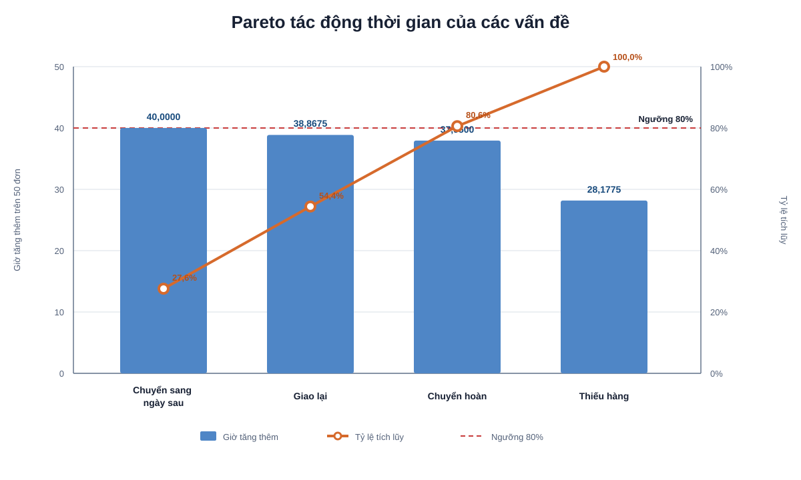
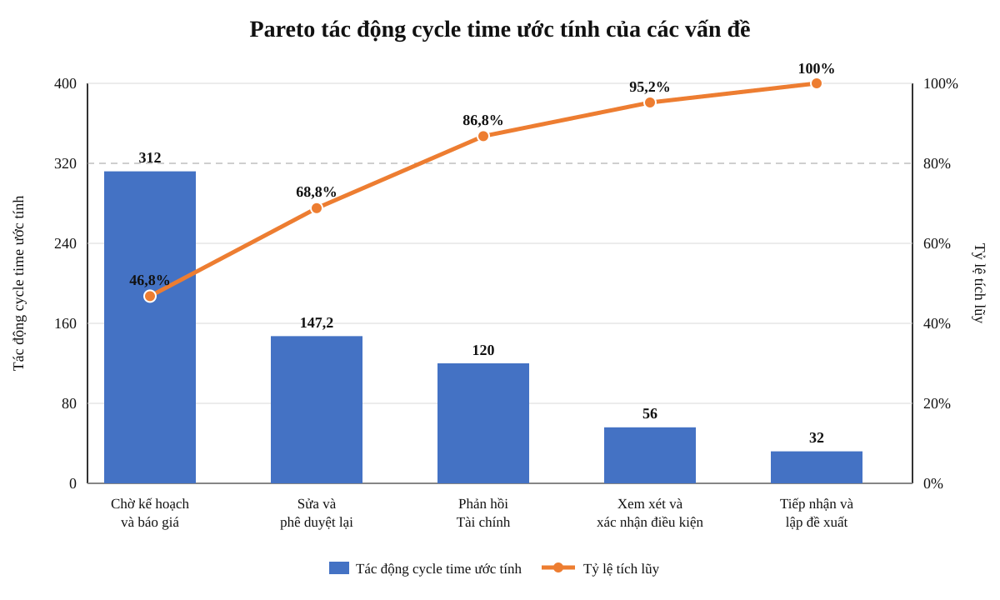
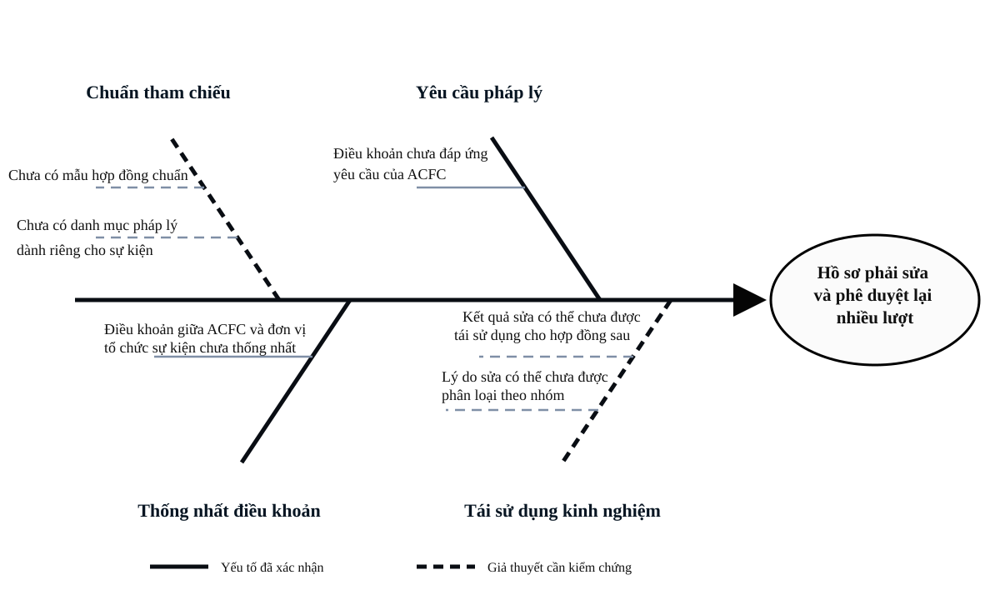

# Chương 3. Phân tích quy trình

**Phạm vi:** phân tích định tính (VA/BVA/NVA, lãng phí, các bên liên quan, vấn đề nổi bật) và định lượng (thời gian, chi phí) cho cả 6 quy trình đã mô hình hóa ở Chương 2, theo đúng cách FUTA Bus Lines tách riêng phần phân tích khỏi phần mô hình hóa. Chương này không mô tả lại các bước quy trình hay sơ đồ BPMN — nội dung đó đã có ở Chương 2; ở đây chỉ phân tích giá trị, lãng phí, vấn đề và đề xuất cải tiến dựa trên các bước đã mô tả.

---

## 3.1. C2 — Xử lý đơn hàng trực tuyến

### 3.1.1. Phân tích định tính

##### a. Phân loại hoạt động VA/BVA/NVA

Bảng phân loại 31 hoạt động từ góc nhìn người mua hàng trực tuyến, dựa trên giá trị khách hàng nhận được và yêu cầu vận hành, kiểm soát của ACFC.

| Hoạt động | Người thực hiện | VA/BVA/NVA | Giải thích |
|---|---|---|---|
| 1. Gửi thông tin đơn | Khách hàng | VA | Hình thành yêu cầu mua hàng theo nhu cầu của khách hàng |
| 2. Xác nhận thông tin đơn | Khách hàng | VA | Bảo đảm đơn phản ánh đúng sản phẩm, số lượng, giao hàng và thanh toán khách hàng chọn |
| 3. Chọn phương án xử lý thiếu hàng | Khách hàng | VA | Cho phép khách hàng quyết định kết quả phù hợp khi ACFC không đủ hàng |
| 4. Nhận hàng | Khách hàng | VA | Là kết quả trực tiếp khách hàng cần đạt từ quy trình |
| 5. Gọi xác thực thông tin đơn | Bộ phận xử lý đơn hàng | BVA | Không trực tiếp tạo giá trị cho khách hàng nhưng là kiểm soát bắt buộc trước khi xử lý đơn |
| 6. Hủy đơn | Bộ phận xử lý đơn hàng | BVA | Ngăn ACFC tiếp tục xử lý đơn không xác thực được, tránh phát sinh chi phí và rủi ro giao hàng |
| 7. Kiểm tra tồn kho trên hệ thống | Bộ phận xử lý đơn hàng | BVA | Cần để kiểm soát khả năng đáp ứng và quyết định luồng đủ hàng hoặc thiếu hàng |
| 8. Thông báo tình trạng thiếu hàng | Bộ phận xử lý đơn hàng | VA | Cung cấp thông tin để khách hàng chọn phương án phù hợp với nhu cầu |
| 9. Đóng gói đơn hàng | Bộ phận xử lý đơn hàng | VA | Chuẩn bị hàng đủ điều kiện bàn giao và bảo vệ hàng trong quá trình giao |
| 10. Thực hiện phương án khách hàng chọn | Bộ phận xử lý đơn hàng | VA | Điều chỉnh đơn theo lựa chọn cụ thể của khách hàng khi thiếu hàng |
| 11. Gửi xác nhận hủy | Bộ phận xử lý đơn hàng | VA | Xác nhận kết quả hủy mà khách hàng đã lựa chọn |
| 12. Hoàn tất và bàn giao kiện hàng | Bộ phận xử lý đơn hàng | VA | Đưa kiện hàng vào luồng vận chuyển để khách hàng có thể nhận hàng |
| 13. Tiếp nhận kết quả giao | Bộ phận xử lý đơn hàng | NVA | Chỉ tiếp nhận thông tin từ Đơn vị vận chuyển, không làm thay đổi kết quả khách hàng nhận; có thể tự động hóa |
| 14. Cập nhật, đối soát và đóng đơn | Bộ phận xử lý đơn hàng | BVA | Cần để kiểm soát trạng thái, thanh toán và hoàn tất quản lý đơn |
| 15. Cập nhật trạng thái giao thất bại | Bộ phận xử lý đơn hàng | BVA | Ghi nhận tình trạng cần thiết để kiểm soát và tiếp tục xử lý đơn |
| 16. Liên hệ khách hàng | Bộ phận xử lý đơn hàng | VA | Làm rõ thông tin giao lại để khách hàng có thể nhận hàng |
| 17. Gửi yêu cầu giao lại | Bộ phận xử lý đơn hàng | NVA | Chỉ chuyển yêu cầu giữa ACFC và Đơn vị vận chuyển sau lần giao không thành công |
| 18. Tiếp nhận hàng hoàn | Bộ phận xử lý đơn hàng | NVA | Là công việc phục hồi phát sinh vì đơn không được giao thành công |
| 19. Kiểm tra hàng hoàn | Bộ phận xử lý đơn hàng | BVA | Cần để kiểm soát tình trạng hàng và quyết định cập nhật tồn kho hoặc chuyển khiếu nại |
| 20. Cập nhật tồn kho, thanh toán, trạng thái và đóng đơn | Bộ phận xử lý đơn hàng | BVA | Cần để kiểm soát hàng hoàn, nghĩa vụ tài chính, trạng thái và kết thúc đơn |
| 21. Chuyển trường hợp khiếu nại | Bộ phận xử lý đơn hàng | NVA | Chỉ bàn giao thông tin sang bộ phận khác, không thực hiện xử lý nghiệp vụ bổ sung |
| 22. Tiếp nhận trường hợp khiếu nại | Bộ phận xử lý khiếu nại | NVA | Chỉ tiếp nhận thông tin bàn giao, có thể giảm bằng chuyển hồ sơ và trạng thái tự động |
| 23. Nhận kiện hàng | Đơn vị vận chuyển | BVA | Là điều kiện vận hành bắt buộc để Đơn vị vận chuyển thực hiện giao hàng |
| 24. Giao hàng | Đơn vị vận chuyển | VA | Trực tiếp đưa sản phẩm đến khách hàng và tạo kết quả chính của dịch vụ |
| 25. Xác định kết quả giao | Đơn vị vận chuyển | BVA | Cần để xác định đơn giao thành công hay phải chuyển sang xử lý thất bại |
| 26. Gửi kết quả giao thành công | Đơn vị vận chuyển | NVA | Chỉ truyền kết quả giao cho ACFC, không tạo thêm giá trị cho khách hàng |
| 27. Xác định nguyên nhân giao thất bại | Đơn vị vận chuyển | BVA | Cung cấp căn cứ để quyết định cách xử lý tiếp theo và theo dõi nguyên nhân thất bại |
| 28. Đánh giá khả năng giao lại | Đơn vị vận chuyển | BVA | Tránh tổ chức giao lại khi không còn khả thi và hỗ trợ quyết định chuyển hoàn |
| 29. Gửi kết quả giao và đánh giá | Đơn vị vận chuyển | NVA | Chỉ truyền thông tin xử lý giữa Đơn vị vận chuyển và ACFC |
| 30. Giao lại | Đơn vị vận chuyển | NVA | Làm lại hoạt động giao hàng vì lần giao trước không đạt kết quả |
| 31. Chuyển hàng về | Đơn vị vận chuyển | NVA | Là vận chuyển ngược phát sinh vì không thể hoàn tất giao hàng |

Kết quả gồm 11 hoạt động VA, 11 hoạt động BVA và 9 hoạt động NVA. VA tập trung vào xác lập nhu cầu, chuẩn bị và giao hàng; BVA tập trung vào kiểm soát tồn kho, trạng thái, thanh toán và ngoại lệ; NVA tập trung ở các bước chuyển tiếp thông tin và xử lý sau giao thất bại. ACFC cần giữ ổn định nhóm VA, tinh gọn nhóm BVA và ưu tiên giảm nhóm NVA — trước hết ở các bước chuyển tiếp thông tin thuần túy (13, 17, 18, 21, 22, 26, 29, 30, 31), vốn không làm thay đổi kết quả khách hàng nhận được.

##### b. Phân tích lãng phí

| Bước | Loại lãng phí | Bằng chứng | Tác động | Khắc phục |
|---|---|---|---|---|
| Nhánh chờ bổ sung hàng sau xử lý thiếu hàng | Hold | Khách hàng có thể chọn chờ hàng; đơn chỉ được đóng gói sau khi có hàng bổ sung | Kéo dài thời gian hoàn tất và giữ đơn ở trạng thái chờ | Kiểm tra khả năng đáp ứng sớm, thông báo thời gian dự kiến và theo dõi riêng đơn chờ hàng |
| 9 và 12. Đóng gói, hoàn tất và bàn giao kiện hàng | Hold | Phần việc chưa hoàn thành phải chuyển sang ngày làm việc tiếp theo khi đã hết giờ làm việc | Đơn dở dang phải chờ sang ngày sau, kéo dài thời gian bàn giao | Theo dõi giờ tiếp nhận, giờ đóng gói xong và giờ bàn giao; nhận diện đơn gần cuối ca để điều phối hoặc thông báo mốc xử lý tiếp theo |
| 13, 26 và 29. Gửi, tiếp nhận kết quả giao | Move | Kết quả giao được chuyển từ Đơn vị vận chuyển sang Bộ phận xử lý đơn hàng rồi mới được cập nhật | Tăng bước bàn giao, thời gian cập nhật và nguy cơ trạng thái không đồng bộ | Đồng bộ trạng thái giao tự động giữa hai bên, kèm nhật ký cập nhật |
| 17, 21 và 22. Chuyển yêu cầu giao lại hoặc trường hợp khiếu nại | Move | Các bước chỉ chuyển thông tin giữa các vai trò, không có kiểm tra hoặc lập hồ sơ bổ sung | Tăng số lần bàn giao và thời gian chờ bên tiếp nhận xử lý | Tự động chuyển hồ sơ, phân công người xử lý và cập nhật trạng thái trên cùng luồng thông tin |
| 30. Giao lại | Defects | Giao lại phát sinh sau lần giao thất bại; nguyên nhân thường gặp từ phía người nhận gồm không liên lạc được, không có mặt, từ chối nhận, sai số điện thoại hoặc sai địa chỉ | Phát sinh thêm một lần xử lý và vận chuyển, kéo dài thời gian hoàn tất đơn | Xác nhận lại số điện thoại, địa chỉ, khả năng nhận hàng và thời điểm giao dựa trên nguyên nhân thực tế trước khi giao lại |
| 31. Chuyển hàng về | Move | Đơn vị vận chuyển phải vận chuyển ngược kiện hàng khi không thể tiếp tục giao | Phát sinh quãng vận chuyển, tiếp nhận hàng hoàn và kéo dài thời gian đóng đơn | Ghi nhận nguyên nhân chuyển hoàn; giảm các nguyên nhân có thể phòng ngừa bằng xác nhận thông tin người nhận trước khi giao |
| 19-22. Kiểm tra hàng hoàn và chuyển khiếu nại | Defects | Hàng hoàn có thể hư hỏng hoặc thất lạc — thất lạc được xem là thiếu hàng trong kiện hoàn đã tiếp nhận `[giả định]` | Phát sinh kiểm tra, xử lý khiếu nại và điều chỉnh tồn kho hoặc thanh toán; có nguy cơ mất hàng | Lưu bằng chứng bàn giao và tình trạng kiện hoàn; phân nhóm nguyên nhân trước khi quy trách nhiệm hoặc chọn biện pháp khắc phục |

Nguồn hiện có của C2 ghi nhận đủ 3 loại lãng phí Move, Hold và Defects; **loại Over-processing chưa có bằng chứng riêng trong tài liệu gốc** — nguồn cũng không đưa Inventory và Overproduction vào phân tích vì lý do tương tự. Đây là khoảng trống cần làm rõ qua phỏng vấn (xem mục 3.1.4) thay vì tự suy diễn thêm một dòng lãng phí không có căn cứ.

##### c. Phân tích các bên liên quan

| Bên liên quan | Mối quan tâm | Vấn đề tác động | Vai trò trong cải tiến |
|---|---|---|---|
| Khách hàng | Thông tin đơn chính xác, biết tình trạng hàng, nhận hàng đúng dự kiến và được thông báo rõ khi có ngoại lệ | Thiếu hàng, đơn chuyển sang ngày sau, giao lại, chuyển hoàn | Xác nhận thông tin liên hệ, địa chỉ, phương án thiếu hàng và khả năng nhận hàng |
| Bộ phận xử lý đơn hàng | Kiểm soát hàng đợi, tồn kho, tiến độ đóng gói, bàn giao và trạng thái đơn | Tất cả vấn đề trong quy trình | Theo dõi vấn đề, điều phối xử lý, áp dụng quy tắc ưu tiên và phối hợp các bên |
| Đơn vị vận chuyển | Thông tin người nhận đầy đủ, kiện hàng sẵn sàng bàn giao, kết quả giao được chuyển chính xác | Chậm hoặc lệch trạng thái, giao lại, chuyển hoàn | Ghi nhận nguyên nhân giao thất bại, kết quả giao và tình trạng kiện hoàn; phối hợp đồng bộ trạng thái |
| Bộ phận xử lý khiếu nại | Hồ sơ chuyển giao đầy đủ, có bằng chứng về tình trạng kiện và trách nhiệm của các bên | Hàng hoàn hư hỏng hoặc thất lạc | Tiếp nhận, phân loại và theo dõi trường hợp khiếu nại sau khi được chuyển giao |
| Quản lý quy trình | Cycle time, chi phí ngoại lệ, tỷ lệ hoàn tất trong ngày và chất lượng dịch vụ | Các vấn đề ưu tiên trong issue register | Phê duyệt quy tắc điều phối, ngưỡng cảnh báo, chỉ số theo dõi và nguồn lực cải tiến |

Bộ phận xử lý đơn hàng là đầu mối trung tâm vì tiếp nhận, điều phối và cập nhật hầu hết ngoại lệ. Khách hàng và Đơn vị vận chuyển quyết định trực tiếp khả năng giao thành công; Bộ phận xử lý khiếu nại tham gia khi hàng hoàn bất thường; Quản lý quy trình cung cấp quy tắc, chỉ số và nguồn lực. Cải tiến vì vậy cần tập trung vào phối hợp giữa các bên và khả năng theo dõi trạng thái xuyên suốt.

##### d. Vấn đề nổi bật (Issue register)

| Vấn đề | Bước | Nguyên nhân giả định | Tác động định lượng | Ưu tiên | Khắc phục | Owner |
|---|---|---|---|---|---|---|
| Không liên hệ được khách hàng, phải hủy đơn | 5-6 | Số điện thoại sai, khách hàng không nghe máy hoặc thời điểm gọi chưa phù hợp | Giả định 5% đơn; chi phí tăng thêm 26.600 đồng/đơn hủy | Chưa xếp hạng theo thời gian | Kiểm tra định dạng số điện thoại, ghi nhận kết quả liên hệ và chọn lại thời điểm liên hệ phù hợp | Bộ phận xử lý đơn hàng |
| Thiếu hàng | 7-10 | Tồn kho khả dụng chưa phản ánh kịp thời nhu cầu của đơn hoặc hàng chưa được giữ cho đơn | Giả định 10% đơn; 5,6355 giờ/trường hợp; 34.080 đồng/đơn thiếu hàng | Trung bình | Kiểm tra khả năng đáp ứng sớm, thông báo thời điểm bổ sung dự kiến và theo dõi riêng đơn chờ hàng | Bộ phận xử lý đơn hàng |
| Công việc cuối ca chuyển sang ngày làm việc tiếp theo | 9, 12 | Quy tắc ưu tiên cuối ca, năng lực xử lý và thông tin hàng đợi chưa hỗ trợ phát hiện sớm đơn có nguy cơ trễ | Giả định 10% đơn, tăng 8 giờ/trường hợp | **Cao** | Thiết lập quy tắc ưu tiên cuối ca, theo dõi tuổi đơn và điều phối tải trước khi hết ca | Bộ phận xử lý đơn hàng |
| Kết quả giao phải chuyển qua nhiều bước | 13, 26, 29 | Trạng thái giữa các bên chưa được đồng bộ tự động hoặc cảnh báo khi cập nhật chậm | Giả định 10% đơn bị chậm hoặc lệch trạng thái | Chưa xếp hạng theo thời gian | Chuẩn hóa trạng thái và thời điểm cập nhật; trung hạn đồng bộ trạng thái kèm nhật ký | Bộ phận xử lý đơn hàng |
| Yêu cầu giao lại hoặc khiếu nại chuyển thủ công | 17, 21-22 | Hồ sơ, người nhận việc và trạng thái xử lý chưa được chuyển trên một luồng thông tin thống nhất | Giả định tương đương 10% tổng đơn | Chưa xếp hạng theo thời gian | Chuẩn hóa hồ sơ chuyển giao; trung hạn tự động phân công và cập nhật trạng thái | Bộ phận xử lý đơn hàng |
| Giao lần đầu thất bại, phải giao lại | 27-30 | Không liên lạc được người nhận, người nhận vắng mặt hoặc từ chối nhận; số điện thoại, địa chỉ hoặc thời điểm giao chưa phù hợp | 7% tổng đơn; 11,1050 giờ/trường hợp; 97.000 đồng/đơn giao lại | **Cao** | Xác nhận lại số điện thoại, địa chỉ, khả năng nhận và thời điểm giao; phối hợp Đơn vị vận chuyển ghi mã nguyên nhân thất bại | Bộ phận xử lý đơn hàng |
| Không thể tiếp tục giao, phải chuyển hoàn | 18-20, 31 | Thông tin người nhận chưa được xác nhận đủ hoặc nguyên nhân thất bại chưa được xử lý trước lượt giao tiếp theo | 4,4% tổng đơn; 17,25 giờ/trường hợp; 111.400 đồng/đơn chuyển hoàn | **Cao** | Ghi mã nguyên nhân chuyển hoàn, phân nhóm nguyên nhân có thể phòng ngừa và phối hợp Đơn vị vận chuyển kiểm soát bàn giao | Bộ phận xử lý đơn hàng |
| Hàng hoàn hư hỏng hoặc thất lạc | 19-22 | Bằng chứng bàn giao hoặc tình trạng kiện chưa đủ để xác định thời điểm và trách nhiệm phát sinh | Giả định 10% số đơn hoàn, tương đương 0,44% tổng đơn | Chưa xếp hạng theo thời gian | Lưu bằng chứng bàn giao, tình trạng kiện và mã nguyên nhân trước khi chuyển hồ sơ khiếu nại | Bộ phận xử lý khiếu nại |

Ba nhóm vấn đề nổi lên: khả năng đáp ứng và xử lý trong ngày; chuyển giao thông tin giữa các bên; ngoại lệ sau giao thất bại. Theo tác động thời gian đã ước tính, chuyển việc sang ngày sau, giao lại và chuyển hoàn là nhóm ưu tiên cao; thiếu hàng xếp trung bình; các vấn đề còn lại cần tiếp tục theo dõi nhưng chưa đủ cơ sở xếp hạng do chưa có tác động thời gian cùng đơn vị.

### 3.1.2. Phân tích định lượng

##### a. Phân tích thời gian

Quy tắc quy đổi: 1 ngày làm việc = 8 giờ làm việc. Cycle time (CT) gồm thời gian xử lý và thời gian chờ; Processing time (PT) chỉ gồm thời gian trực tiếp thực hiện hoạt động.

Đường cơ sở (baseline) gồm các hoạt động tuần tự `1 → 5 → 2 → 7 → 9 → 12 → 23 → 24 → 25 → 26 → 13 → 14`. CT trước và sau giai đoạn giao hàng:

`CT_ngoài_giao_hàng = 0,08 + 0,25 + 0,08 + 0,10 + 4,00 + 4,00 + 0,25 + 0,08 + 0,08 + 0,08 + 0,33 = 9,33 giờ làm việc/đơn`

Thời gian giao hàng công khai theo vùng được cộng vào CT đường cơ sở:

| Vùng giao | Thời gian giao công khai | CT đường cơ sở |
|---|---|---|
| Nội tỉnh hoặc nội thành | 1-3 ngày làm việc | 17,33-33,33 giờ (2,17-4,17 ngày) |
| Nội vùng | 2-4 ngày làm việc | 25,33-41,33 giờ (3,17-5,17 ngày) |
| Liên vùng TP.HCM – Hà Nội – Đà Nẵng | 3-5 ngày làm việc | 33,33-49,33 giờ (4,17-6,17 ngày) |
| Từ ba thành phố lớn đến tỉnh khác vùng | 5-7 ngày làm việc | 49,33-65,33 giờ (6,17-8,17 ngày) |

Các cấu trúc luồng khác được tính riêng: cổng XOR xác thực (`CT_xác_thực = 0,3345 giờ/đơn`), cụm thiếu hàng theo tỷ lệ nhánh (`CT_tăng_thêm_do_thiếu_hàng = 0,5636 giờ/đơn`), cổng kết quả giao lần đầu (`CT_kết_quả_giao = 1,8489 giờ/đơn`), và vòng lặp giao lại theo công thức `CT_vòng_lặp = T/(1-r)` với `r = 20%`, cho kết quả `CT_vòng_lặp_giao = 11,1050 giờ/đơn phát sinh giao lại`.

PT của đường cơ sở là `2,21 giờ/đơn`. Hiệu suất thời gian (`PT/CT × 100%`) theo vùng giao dao động từ **3,38% đến 12,75%** — phần lớn cycle time là thời gian chờ, đặc biệt là thời gian giao hàng vốn nằm ngoài khả năng kiểm soát trực tiếp của Bộ phận xử lý đơn hàng.

##### b. Phân tích chi phí

`Chi phí = Σ(thời gian nguồn lực × đơn giá) + chi phí vật tư/hệ thống`

Thời gian nhân sự ACFC trên đường cơ sở là `PT_ACFC = 1,30 giờ/đơn`, với đơn giá 80.000 đồng/giờ:

`Chi phí_nhân_sự = 1,30 × 80.000 = 104.000 đồng/đơn`
`Chi phí_đường_cơ_sở = 104.000 + 40.000 (phí giao lần đầu) + 10.000 (bao bì) + 5.000 (hệ thống) = 159.000 đồng/đơn`

| Ngoại lệ | Chi phí tăng thêm |
|---|---|
| Không liên hệ được và hủy đơn | 26.600 đồng/đơn hủy |
| Xử lý thiếu hàng | 34.080 đồng/đơn thiếu hàng |
| Giao lại | 97.000 đồng/đơn phát sinh giao lại |
| Chuyển hoàn và đóng đơn | 111.400 đồng/đơn chuyển hoàn |
| Chuyển trường hợp khiếu nại | 14.400 đồng/trường hợp, chưa gồm chi phí xử lý khiếu nại tiếp theo |

Toàn bộ số liệu xác suất (95%/5%, 90%/10%, tỷ lệ chọn phương án khi thiếu hàng, tỷ lệ giao thành công/giao lại) và đơn giá (80.000 đồng/giờ nhân sự, 40.000 đồng/lượt giao, 10.000 đồng bao bì, 5.000 đồng hệ thống) đều là **giả định của nhóm dùng để minh họa cách tính**, chưa phải số liệu nội bộ thật của ACFC.

### 3.1.3. Phân tích nguyên nhân gốc

**Ưu tiên vấn đề bằng Pareto**

Pareto dùng số giờ tăng thêm kỳ vọng trên 50 đơn để so sánh bốn vấn đề có cùng đơn vị đo.

| Thứ tự | Vấn đề | Tác động cơ sở | Tỷ trọng | Tỷ lệ tích lũy |
|---:|---|---:|---:|---:|
| 1 | Công việc cuối ca chuyển sang ngày làm việc tiếp theo | 40,0000 giờ/50 đơn | 27,6% | 27,6% |
| 2 | Giao lần đầu thất bại, phải giao lại | 38,8675 giờ/50 đơn | 26,8% | 54,4% |
| 3 | Không thể tiếp tục giao, phải chuyển hoàn | 37,9500 giờ/50 đơn | 26,2% | 80,6% |
| 4 | Thiếu hàng | 28,1775 giờ/50 đơn | 19,4% | 100,0% |

> **Hình 3.1 — Pareto số giờ tăng thêm kỳ vọng trên 50 đơn của quy trình C2.**
>
> 

Ba vấn đề đầu (chuyển việc sang ngày sau, giao lại, chuyển hoàn) tạo ra 80,6% tổng giờ tăng thêm của bốn vấn đề được định lượng — theo nguyên tắc 80/20, đây là nhóm cần ưu tiên xử lý trước, đứng đầu là công việc cuối ca chuyển sang ngày làm việc tiếp theo.

**5 Whys / Sơ đồ xương cá**

*(Nguồn hiện có của C2 chưa phân tích nguyên nhân gốc bằng 5 Whys hoặc sơ đồ xương cá cho vấn đề ưu tiên hàng đầu — chờ Huỳnh Gia Bảo bổ sung.)*

### 3.1.4. Phỏng vấn bổ sung

> Nguồn: khoảng trống nêu ở mục 3.1.1.b (loại lãng phí Over-processing chưa có bằng chứng) và mục 3.1.2 (toàn bộ số liệu xác suất/chi phí là giả định), đối chiếu `docs/workspaces/HuynhGiaBao/quy-trinh/phan-tich-dinh-luong/xu-ly-don-hang-truc-tuyen.md` và `docs/workspaces/HuynhGiaBao/quy-trinh/phan-tich-van-de/xu-ly-don-hang-truc-tuyen.md` (Huỳnh Gia Bảo).

1. Có bước nào trong quy trình bị kiểm tra hoặc xử lý dư thừa nhiều lần so với yêu cầu thực tế (ví dụ xác thực đơn, kiểm tra hàng hoàn) hay không — đây là căn cứ để xác nhận có tồn tại lãng phí Over-processing hay không?
2. Tỷ lệ đơn thực tế không liên hệ được khách hàng, tỷ lệ đơn thiếu hàng và tỷ lệ giao thành công lần đầu theo dữ liệu vận hành thật là bao nhiêu — để thay thế các tỷ lệ giả định (95%/5%, 90%/10%, 90%/10%)?
3. Đơn giá nhân công thực tế của Bộ phận xử lý đơn hàng và Bộ phận xử lý khiếu nại theo giờ là bao nhiêu?
4. Phí giao hàng, giao lại và chuyển hoàn thực tế theo đơn vị vận chuyển hiện dùng là bao nhiêu, có khác nhau theo vùng giao hay không?
5. Tỷ lệ các phương án khách hàng chọn khi thiếu hàng (chờ hàng/thay thế/mua hiện có/hủy phần/hủy toàn bộ) theo dữ liệu thật là bao nhiêu, để thay thế bộ tỷ lệ giả định 20/30/25/15/10%?

### 3.1.5. Đề xuất cải tiến (TO-BE)

Dựa trên hướng xử lý đã nêu tại từng vấn đề trong issue register (mục 3.1.1.d), ba nhóm cải tiến ưu tiên theo thứ tự Pareto:

1. **Công việc cuối ca chuyển sang ngày làm việc tiếp theo** — thiết lập quy tắc ưu tiên xử lý cuối ca, theo dõi tuổi đơn và điều phối tải nhân sự trước khi hết ca, thay vì để đơn tồn đọng đến khi hết giờ mới phát hiện.
2. **Giao lần đầu thất bại phải giao lại** — xác nhận lại số điện thoại, địa chỉ, khả năng nhận hàng và thời điểm giao trước khi yêu cầu giao lại; phối hợp Đơn vị vận chuyển ghi nhận mã nguyên nhân thất bại thay vì chỉ ghi nhận kết quả giao/không giao.
3. **Không thể tiếp tục giao, phải chuyển hoàn** — ghi mã nguyên nhân chuyển hoàn ngay khi phát sinh, phân nhóm nguyên nhân có thể phòng ngừa được (sai địa chỉ, sai số điện thoại) để xử lý từ gốc thay vì chỉ tiếp nhận hàng hoàn thụ động.

Các cải tiến trung hạn khác — đồng bộ trạng thái giao tự động giữa Bộ phận xử lý đơn hàng và Đơn vị vận chuyển, tự động chuyển hồ sơ giao lại/khiếu nại — trực tiếp giảm nhóm hoạt động NVA đã xác định ở mục 3.1.1.a (các bước 13, 17, 18, 21, 22, 26, 29 hiện đều là chuyển tiếp thông tin thuần túy).

---

## 3.2. C3 — Tổ chức sự kiện truyền thông sản phẩm

### 3.2.1. Phân tích định tính

##### a. Phân loại hoạt động VA/BVA/NVA

| Hoạt động | Người thực hiện | VA/BVA/NVA | Giải thích |
|---|---|---|---|
| 1. Gửi yêu cầu truyền thông | Ban điều hành ACFC | BVA | Không trực tiếp tạo trải nghiệm cho khách hàng, nhưng cần để khởi tạo trường hợp và xác định sản phẩm phải truyền thông |
| 2. Tiếp nhận yêu cầu truyền thông | Phòng Marketing | NVA | Chỉ ghi nhận việc bàn giao yêu cầu, không làm tăng giá trị khách hàng nhận được |
| 3. Lập Đề xuất ý tưởng | Phòng Marketing | VA | Xác định mục tiêu, khách hàng mục tiêu, thông điệp, hoạt động và hình ảnh định hướng |
| 4. Xây dựng Kế hoạch sự kiện chi tiết và báo giá | Đơn vị tổ chức sự kiện | VA | Chuyển ý tưởng thành phương án thực thi cụ thể phục vụ trải nghiệm khách hàng |
| 5. Tiếp nhận kế hoạch và báo giá | Phòng Marketing | BVA | Cần để ACFC đánh giá chất lượng thực thi, lịch và ngân sách trước khi cam kết nguồn lực |
| 6. Xác nhận điều kiện thương hiệu và sản phẩm | Phòng Marketing | BVA | Cần để thông tin sản phẩm, hình ảnh thương hiệu và khả năng cung ứng được kiểm soát trước khi tổ chức |
| 7. Hoàn thiện hồ sơ sự kiện | Phòng Marketing | BVA | Bộ hồ sơ cần cho kiểm soát và phê duyệt nội bộ |
| 8. Trình hồ sơ phê duyệt | Phòng Marketing | NVA | Chỉ chuyển hồ sơ giữa các bên, không làm thay đổi nội dung khách hàng nhận được |
| 9. Phê duyệt hồ sơ sự kiện | Nhóm phê duyệt nội bộ | BVA | Cần để kiểm soát pháp lý, ngân sách, thuế, thanh toán và hàng xuất làm quà |
| 10. Tổng hợp yêu cầu điều chỉnh | Phòng Marketing | NVA | Phát sinh vì hồ sơ chưa đạt yêu cầu, không tạo giá trị mới |
| 11. Điều chỉnh kế hoạch và báo giá | Đơn vị tổ chức sự kiện | NVA | Làm lại đầu ra đã lập do yêu cầu sửa hoặc phương án chưa khả thi |
| 12. Hoàn thiện hồ sơ điều chỉnh | Phòng Marketing | NVA | Lặp lại việc hoàn thiện hồ sơ sau điều chỉnh, không tạo thêm giá trị trực tiếp |
| 13. Ký hợp đồng với Đơn vị tổ chức sự kiện | Ban điều hành ACFC | BVA | Cần để xác lập quyền, nghĩa vụ, phạm vi công việc và căn cứ thanh toán |
| 14. Thực hiện sự kiện theo kế hoạch | Đơn vị tổ chức sự kiện | VA | Tạo ra trải nghiệm, thông tin sản phẩm, ưu đãi hoặc quà tặng khách hàng trực tiếp nhận tại sự kiện |
| 15. Giám sát việc thực hiện | Phòng Marketing | BVA | Cần để bảo đảm sự kiện bám kế hoạch, thông điệp, hình ảnh thương hiệu |
| 16. Bàn giao kết quả sự kiện | Đơn vị tổ chức sự kiện | BVA | Cần cho nghiệm thu, thanh toán và báo cáo, không tạo thêm giá trị trực tiếp cho người tham dự |
| 17. Đối chiếu hạng mục bàn giao | Phòng Marketing | BVA | Cần để kiểm tra đơn vị tổ chức sự kiện đã thực hiện đủ hạng mục theo hợp đồng |
| 18. Lập Biên bản nghiệm thu | Phòng Marketing | BVA | Chính thức hóa kết quả đối chiếu, làm căn cứ thanh toán |
| 19. Xác nhận Biên bản nghiệm thu | Đơn vị tổ chức sự kiện | BVA | Cần để hai bên thống nhất kết quả thực hiện và trách nhiệm sau sự kiện |
| 20. Tiếp nhận Biên bản nghiệm thu đã xác nhận | Phòng Marketing | NVA | Chỉ là bước nhận lại chứng từ đã xác nhận, không làm tăng giá trị |
| 21. Xử lý thanh toán | Phòng Tài chính | BVA | Cần để thực hiện nghĩa vụ tài chính, kiểm soát hóa đơn và đóng giao dịch với nhà cung cấp |
| 22. Lập Báo cáo hậu sự kiện | Phòng Marketing | BVA | Cần để đánh giá kết quả, ghi nhận vấn đề và cải thiện sự kiện sau |
| 23. Trình Báo cáo hậu sự kiện | Phòng Marketing | NVA | Chỉ chuyển báo cáo đến cấp duyệt, không làm thay đổi giá trị khách hàng nhận được |
| 24. Phê duyệt Báo cáo hậu sự kiện | Ban điều hành ACFC | BVA | Cần để xác nhận kết quả, trách nhiệm và chính thức đóng quy trình |

Quy trình có 3 hoạt động VA, 14 hoạt động BVA và 7 hoạt động NVA. Giá trị khách hàng tập trung ở khâu hình thành ý tưởng, thiết kế kế hoạch và thực hiện sự kiện; phần lớn hoạt động còn lại phục vụ kiểm soát, pháp lý và thanh toán. Nhóm NVA chủ yếu là tiếp nhận, chuyển hồ sơ và làm lại sau phản hồi — ưu tiên giảm bằng số hóa luồng công việc, kiểm tra sớm và quản lý một phiên bản hồ sơ thống nhất.

##### b. Phân tích lãng phí

| Bước | Loại lãng phí | Bằng chứng | Tác động | Khắc phục |
|---|---|---|---|---|
| 2-3. Tiếp nhận yêu cầu và lập Đề xuất ý tưởng | Hold | Cụm bước kéo dài khoảng 48 giờ theo lịch; thời gian xử lý khoảng 16 giờ làm việc; thời gian chờ khoảng 32 giờ (giả định) | Làm chậm thời điểm gửi ý tưởng cho đơn vị tổ chức sự kiện, thu hẹp thời gian chuẩn bị | Dùng một phiếu khởi tạo ngắn, quy định người phụ trách và thời hạn hoàn thành Bản đề xuất ý tưởng sơ bộ |
| 4. Xây dựng Kế hoạch sự kiện chi tiết và báo giá | Hold | Từ lúc đơn vị tổ chức sự kiện nhận đủ đề xuất đến khi gửi kế hoạch và báo giá đầu tiên mất khoảng 80 giờ trong lịch làm việc (10 ngày làm việc) — **số liệu phỏng vấn thật**, quy đổi thành 336 giờ theo lịch (giả định) | Kéo dài giai đoạn chuẩn bị, tăng nguy cơ phải đổi lịch, địa điểm hoặc nguồn lực | Chốt mốc phản hồi theo quy mô sự kiện, dùng mẫu kế hoạch chung và theo dõi trạng thái từng hạng mục |
| 5-6. Tiếp nhận kế hoạch, báo giá và xác nhận điều kiện | Hold | Cụm bước kéo dài khoảng 72 giờ theo lịch; thời gian xử lý khoảng 16 giờ; thời gian chờ khoảng 56 giờ (giả định) | Hồ sơ phê duyệt được hình thành muộn, kéo theo thời điểm ký hợp đồng và triển khai | Cho các bên liên quan kiểm tra điều kiện thương hiệu, sản phẩm, địa điểm và ngân sách trên cùng một hồ sơ ngay khi nhận kế hoạch |
| 8-12. Trình, phê duyệt và điều chỉnh hồ sơ | Move | Hồ sơ và phản hồi phải đi qua Phòng Marketing, Nhóm phê duyệt nội bộ và Đơn vị tổ chức sự kiện; việc sửa hợp đồng là khâu cần trao đổi nhiều lượt nhất | Tăng số lần bàn giao, nguy cơ dùng sai phiên bản và thời gian phối hợp | Dùng một hồ sơ số có kiểm soát phiên bản, phân quyền nhận xét và nhật ký thay đổi |
| 9. Phê duyệt hồ sơ sự kiện | Hold | Phòng Pháp lý phản hồi một lượt khoảng 72 giờ theo lịch **(số liệu phỏng vấn thật)**; Phòng Tài chính có thể mất tối đa 336 giờ theo lịch **(số liệu phỏng vấn thật, giá trị tối đa)** | Tạo điểm nghẽn trước khi ký hợp đồng; các nhánh hoàn thành sớm vẫn phải chờ nhánh chậm nhất | Quy định thời hạn phản hồi theo loại hồ sơ, hiển thị trạng thái từng nhánh và cảnh báo hồ sơ sắp quá hạn |
| 10-12. Điều chỉnh và trình lại hồ sơ | Defects | Khoảng 80% dự thảo hợp đồng bị yêu cầu sửa sau lần kiểm tra đầu tiên **(số liệu phỏng vấn thật)**; lý do trực tiếp là điều khoản chưa đáp ứng yêu cầu của ACFC | Phải sửa kế hoạch hoặc hợp đồng, hoàn thiện hồ sơ và phê duyệt lại; kéo dài chu kỳ và tăng công sức của nhiều bên | Ghi nhận nhóm điều khoản và lý do theo từng lượt sửa; sau một kỳ theo dõi mới chuẩn hóa các điều khoản lặp lại |
| 10-12. Điều chỉnh và trình lại hồ sơ | Over-processing | Sửa hợp đồng là khâu trao đổi nhiều lượt nhất do phải đáp ứng yêu cầu của Phòng Pháp lý và thống nhất lại điều khoản với đơn vị tổ chức sự kiện | Lặp việc tổng hợp ý kiến, sửa tài liệu, đóng gói hồ sơ và nộp lại mà không tạo thêm giá trị tương ứng | Gom phản hồi theo từng vòng, quản lý lịch sử phiên bản và khóa phạm vi sửa trước khi các bên cập nhật phần việc liên quan |
| 13. Ký hợp đồng | Hold | Tổng thời gian từ trình ký đến ký khoảng 48 giờ theo lịch (giả định), trong đó thời gian xử lý là 2 giờ | Trì hoãn thời điểm đơn vị tổ chức sự kiện có căn cứ chính thức để triển khai | Chuẩn bị lịch ký ngay khi các nhánh phê duyệt gần hoàn tất, dùng ký số nếu quy định nội bộ cho phép |
| 21. Xử lý thanh toán | Defects | Hồ sơ thanh toán thường bị trả lại khi chứng từ sai, thiếu hoặc thông tin thanh toán không khớp | Phát sinh bổ sung, đối chiếu và nộp lại chứng từ; kéo dài thời gian đóng giao dịch | Dùng danh mục kiểm tra chứng từ, đối chiếu thông tin hợp đồng, hóa đơn và Biên bản nghiệm thu trước khi chuyển Phòng Tài chính |

C3 là quy trình duy nhất trong nhóm đã ghi nhận đủ **4 loại lãng phí** theo yêu cầu rubric: Hold, Move, Defects và Over-processing.

##### c. Phân tích các bên liên quan

| Bên liên quan | Nhóm vai trò | Mối quan tâm | Mức ảnh hưởng | Vấn đề ghi nhận |
|---|---|---|---|---|
| Khách tham dự | Khách hàng | Trải nghiệm sự kiện, thông tin sản phẩm chính xác, ưu đãi hoặc quà tặng | Trung bình | Chưa có dữ liệu trực tiếp để kết luận |
| Phòng Marketing | Người tham gia và chủ sở hữu quy trình | Tiến độ, tính khả thi, chất lượng phương án và khả năng phối hợp các bên | Cao | Phải tổng hợp phản hồi, chuyển yêu cầu sửa và hoàn thiện hồ sơ nhiều lượt |
| Phòng Pháp lý | Người tham gia kiểm soát | Điều khoản hợp đồng đáp ứng yêu cầu của ACFC | Cao | Khoảng 80% dự thảo hợp đồng bị yêu cầu sửa sau lần kiểm tra đầu tiên; một lượt phản hồi mất khoảng 72 giờ theo lịch |
| Phòng Tài chính | Người tham gia kiểm soát | Ngân sách, tính đầy đủ của hồ sơ, chứng từ và thông tin thanh toán | Cao | Phản hồi hồ sơ phê duyệt có thể kéo dài tối đa 336 giờ theo lịch; hồ sơ thanh toán bị trả lại khi chứng từ sai, thiếu hoặc không khớp |
| Phòng Procurement | Người tham gia có điều kiện | Kiểm soát việc xuất hàng làm quà | Trung bình | Khoảng 80% tổng số sự kiện có xuất hàng làm quà và cần Procurement phê duyệt |
| Đơn vị tổ chức sự kiện | Đối tác bên ngoài | Đầu vào ổn định, thời gian phản hồi và phạm vi sửa rõ ràng | Cao | Mất khoảng 80 giờ trong lịch làm việc để gửi kế hoạch và báo giá đầu tiên; sửa hợp đồng là khâu phải trao đổi nhiều lượt nhất |
| Ban điều hành ACFC | Nhà tài trợ và quản lý điều hành | Sự kiện phù hợp định hướng, hợp đồng đủ điều kiện ký và báo cáo phản ánh đúng kết quả | Cao | Chưa ghi nhận vấn đề riêng ở khâu ký duyệt; khoảng 80% báo cáo hậu sự kiện được duyệt ngay lần đầu |

Vấn đề có bằng chứng tập trung tại điểm giao giữa Phòng Marketing, các bộ phận kiểm soát và Đơn vị tổ chức sự kiện — nơi hồ sơ phải chờ phản hồi, được sửa và bàn giao lại.

##### d. Vấn đề nổi bật (Issue register)

| Vấn đề | Bước | Nguyên nhân | Tác động định lượng | Ưu tiên | Khắc phục | Owner |
|---|---|---|---|---|---|---|
| Hồ sơ phải sửa và phê duyệt lại nhiều lượt | 8-12 | **Đã xác nhận:** Phòng Pháp lý tham gia soạn từ đầu và thường yêu cầu sửa vì điều khoản chưa đáp ứng yêu cầu ACFC; ACFC chưa có mẫu hợp đồng chuẩn hoặc danh mục pháp lý dành cho sự kiện | Khoảng 80% dự thảo hợp đồng phải sửa lần đầu; phần cycle time tăng thêm ước tính 147,2 giờ theo lịch/hồ sơ | Cao | Ghi nhận lý do sửa theo từng lượt, sau đó chuẩn hóa các điều khoản lặp lại và quản lý phiên bản hợp đồng | Phòng Marketing phối hợp Phòng Pháp lý |
| Chờ kế hoạch sự kiện chi tiết và báo giá đầu tiên | 4 | Giả định: chưa có thời hạn phản hồi theo quy mô sự kiện, biểu mẫu và trạng thái từng hạng mục chưa chuẩn hóa | Khoảng 80 giờ trong lịch làm việc (10 ngày làm việc); quy đổi 336 giờ theo lịch | Cao | Quy định thời hạn phản hồi theo quy mô, dùng mẫu kế hoạch chung và theo dõi trạng thái từng hạng mục | Đơn vị tổ chức sự kiện |
| Nhánh phê duyệt Tài chính phản hồi chậm | 9 | Giả định: chưa phân loại thời hạn phản hồi theo loại hồ sơ, chưa có cảnh báo hồ sơ sắp quá hạn | Tối đa 336 giờ theo lịch/hồ sơ (giá trị tối đa, không phải trung bình) | Cao | Quy định thời hạn phản hồi theo loại hồ sơ, hiển thị trạng thái và cảnh báo quá hạn | Phòng Tài chính |
| Chờ xem xét kế hoạch và xác nhận điều kiện | 5-6 | Giả định: thông tin thương hiệu, sản phẩm, địa điểm và ngân sách nằm ở nhiều đầu mối | Cycle time khoảng 72 giờ theo lịch, processing time khoảng 16 giờ làm việc | Trung bình | Cho các bên liên quan kiểm tra điều kiện trên cùng một hồ sơ ngay khi nhận kế hoạch | Phòng Marketing |
| Chờ trong cụm tiếp nhận và lập đề xuất ý tưởng | 2-3 | Giả định: chưa quy định rõ trạng thái, người phụ trách và thời hạn hoàn thành đề xuất sơ bộ | Cycle time khoảng 48 giờ theo lịch, processing time khoảng 16 giờ làm việc | Trung bình | Dùng phiếu khởi tạo ngắn, chỉ định người phụ trách và thời hạn hoàn thành đề xuất | Phòng Marketing |
| Hồ sơ thanh toán bị trả lại | 21 | Giả định: chứng từ chưa được kiểm tra đầy đủ và đối chiếu thông tin trước khi chuyển Phòng Tài chính | Chưa có tỷ lệ hồ sơ và số giờ phát sinh cụ thể | Trung bình | Dùng danh mục kiểm tra, đối chiếu hợp đồng, hóa đơn và Biên bản nghiệm thu trước khi chuyển | Phòng Marketing |
| Người có sức ảnh hưởng (KOL) được đề xuất không thể tham gia | 14 | Giả định: lịch khả dụng chưa được kiểm tra sớm, chưa có phương án thay thế sẵn sàng | Ước tính khoảng 20% KOL đề xuất ban đầu phải thay | Trung bình | Kiểm tra lịch sớm, lập danh sách thay thế và xác định tiêu chí tương đương trước khi chốt phương án | Phòng Marketing |

Năm vấn đề đầu có thể quy đổi về tác động thời gian để so sánh trên Pareto (mục 3.2.3); hai vấn đề còn lại (thanh toán bị trả lại, KOL không tham gia được) vẫn cần quản lý nhưng chưa đủ số liệu cùng đơn vị để xếp vào Pareto.

### 3.2.2. Phân tích định lượng

##### a. Phân tích thời gian

Cycle time (CT) được quy đổi về giờ theo lịch; processing time (PT) là tổng giờ làm việc trực tiếp. Phần trước phê duyệt tính tuần tự:

`CT_trước = 2 + 48 + 336 + 72 + 17 = 475 giờ theo lịch/sự kiện`

Cụm phê duyệt nội bộ (Pháp lý, Tài chính, Procurement) chạy song song nên CT của cụm bằng nhánh chậm nhất, cộng thêm phần kỳ vọng của lượt điều chỉnh đầu tiên (xác suất 80% theo số liệu phỏng vấn thật):

- Kịch bản điển hình: `CT_AND = max(72, 120, 96) = 120 giờ`; `CT_phê_duyệt = 120 + 80% × (64 + 120) = 267,2 giờ theo lịch/hồ sơ`
- Kịch bản biên trên (dùng giá trị tối đa 336 giờ của Tài chính): `CT_AND = max(72, 336, 96) = 336 giờ`; `CT_phê_duyệt = 336 + 80% × (64 + 336) = 656 giờ theo lịch/hồ sơ`

Phần sau phê duyệt (chuẩn bị/thực hiện/giám sát sự kiện, bàn giao/nghiệm thu, thanh toán và báo cáo song song):

`CT_sau = 48 + 336 + 137 + max(120, 48) + 24 = 665 giờ theo lịch/sự kiện`

**Cycle time toàn quy trình** (trường hợp `Sự kiện hoàn thành`):

- Kịch bản điển hình: `CT = 475 + 267,2 + 665 = 1.407,2 giờ`, tương đương **58,6 ngày theo lịch/sự kiện**
- Kịch bản biên trên: `CT = 475 + 656 + 665 = 1.796 giờ`, tương đương **74,8 ngày theo lịch/sự kiện**

Khoảng cách giữa hai kịch bản phát sinh từ thời gian phản hồi Tài chính — biên trên dùng mức tối đa 336 giờ từ dữ liệu phỏng vấn, không phải giá trị trung bình thực tế.

Tổng processing time của trường hợp hoàn thành là `PT = 65,5 + 36,48 + 138,5 = 240,48 giờ làm việc/sự kiện`. Hiệu suất thời gian (`PT/CT × 100%`):

- Kịch bản điển hình: `240,48 / 1.407,2 × 100% = 17,1%`
- Kịch bản biên trên: `240,48 / 1.796 × 100% = 13,4%`

Thời gian xử lý trực tiếp chiếm dưới 1/5 cycle time trong cả hai kịch bản; phần lớn còn lại là thời gian chờ phản hồi, chờ bàn giao và thời gian phát sinh do hồ sơ quay lại điều chỉnh.

##### b. Phân tích chi phí

Chi phí nhân lực theo từng bên tham gia:

| Nguồn lực | Thời gian | Đơn giá | Chi phí |
|---|---:|---:|---:|
| Ban điều hành ACFC | 4,5 giờ làm việc/sự kiện | 500.000 đồng/giờ | 2.250.000 đồng/sự kiện |
| Phòng Marketing | 87,9 giờ làm việc/sự kiện | 200.000 đồng/giờ | 17.580.000 đồng/sự kiện |
| Đơn vị tổ chức sự kiện | 126,8 giờ làm việc/sự kiện | 300.000 đồng/giờ | 38.040.000 đồng/sự kiện |
| Phòng Pháp lý | 7,2 giờ làm việc/sự kiện | 300.000 đồng/giờ | 2.160.000 đồng/sự kiện |
| Phòng Tài chính | 11,2 giờ làm việc/sự kiện | 250.000 đồng/giờ | 2.800.000 đồng/sự kiện |
| Phòng Procurement | 2,88 giờ làm việc/sự kiện | 200.000 đồng/giờ | 576.000 đồng/sự kiện |

`Chi phí nhân lực = 63.406.000 đồng/sự kiện`

Cộng chi phí sản xuất/địa điểm/vận hành (300.000.000đ, giả định), chi phí hàng tặng kỳ vọng theo tỷ lệ 80% sự kiện có xuất hàng (`80% × 50.000.000 = 40.000.000đ`) và chi phí hệ thống/công cụ hỗ trợ (5.000.000đ):

`Chi phí = 63.406.000 + 300.000.000 + 40.000.000 + 5.000.000 = 408.406.000 đồng/sự kiện`

Toàn bộ đơn giá nhân công, chi phí sản xuất/địa điểm và chi phí hệ thống là **giả định phân tích minh họa cách tính**, chưa phải số liệu nội bộ thật của ACFC; riêng tỷ lệ 80% sự kiện có xuất hàng làm quà là số liệu phỏng vấn thật.

### 3.2.3. Phân tích nguyên nhân gốc

**Ưu tiên vấn đề bằng Pareto**

Pareto dùng tác động cycle time theo kịch bản điển hình để so sánh 5 vấn đề có cùng đơn vị đo.

| Thứ tự | Vấn đề | Tác động cycle time ước tính | Tỷ trọng | Tỷ lệ tích lũy |
|---:|---|---:|---:|---:|
| 1 | Chờ kế hoạch sự kiện chi tiết và báo giá đầu tiên | 312 giờ | 46,8% | 46,8% |
| 2 | Hồ sơ phải sửa và phê duyệt lại nhiều lượt | 147,2 giờ | 22,1% | 68,8% |
| 3 | Nhánh phê duyệt Tài chính phản hồi chậm | 120 giờ | 18,0% | 86,8% |
| 4 | Chờ xem xét kế hoạch và xác nhận điều kiện | 56 giờ | 8,4% | 95,2% |
| 5 | Chờ trong cụm tiếp nhận và lập đề xuất ý tưởng | 32 giờ | 4,8% | 100,0% |

> **Hình 3.2 — Pareto tác động cycle time ước tính của các vấn đề trong quy trình C3.**
>
> 

Thời gian chờ kế hoạch và báo giá đứng đầu với 46,8%; cùng với hồ sơ phải sửa/phê duyệt lại (22,1%) và nhánh Tài chính phản hồi chậm (18,0%), ba vấn đề đầu tạo ra 86,8% tổng tác động của năm vấn đề có thể định lượng.

**Phân tích 5 Whys**

Vấn đề hồ sơ phải sửa và phê duyệt lại nhiều lượt được chọn phân tích sâu vì đã có dữ liệu xác nhận ba cấp nguyên nhân đầu (thời gian chờ kế hoạch/báo giá đứng đầu Pareto nhưng nguyên nhân hiện mới là giả định, chưa đủ cơ sở phân tích 5 Whys).

| Cấp | Câu hỏi | Trả lời | Trạng thái |
|---:|---|---|---|
| 1 | Tại sao hồ sơ phải sửa nhiều lần? | Vì Phòng Pháp lý thường yêu cầu sửa hợp đồng | Đã xác nhận |
| 2 | Tại sao Phòng Pháp lý yêu cầu sửa? | Vì điều khoản hợp đồng chưa đáp ứng yêu cầu ACFC | Đã xác nhận |
| 3 | Tại sao điều khoản chưa đáp ứng? | Vì một số điều khoản giữa ACFC và đơn vị tổ chức sự kiện chưa được thống nhất | Đã xác nhận |
| 4 | Tại sao các điều khoản chưa được thống nhất sớm? | Việc chưa có mẫu hợp đồng hoặc danh mục pháp lý dùng chung có thể làm các bên thiếu chuẩn phân biệt điều khoản bắt buộc, được thương lượng và cần phê duyệt ngoại lệ | Giả định |
| 5 | Tại sao chuẩn tham chiếu chưa phản ánh đầy đủ các tình huống đã gặp? | Lý do sửa có thể chưa được phân loại và tái sử dụng để cập nhật chuẩn cho hợp đồng sau | Giả định |

**Sơ đồ xương cá**

> **Hình 3.3 — Các yếu tố liên quan đến việc hồ sơ phải sửa và phê duyệt lại nhiều lượt.**
>
> 

### 3.2.4. Phỏng vấn bổ sung

> Nguồn: khoảng trống nêu ở mục 3.2.1.d (vấn đề chưa xếp Pareto) và mục 3.2.2 (toàn bộ đơn giá/chi phí cố định là giả định), đối chiếu `docs/workspaces/HuynhGiaBao/quy-trinh/phan-tich-dinh-luong/to-chuc-su-kien-truyen-thong-san-pham.md` và `docs/workspaces/HuynhGiaBao/quy-trinh/phan-tich-van-de/to-chuc-su-kien-truyen-thong-san-pham.md` (Huỳnh Gia Bảo).

1. Tỷ lệ hồ sơ thanh toán bị trả lại do chứng từ sai/thiếu/không khớp là bao nhiêu, và số giờ phát sinh trung bình mỗi trường hợp là bao nhiêu — để đưa vấn đề này vào Pareto cùng đơn vị với 5 vấn đề còn lại?
2. Đơn giá nhân công theo giờ thực tế của Ban điều hành, Phòng Marketing, Đơn vị tổ chức sự kiện, Phòng Pháp lý, Phòng Tài chính và Phòng Procurement là bao nhiêu — để thay thế các đơn giá giả định (200.000–500.000 đồng/giờ)?
3. Chi phí sản xuất/địa điểm/vận hành trung bình một sự kiện và ngân sách hàng tặng thực tế là bao nhiêu — để thay thế mức giả định (300.000.000đ và 50.000.000đ)?
4. Nguyên nhân sâu hơn (cấp 4-5 của 5 Whys) — việc thiếu mẫu hợp đồng/danh mục pháp lý dùng chung — có đúng là nguyên nhân gốc hay còn yếu tố nào khác chưa được ghi nhận?
5. Thời gian phản hồi trung bình thực tế của Phòng Tài chính (không phải giá trị tối đa 336 giờ) là bao nhiêu, để thu hẹp khoảng cách giữa kịch bản điển hình và kịch bản biên trên?

### 3.2.5. Đề xuất cải tiến (TO-BE)

Theo đúng thứ tự ưu tiên Pareto (mục 3.2.3):

1. **Chờ kế hoạch sự kiện chi tiết và báo giá đầu tiên (46,8%)** — quy định thời hạn phản hồi theo quy mô sự kiện, dùng mẫu kế hoạch chung và theo dõi trạng thái từng hạng mục thay vì chờ đơn vị tổ chức sự kiện chủ động gửi.
2. **Hồ sơ phải sửa và phê duyệt lại nhiều lượt (22,1%)** — theo kết quả 5 Whys, xây dựng mẫu hợp đồng hoặc thư viện điều khoản dùng chung (phân loại bắt buộc/thương lượng/cần phê duyệt ngoại lệ), đồng thời ghi nhận lý do sửa theo từng lượt để chuẩn hóa các điều khoản lặp lại sau một kỳ theo dõi.
3. **Nhánh phê duyệt Tài chính phản hồi chậm (18,0%)** — quy định thời hạn phản hồi theo loại hồ sơ, hiển thị trạng thái từng nhánh phê duyệt và cảnh báo hồ sơ sắp quá hạn.

Hai vấn đề còn lại trong Pareto (chờ xem xét kế hoạch/xác nhận điều kiện, chờ tiếp nhận và lập đề xuất ý tưởng) dùng chung hướng xử lý: cho các bên liên quan kiểm tra điều kiện trên cùng một hồ sơ và dùng phiếu khởi tạo ngắn có chỉ định người phụ trách, thời hạn rõ ràng — giảm cả hai điểm chờ mà không cần thêm nguồn lực mới.

---

## 3.3. M1 — Quản lý vận hành cửa hàng

### 3.3.1. Phân tích định tính

##### a. Phân loại hoạt động VA/BVA/NVA

| Hoạt động | Phân loại | Nhận xét |
|---|---|---|
| Chuẩn bị khu vực bán hàng/trưng bày | VA | Giúp cửa hàng sẵn sàng phục vụ và tác động trực tiếp đến trải nghiệm mua sắm của khách hàng |
| Phục vụ và hỗ trợ hoạt động bán hàng trong ca | VA | Tạo giá trị trực tiếp cho khách hàng trong quá trình mua sắm |
| Xử lý sự cố ảnh hưởng đến khách hàng | VA | Hạn chế gián đoạn và giảm ảnh hưởng tiêu cực đến trải nghiệm của khách hàng |
| Phân công nhân sự đầu ca | BVA | Không tạo giá trị trực tiếp cho khách hàng nhưng cần thiết để tổ chức cửa hàng |
| Kiểm tra tình trạng hàng hóa | BVA | Cần thiết để bảo đảm cửa hàng có đủ thông tin và hàng hóa phục vụ bán hàng |
| Theo dõi hoạt động trong ca | BVA | Giúp quản lý phát hiện và xử lý vấn đề kịp thời |
| Đối soát tiền/hóa đơn cuối ca | BVA | Cần thiết cho kiểm soát doanh thu và giao dịch |
| Kiểm tra hàng hóa cuối ca | BVA | Cần thiết để phát hiện chênh lệch và kiểm soát hàng hóa |
| Tổng hợp kết quả bán hàng | BVA | Phục vụ quản trị và theo dõi tình hình hoạt động cửa hàng |
| Lập báo cáo vận hành | BVA | Cần thiết cho quản lý và kiểm soát nội bộ |
| Chờ bổ sung hoặc xác nhận thông tin | NVA | Là thời gian chờ, không tạo thêm giá trị cho khách hàng hoặc doanh nghiệp |
| Kiểm tra lại nhiều lần khi phát sinh chênh lệch | NVA | Là hoạt động làm lại; cần giảm bằng cách chuẩn hóa dữ liệu và kiểm soát sớm |
| Nhập hoặc tổng hợp lại cùng một thông tin ở nhiều nơi | NVA | Nếu tồn tại trong thực tế thì đây là thao tác dư thừa, cần được xác nhận khi phỏng vấn |
| Chờ đơn vị khác phản hồi khi chuyển cấp | NVA | Thời gian chờ không tạo giá trị; có thể giảm bằng SLA và quy định trách nhiệm rõ ràng |

Quy trình có 3 hoạt động VA, 7 hoạt động BVA và 4 hoạt động NVA. Giá trị khách hàng tập trung ở khâu chuẩn bị, phục vụ bán hàng và xử lý sự cố; nhóm NVA chủ yếu là thời gian chờ và các thao tác kiểm tra/nhập liệu lặp lại quanh chênh lệch cuối ca — trùng với vấn đề nổi bật nhất ở mục d bên dưới.

##### b. Phân tích lãng phí

| Bước | Loại lãng phí | Bằng chứng | Tác động | Khắc phục |
|---|---|---|---|---|
| Kiểm tra hàng hóa đầu ca và cuối ca (Bước 2, 5) | Move | Nhân viên phải di chuyển nhiều lần giữa khu vực bán hàng, kho và vị trí kiểm tra để lấy thông tin hoặc kiểm tra hàng hóa; khi thông tin hàng hóa không tập trung, có thể phải kiểm tra trực tiếp nhiều lần | Tăng thời gian thực hiện công việc, giảm thời gian dành cho khách hàng, dễ phát sinh thao tác lặp lại | Chuẩn hóa vị trí và cách lưu trữ thông tin cần kiểm tra, dùng checklist đầu ca/cuối ca, tập trung thông tin hàng hóa và trạng thái xử lý trên cùng một nguồn dữ liệu nếu hệ thống cho phép |
| Tiếp nhận kế hoạch (Bước 1); xử lý sự cố và chênh lệch (Bước 4, 6) | Hold | Chờ bổ sung hoặc xác nhận thông tin trước khi bắt đầu ca; chờ phản hồi từ Retail Operations khi có vấn đề vượt thẩm quyền; chờ xác định nguyên nhân khi có chênh lệch cuối ca | Kéo dài thời gian chuẩn bị hoặc đóng ca, vấn đề không được xử lý ngay, có thể làm gián đoạn hoạt động vận hành | Xác định rõ đầu mối tiếp nhận từng loại vấn đề, quy định SLA cho các trường hợp chuyển cấp, chuẩn hóa checklist thông tin cần có trước khi bắt đầu ca |
| Xử lý chênh lệch và lập báo cáo (Bước 6, 7) | Over-processing | Kiểm tra lại nhiều lần cùng một giao dịch/chứng từ khi phát hiện chênh lệch; nhập hoặc tổng hợp lại cùng một dữ liệu ở nhiều biểu mẫu/hệ thống; nhiều bước xác nhận cho cùng một vấn đề | Tăng khối lượng công việc, tăng nguy cơ nhập sai dữ liệu, kéo dài thời gian hoàn tất báo cáo cuối ca | Dùng một nguồn dữ liệu thống nhất, giảm nhập liệu lặp lại, chuẩn hóa nguyên tắc kiểm tra và ngưỡng chuyển cấp |
| — | Defects | *(chưa có bằng chứng trong nguồn — xem câu hỏi phỏng vấn số 1, mục 3.3.4)* | — | — |

Nguồn hiện có của M1 ghi nhận 3 loại lãng phí Move, Hold và Over-processing; **loại Defects chưa có bằng chứng trong tài liệu gốc**.

##### c. Phân tích các bên liên quan

*(Nguồn hiện có của M1 chưa có phân tích các bên liên quan riêng — chờ Lương Triệu Khang bổ sung. Chương 2 mục 2.1.1.1.b đã liệt kê 5 actor tham gia trực tiếp — Quản lý cửa hàng, Nhân viên bán hàng, Thu ngân, Phụ trách hàng hóa/kho, Retail Operations — nhưng chưa có mức ảnh hưởng, mối quan tâm và vấn đề tác động cho từng bên như cấu trúc đã dùng ở C2/C3.)*

##### d. Vấn đề nổi bật (Issue register)

| Vấn đề | Bước | Nguyên nhân giả định | Tác động định lượng | Ưu tiên | Khắc phục | Owner |
|---|---|---|---|---|---|---|
| Chênh lệch cuối ca làm phát sinh rework | 5-6 | Giả thuyết Fishbone (mục 3.3.3): nhập sai thông tin, bỏ sót bước kiểm tra, bàn giao ca chưa đầy đủ, checklist chưa thống nhất, dữ liệu nằm nhiều nguồn chưa tự động đối soát | *(chưa có — cần tần suất và thời gian xử lý trung bình, xem câu hỏi phỏng vấn số 2)* | Chưa xếp hạng | Chuẩn hóa checklist mở ca/đóng ca, thiết lập cảnh báo sớm cho các chênh lệch có thể phát hiện trước cuối ca, theo dõi nguyên nhân chênh lệch theo nhóm | Quản lý cửa hàng |
| Phụ thuộc vào phản hồi khi chuyển cấp | 4, 6 | Chưa có ma trận chuyển cấp và SLA phản hồi cụ thể cho từng loại sự cố/chênh lệch | *(chưa có — cần thời gian phản hồi trung bình, xem câu hỏi phỏng vấn số 3)* | Chưa xếp hạng | Thiết lập ma trận chuyển cấp theo loại sự cố/chênh lệch, quy định SLA phản hồi đối với vấn đề chuyển sang đơn vị khác | Quản lý cửa hàng phối hợp Retail Operations |
| Nguy cơ trùng lặp trong kiểm tra và tổng hợp thông tin | 2, 5, 7 | Thông tin bán hàng, tiền/hóa đơn và hàng hóa có thể nằm ở nhiều nguồn khác nhau — **nguồn tự nhận đây là giả thuyết chưa xác nhận, không phải vấn đề đã ghi nhận thực tế** | *(chưa có)* | Chưa xếp hạng | Giảm nhập liệu lặp lại, ưu tiên sử dụng một nguồn dữ liệu thống nhất | Quản lý cửa hàng |

### 3.3.2. Phân tích định lượng

##### a. Phân tích thời gian

*(Nguồn hiện có của M1 chỉ xác định công thức và dữ liệu cần thu thập, chưa có số liệu vận hành thật của ACFC — tự nhận "không tự tạo số liệu giả". Đang chờ Lương Triệu Khang thu thập dữ liệu thực tế.)*

| Chỉ số | Công thức |
|---|---|
| Thời gian chuẩn bị đầu ca | Thời điểm cửa hàng sẵn sàng − Thời điểm bắt đầu chuẩn bị |
| Thời gian xử lý sự cố | Thời điểm xử lý xong/chuyển cấp − Thời điểm phát hiện sự cố (tách riêng thời gian xử lý tại cửa hàng và thời gian chờ sau chuyển cấp) |
| Thời gian đối soát và đóng ca | Thời điểm hoàn tất báo cáo − Thời điểm bắt đầu kiểm tra cuối ca |
| Cycle time một ca vận hành | Thời điểm kết thúc quy trình − Thời điểm bắt đầu quy trình, nên tách riêng thời gian vận hành bình thường, chuẩn bị, chờ, rework và đóng ca |

##### b. Phân tích chi phí

*(Nguồn hiện có của M1 chỉ xác định công thức, chưa có dữ liệu lương/chi phí nhân sự/giá trị tổn thất thật của ACFC — chờ bổ sung.)*

| Chỉ số | Công thức |
|---|---|
| Chi phí nhân công chuẩn bị/đóng ca | Tổng thời gian thực hiện × chi phí nhân công theo giờ |
| Chi phí rework | Thời gian làm lại × chi phí nhân công theo giờ (cộng dồn nếu nhiều người tham gia) |
| Chi phí do chênh lệch | Giá trị tiền thiếu/thừa + giá trị hàng hóa thiếu/hư hỏng + chi phí xử lý liên quan — không giả định mọi chênh lệch đều tạo tổn thất tài chính |

### 3.3.3. Phân tích nguyên nhân gốc

**Ưu tiên vấn đề bằng Pareto**

*(Nguồn hiện có của M1 chưa có bảng Pareto — không có tần suất/tác động thời gian cùng đơn vị cho 3 vấn đề ở mục 3.3.1.d để so sánh. Chờ bổ sung sau khi thu thập dữ liệu thời gian/tần suất thật.)*

**Phân tích 5 Whys**

*(Nguồn hiện có của M1 chưa phân tích theo 5 Whys — chờ bổ sung.)*

**Sơ đồ xương cá**

Vấn đề được chọn: **chênh lệch số liệu cuối ca / thời gian đóng ca kéo dài**.

| Nhóm nguyên nhân | Nguyên nhân cần kiểm tra |
|---|---|
| Con người (People) | Nhập sai thông tin; bỏ sót bước kiểm tra; bàn giao ca chưa đầy đủ; chưa thống nhất cách xử lý chênh lệch |
| Quy trình (Process) | Checklist chưa thống nhất; trách nhiệm kiểm tra chưa rõ; nhiều bước kiểm tra lặp lại; quy tắc chuyển cấp chưa rõ |
| Hệ thống (System) | Dữ liệu nằm ở nhiều nguồn; chưa tự động đối soát; dữ liệu cập nhật chậm hoặc không đồng bộ |
| Dữ liệu/Chứng từ (Data/Documents) | Thiếu hóa đơn/chứng từ; thông tin giao dịch chưa đầy đủ; mã hàng hoặc số liệu không khớp |
| Hàng hóa (Goods) | Hàng hóa thực tế khác dữ liệu; điều chuyển/chuyển vị trí chưa cập nhật; sai lệch khi kiểm đếm |
| Quản lý (Management) | Chưa có ngưỡng chuyển cấp rõ; thiếu SLA phản hồi; chưa theo dõi nguyên nhân chênh lệch theo nhóm |

Các nguyên nhân trên là giả thuyết phân tích cần kiểm chứng, không phải kết luận thực tế của ACFC nếu chưa có dữ liệu hoặc phỏng vấn xác nhận.

### 3.3.4. Phỏng vấn bổ sung

> Nguồn: khoảng trống nêu ở mục 3.3.1 (lãng phí Defects, phân tích các bên liên quan) và mục 3.3.3 (giả thuyết Fishbone chưa kiểm chứng), đối chiếu `docs/workspaces/LuongTrieuKhang/Quy_Trinh/phan-tich-dinh-tinh/M1-quan-ly-van-hanh-cua-hang-phan-tich-dinh-tinh.md` (Lương Triệu Khang). Các câu hỏi về thời gian/chi phí/tỷ lệ cơ bản đã được nêu ở Chương 2 mục 2.1.1.2, không lặp lại ở đây.

1. Có trường hợp nào hàng hóa, chứng từ hoặc giao dịch bị lỗi/hư hỏng phải loại bỏ hoặc xử lý lại từ đầu (không chỉ kiểm tra lại) hay không — đây là căn cứ để xác nhận có tồn tại lãng phí Defects hay không?
2. Tần suất chênh lệch cuối ca xảy ra là bao nhiêu (số ca/tuần hoặc %), và thời gian trung bình để xử lý xong một trường hợp chênh lệch là bao lâu?
3. Thời gian phản hồi trung bình thực tế của Retail Operations khi cửa hàng chuyển cấp sự cố hoặc chênh lệch là bao lâu?
4. Trong 6 nhóm nguyên nhân ở sơ đồ xương cá (Con người, Quy trình, Hệ thống, Dữ liệu, Hàng hóa, Quản lý), nhóm nào là nguyên nhân xảy ra thường xuyên nhất theo kinh nghiệm thực tế của quản lý cửa hàng?
5. Ai là các bên liên quan ngoài 5 actor đã nêu ở Chương 2 (vd cấp quản lý khu vực, kiểm toán nội bộ) có mối quan tâm hoặc bị ảnh hưởng bởi quy trình M1, để bổ sung phân tích các bên liên quan ở mục 3.3.1.c?

### 3.3.5. Đề xuất cải tiến (TO-BE)

Theo đúng "Hướng cải thiện đề xuất" đã có trong nguồn:

1. Chuẩn hóa **checklist mở ca và đóng ca**.
2. Xác định rõ **người chịu trách nhiệm** cho từng nhóm kiểm tra.
3. Thiết lập **ma trận chuyển cấp** theo loại sự cố/chênh lệch.
4. Quy định **SLA phản hồi** đối với vấn đề chuyển sang đơn vị khác.
5. Giảm nhập liệu lặp lại và ưu tiên sử dụng **một nguồn dữ liệu thống nhất**.
6. Thiết lập cảnh báo sớm cho các chênh lệch có thể phát hiện trước cuối ca.
7. Theo dõi nguyên nhân chênh lệch theo nhóm để xác định vấn đề lặp lại.

---

## 3.4. S1 — Đổi hàng, bảo hành và xử lý khiếu nại

### 3.4.1. Phân tích định tính

##### a. Phân loại hoạt động VA/BVA/NVA

| Hoạt động | Phân loại | Nhận xét |
|---|---|---|
| Tiếp nhận yêu cầu của khách hàng | VA | Là điểm bắt đầu để khách hàng được hỗ trợ sau bán hàng |
| Hướng dẫn khách hàng cung cấp thông tin cần thiết | VA | Giúp khách hàng hiểu rõ yêu cầu cần bổ sung để tiếp tục xử lý |
| Kiểm tra sản phẩm/bằng chứng để xác định phương án xử lý | BVA | Không trực tiếp tạo giá trị cho khách hàng nhưng cần thiết để bảo đảm yêu cầu được xử lý đúng chính sách |
| Xác định yêu cầu đủ điều kiện hay không | BVA | Cần để kiểm soát việc đổi hàng, bảo hành hoặc xử lý khiếu nại đúng quy định |
| Thực hiện đổi hàng | VA | Tạo kết quả trực tiếp cho khách hàng khi yêu cầu đủ điều kiện |
| Thực hiện bảo hành hoặc phương án xử lý phù hợp | VA | Giải quyết trực tiếp vấn đề sau bán hàng của khách hàng |
| Thông báo kết quả xử lý | VA | Giúp khách hàng biết trạng thái và kết quả cuối cùng của yêu cầu |
| Kiểm tra giao dịch/hóa đơn | BVA | Cần để xác minh yêu cầu và tránh xử lý sai giao dịch |
| Kiểm tra thời hạn và điều kiện chính sách | BVA | Cần thiết để bảo đảm yêu cầu phù hợp với chính sách áp dụng |
| Kiểm tra sản phẩm thay thế | BVA | Cần để xác định khả năng thực hiện đổi hàng |
| Chuyển cấp trường hợp ngoại lệ | BVA | Cần thiết khi trường hợp vượt quyền xử lý thông thường |
| Chờ khách hàng bổ sung thông tin | NVA | Là thời gian chờ, không tạo thêm giá trị |
| Yêu cầu khách hàng cung cấp lại cùng một thông tin nhiều lần | NVA | Gây phiền hà cho khách và kéo dài thời gian xử lý nếu xảy ra trong thực tế |
| Kiểm tra lại nhiều lần cùng một hồ sơ/bằng chứng | NVA | Là hoạt động lặp lại, cần giảm nếu không có lý do kiểm soát rõ ràng |
| Chờ đơn vị khác phản hồi khi chuyển cấp | NVA | Là thời gian chờ và có thể kéo dài cycle time của yêu cầu |

Quy trình có 5 hoạt động VA, 6 hoạt động BVA và 4 hoạt động NVA. Giá trị khách hàng tập trung ở khâu tiếp nhận, hướng dẫn và thực hiện phương án xử lý; nhóm NVA chủ yếu là thời gian chờ và nguy cơ phải lặp lại thông tin/kiểm tra — trùng với 2 trong 3 vấn đề nổi bật ở mục d bên dưới.

##### b. Phân tích lãng phí

| Bước | Loại lãng phí | Bằng chứng | Tác động | Khắc phục |
|---|---|---|---|---|
| Kiểm tra sản phẩm và điều kiện hỗ trợ (Bước 3) | Move | Khách hàng phải mang sản phẩm qua nhiều điểm tiếp nhận/kiểm tra nếu quy trình không có đầu mối rõ ràng; sản phẩm có thể phải di chuyển giữa cửa hàng, kho hoặc đơn vị xử lý nếu trách nhiệm kiểm tra không được xác định rõ | Tăng thời gian xử lý, tăng số lần bàn giao sản phẩm, tăng nguy cơ thất lạc hoặc nhầm lẫn trạng thái xử lý | Xác định một đầu mối tiếp nhận rõ ràng, hạn chế số lần bàn giao sản phẩm, theo dõi trạng thái yêu cầu và vị trí sản phẩm bằng một mã case thống nhất |
| Kiểm tra hồ sơ (Bước 2); kiểm tra sản phẩm thay thế (Bước 5); xem xét ngoại lệ (Bước 6) | Hold | Chờ khách hàng bổ sung hóa đơn/hình ảnh/bằng chứng; chờ kiểm tra tình trạng sản phẩm; chờ xác nhận sản phẩm thay thế; chờ Quản lý/đơn vị có thẩm quyền xử lý ngoại lệ | Kéo dài thời gian từ lúc tiếp nhận đến khi đóng yêu cầu, khách hàng có thể phải liên hệ lại nhiều lần, dễ phát sinh khiếu nại về thời gian phản hồi | Cung cấp checklist hồ sơ ngay từ lần tiếp nhận đầu tiên, quy định thời gian xử lý cho từng trạng thái, thiết lập SLA cho các bước cần chuyển đơn vị khác |
| Tiếp nhận và xác định giao dịch (Bước 1); kiểm tra hồ sơ (Bước 2) | Over-processing | Nhập lại thông tin giao dịch hoặc thông tin khách hàng ở nhiều nơi; yêu cầu khách gửi lại ảnh/chứng từ đã cung cấp trước đó; nhiều đơn vị cùng kiểm tra lại một nội dung mà không có tiêu chí phân quyền rõ ràng | Tăng cycle time, tăng nguy cơ sai sót, làm trải nghiệm khách hàng kém hơn, tăng khối lượng công việc nội bộ | Sử dụng một mã case duy nhất, lưu hồ sơ/bằng chứng tập trung, quy định rõ đơn vị nào chịu trách nhiệm kiểm tra từng loại điều kiện |
| — | Defects | *(chưa có bằng chứng trong nguồn — xem câu hỏi phỏng vấn số 1, mục 3.4.4)* | — | — |

Nguồn hiện có của S1 ghi nhận 3 loại lãng phí Move, Hold và Over-processing; **loại Defects chưa có bằng chứng trong tài liệu gốc**.

##### c. Phân tích các bên liên quan

*(Nguồn hiện có của S1 chưa có phân tích các bên liên quan riêng — chờ Lương Triệu Khang bổ sung. Chương 2 mục 2.4.1.1.b đã liệt kê 4 actor tham gia trực tiếp — Khách hàng, CSKH/Cửa hàng, Đơn vị kiểm tra/xử lý sản phẩm, Quản lý/đơn vị có thẩm quyền — nhưng chưa có mức ảnh hưởng, mối quan tâm và vấn đề tác động cho từng bên như cấu trúc đã dùng ở C2/C3.)*

##### d. Vấn đề nổi bật (Issue register)

| Vấn đề | Bước | Nguyên nhân giả định | Tác động định lượng | Ưu tiên | Khắc phục | Owner |
|---|---|---|---|---|---|---|
| Hồ sơ không đầy đủ làm kéo dài thời gian xử lý | 2 | Giả thuyết Fishbone (mục 3.4.3): checklist hồ sơ chưa rõ, khách hàng thiếu thông tin, nhân viên hướng dẫn chưa đầy đủ | *(chưa có — cần tỷ lệ case phải bổ sung và số lần bổ sung trung bình, xem câu hỏi phỏng vấn số 2)* | Chưa xếp hạng | Chuẩn hóa checklist hồ sơ ngay từ lần tiếp nhận đầu tiên | CSKH/Cửa hàng |
| Trường hợp ngoại lệ phụ thuộc vào việc chuyển cấp | 6 | Chưa có ma trận thẩm quyền và SLA phản hồi cụ thể cho từng loại ngoại lệ | *(chưa có — cần SLA phản hồi thực tế, xem câu hỏi phỏng vấn số 3)* | Chưa xếp hạng | Xây dựng ma trận chuyển cấp cho các trường hợp ngoại lệ, quy định SLA cho từng giai đoạn xử lý | Quản lý/đơn vị có thẩm quyền |
| Nguy cơ khách hàng phải cung cấp lại thông tin nhiều lần | 1, 2 | Thông tin yêu cầu có thể được ghi nhận ở nhiều kênh/đơn vị khác nhau — **nguồn tự nhận đây là giả thuyết chưa xác nhận, không phải vấn đề đã ghi nhận thực tế** | *(chưa có)* | Chưa xếp hạng | Lưu thông tin giao dịch, ảnh/bằng chứng và trạng thái xử lý tại một nơi | CSKH/Cửa hàng |

### 3.4.2. Phân tích định lượng

##### a. Phân tích thời gian

*(Nguồn hiện có của S1 chỉ xác định công thức và dữ liệu cần thu thập, chưa có số liệu vận hành thật của ACFC — tự nhận "không tự tạo số liệu giả". Đang chờ Lương Triệu Khang thu thập dữ liệu thực tế.)*

| Chỉ số | Công thức |
|---|---|
| Cycle time xử lý yêu cầu | Thời điểm đóng yêu cầu − thời điểm tiếp nhận yêu cầu |
| Thời gian chờ khách hàng bổ sung hồ sơ | Thời điểm khách bổ sung đầy đủ − thời điểm yêu cầu bổ sung |
| Thời gian kiểm tra sản phẩm/bằng chứng | Thời điểm hoàn tất kiểm tra − thời điểm bắt đầu kiểm tra |
| Thời gian xử lý trường hợp chuyển cấp | Thời điểm có kết quả xử lý ngoại lệ − thời điểm chuyển cấp |

##### b. Phân tích chi phí

*(Nguồn hiện có của S1 chỉ xác định công thức, chưa có dữ liệu chi phí nội bộ thật của ACFC — chờ bổ sung.)*

| Chỉ số | Công thức |
|---|---|
| Chi phí xử lý một case | Σ (thời gian của từng actor × chi phí nhân công/giờ của actor đó) |
| Chi phí rework | Tổng thời gian kiểm tra/làm lại × chi phí nhân công theo giờ |
| Chi phí logistics/di chuyển sản phẩm | Tổng chi phí vận chuyển/phát sinh liên quan đến case — chỉ áp dụng khi thực tế quy trình có hoạt động này |
| Chi phí xử lý sau bán hàng | Chi phí sản phẩm thay thế + chi phí vận chuyển + chi phí nhân công + chi phí khác — không mặc định mọi case đều tạo chi phí sản phẩm thay thế |

### 3.4.3. Phân tích nguyên nhân gốc

**Ưu tiên vấn đề bằng Pareto**

*(Nguồn hiện có của S1 chưa có bảng Pareto — không có tần suất/tác động thời gian cùng đơn vị cho 3 vấn đề ở mục 3.4.1.d để so sánh. Chờ bổ sung sau khi thu thập dữ liệu thời gian/tần suất thật.)*

**Phân tích 5 Whys**

*(Nguồn hiện có của S1 chưa phân tích theo 5 Whys — chờ bổ sung.)*

**Sơ đồ xương cá**

Vấn đề được chọn: **thời gian xử lý yêu cầu đổi hàng/bảo hành/khiếu nại kéo dài**.

| Nhóm nguyên nhân | Nguyên nhân cần kiểm tra |
|---|---|
| Con người (People) | Nhân viên hướng dẫn chưa đầy đủ; khách hàng thiếu thông tin; chưa rõ người chịu trách nhiệm xử lý; trường hợp ngoại lệ phụ thuộc cá nhân |
| Quy trình (Process) | Checklist hồ sơ chưa rõ; nhiều bước xác nhận; tiêu chí đủ điều kiện chưa thống nhất; quy tắc chuyển cấp chưa rõ |
| Hệ thống (System) | Dữ liệu giao dịch và hồ sơ yêu cầu không liên thông; chưa có mã case thống nhất; khó theo dõi trạng thái |
| Dữ liệu/Chứng từ (Data/Documents) | Thiếu hóa đơn, mã đơn, ảnh hoặc bằng chứng; thông tin giao dịch không đầy đủ |
| Sản phẩm/Hàng hóa (Product/Goods) | Khó xác định tình trạng sản phẩm; thiếu sản phẩm thay thế; cần chuyển sản phẩm đến nơi khác để kiểm tra |
| Quản lý (Management) | Chưa có SLA; chưa có ma trận thẩm quyền; chưa theo dõi nguyên nhân chậm xử lý theo nhóm |

Các nguyên nhân trên là giả thuyết phân tích cần kiểm chứng, không phải kết luận thực tế của ACFC nếu chưa có dữ liệu hoặc phỏng vấn xác nhận.

### 3.4.4. Phỏng vấn bổ sung

> Nguồn: khoảng trống nêu ở mục 3.4.1 (lãng phí Defects, phân tích các bên liên quan) và mục 3.4.3 (giả thuyết Fishbone chưa kiểm chứng), đối chiếu `docs/workspaces/LuongTrieuKhang/Quy_Trinh/phan-tich-dinh-tinh/S1-doi-hang-bao-hanh-khieu-nai-phan-tich-dinh-tinh.md` (Lương Triệu Khang). Các câu hỏi về thời gian/chi phí/tỷ lệ cơ bản đã được nêu ở Chương 2 mục 2.4.1.2, không lặp lại ở đây.

1. Có trường hợp nào sản phẩm đổi/bảo hành bị xử lý sai (đổi nhầm sản phẩm, bảo hành sai điều kiện) phải hủy hoặc làm lại từ đầu hay không — đây là căn cứ để xác nhận có tồn tại lãng phí Defects hay không?
2. Tỷ lệ case phải bổ sung hồ sơ trên tổng số case là bao nhiêu, và số lần bổ sung trung bình của một case là bao nhiêu?
3. Thời gian phản hồi trung bình thực tế của Quản lý/đơn vị có thẩm quyền khi một case được chuyển cấp là bao lâu?
4. Trong 6 nhóm nguyên nhân ở sơ đồ xương cá (Con người, Quy trình, Hệ thống, Dữ liệu, Sản phẩm, Quản lý), nhóm nào là nguyên nhân xảy ra thường xuyên nhất theo kinh nghiệm thực tế của CSKH/Cửa hàng?
5. Ai là các bên liên quan ngoài 4 actor đã nêu ở Chương 2 (vd nhà cung cấp bảo hành, bộ phận kế toán hoàn tiền) có mối quan tâm hoặc bị ảnh hưởng bởi quy trình S1, để bổ sung phân tích các bên liên quan ở mục 3.4.1.c?

### 3.4.5. Đề xuất cải tiến (TO-BE)

Theo đúng "Hướng cải thiện đề xuất" đã có trong nguồn:

1. Chuẩn hóa **checklist hồ sơ** ngay từ lần tiếp nhận đầu tiên.
2. Tạo **mã case duy nhất** cho mỗi yêu cầu sau bán hàng.
3. Lưu thông tin giao dịch, ảnh/bằng chứng và trạng thái xử lý tại một nơi.
4. Quy định rõ **tiêu chí đủ điều kiện** cho từng loại yêu cầu.
5. Xây dựng **ma trận chuyển cấp** cho các trường hợp ngoại lệ.
6. Quy định **SLA** cho từng giai đoạn xử lý.
7. Cho phép CSKH/Cửa hàng theo dõi trạng thái để khách hàng không phải liên hệ nhiều lần.
8. Theo dõi nguyên nhân từ chối và nguyên nhân chậm xử lý để xác định vấn đề lặp lại.

---

## 3.5. S4 — Đăng ký, xác thực OTP và kích hoạt tài khoản thành viên

### 3.5.1. Phân tích định tính

##### a. Phân loại hoạt động VA/BVA/NVA

| Hoạt động | Phân loại | Nhận xét |
|---|---|---|
| Nhập số điện thoại/thông tin cá nhân | BVA | Cần để tạo hồ sơ khách hàng và định danh tài khoản |
| Nhận và xác nhận mã OTP | BVA | Xác thực bảo mật trước khi tạo tài khoản |
| Tạo và kích hoạt tài khoản | VA | Giá trị trực tiếp — khách hàng mua sắm và hưởng ưu đãi thành viên |
| Đăng nhập bằng mật khẩu đã lưu | VA | Truy cập ngay quyền lợi thành viên |
| Chờ nhận OTP/mật khẩu tạm | NVA | Chờ (Hold); rút ngắn thời gian gửi và có kênh dự phòng |
| Nhập lại OTP do sai/hết hạn | NVA | Lỗi (Defects); cho gửi lại OTP không cần nhập lại toàn bộ thông tin |
| Đăng ký lại từ đầu khi OTP hết hạn | NVA | Xử lý dư (Over-processing); lưu tạm dữ liệu đã nhập trong phiên |
| Liên hệ CSKH qua nhiều kênh không đầu mối rõ | NVA | Di chuyển (Move); hợp nhất kênh hỗ trợ ngay trên trang đăng ký/đăng nhập |

Quy trình có 2 hoạt động VA, 2 hoạt động BVA và 4 hoạt động NVA. Đây là quy trình tự phục vụ (self-service) nên tỷ trọng NVA cao hơn các quy trình có nhân sự trực tiếp phục vụ — phần lớn NVA gắn với thời gian chờ và các bước phát sinh khi có lỗi (OTP sai/hết hạn, phải đăng ký lại, phải liên hệ CSKH).

##### b. Phân tích lãng phí

| Bước | Loại lãng phí | Bằng chứng | Tác động | Khắc phục |
|---|---|---|---|---|
| Liên hệ CSKH khi gặp lỗi (Bước 3) | Move | Khách tự tìm hotline/fanpage/Zalo/email khi gặp lỗi thay vì có kênh hỗ trợ ngay tại chỗ | Khách phải rời khỏi luồng đăng ký để tìm kênh hỗ trợ, tăng khả năng bỏ dở | Bổ sung nút hỗ trợ/chatbot ngay trên trang đăng ký/đăng nhập |
| Gửi và xác thực OTP (Bước 3) | Hold | Chờ nhận OTP hoặc mật khẩu tạm qua Zalo ZNS/SMS | Kéo dài thời gian hoàn tất đăng ký, tăng nguy cơ khách bỏ dở khi chờ lâu | Rút ngắn thời gian gửi, thêm kênh dự phòng, hiển thị đếm ngược hiệu lực OTP |
| Đăng ký lại khi OTP hết hạn (Bước 3-4) | Over-processing | Khách phải nhập lại toàn bộ thông tin cá nhân khi OTP hết hạn thay vì chỉ gửi lại OTP | Tăng thao tác không cần thiết, tăng khả năng khách bỏ dở giữa chừng | Lưu tạm dữ liệu đã nhập trong phiên, chỉ yêu cầu gửi lại OTP |
| Nhập lại OTP hoặc gặp lỗi số điện thoại đã tồn tại (Bước 2-3) | Defects | OTP sai/hết hạn, số điện thoại đã tồn tại nhưng không có thông báo lỗi cụ thể | Khách không biết bước tiếp theo cần làm gì, phải tự đoán hoặc liên hệ CSKH | Thông báo lỗi cụ thể theo từng nguyên nhân kèm hướng dẫn bước tiếp theo |

S4 là quy trình duy nhất ngoài C3 ghi nhận đủ **4 loại lãng phí** theo yêu cầu rubric ngay từ nguồn gốc (mục 8.5 báo cáo Nguyễn Công Hưng, bảng chung cho M3/S3/S4/S1).

##### c. Phân tích các bên liên quan

*(Nguồn hiện có của S4 chưa có phân tích các bên liên quan riêng — chờ Nguyễn Công Hưng bổ sung. Chương 2 mục 2.6.1.1.b đã liệt kê 5 actor tham gia trực tiếp — Khách hàng, Cổng ĐK (Frontend), Salesforce CRM, OTP Gateway, CSKH & Đồng bộ — nhưng chưa có mức ảnh hưởng, mối quan tâm và vấn đề tác động cho từng bên như cấu trúc đã dùng ở C2/C3.)*

##### d. Vấn đề nổi bật (Issue register)

| Vấn đề | Bước | Nguyên nhân | Tác động định lượng | Ưu tiên | Khắc phục | Owner |
|---|---|---|---|---|---|---|
| Tỷ lệ bỏ dở đăng ký cao | 3-4 | OTP đến chậm hoặc hết hạn, khách phải nhập lại toàn bộ thông tin | *(nguồn có số minh họa nhưng tự nhận không phải số thật — xem mục 3.5.2 và câu hỏi phỏng vấn số 1)* | Chưa xếp hạng | Lưu tạm dữ liệu phiên, điều chỉnh hợp lý thời gian hiệu lực OTP theo dữ liệu thực | Cổng ĐK (Frontend), OTP Gateway |
| Khách không tự xử lý được lỗi đăng nhập | 2-3 | Thông báo lỗi chung chung, thiếu hướng dẫn bước kế tiếp | *(chưa có — xem câu hỏi phỏng vấn số 3)* | Chưa xếp hạng | Chuẩn hóa thông báo lỗi theo từng nguyên nhân (OTP sai, số điện thoại đã tồn tại, tài khoản bị khóa) | Cổng ĐK (Frontend) |
| Khối lượng yêu cầu CSKH về tài khoản tăng | 3 | Thiếu kênh tự phục vụ rõ ràng trên trang đăng ký/đăng nhập | *(nguồn có số minh họa nhưng tự nhận không phải số thật — xem mục 3.5.2)* | Chưa xếp hạng | Tích hợp chatbot/hướng dẫn tự khắc phục tại bước phát sinh lỗi trước khi chuyển CSKH | CSKH & Đồng bộ |

### 3.5.2. Phân tích định lượng

##### a. Phân tích thời gian

*(Nguồn hiện có của S4 (mục 9.3) có bảng số liệu nhưng tự dán nhãn rõ **"số nhóm tự đặt để minh họa cách tính — KHÔNG phải số liệu thực của ACFC"**. Giữ lại công thức, không trình bày số liệu như phân tích thật. Đang chờ Nguyễn Công Hưng thu thập số liệu vận hành thật.)*

| Chỉ số | Công thức |
|---|---|
| Thời gian hoàn tất đăng ký (cycle time) | Thời điểm kích hoạt tài khoản − thời điểm bắt đầu đăng ký |
| Thời gian chờ nhận OTP | Thời điểm nhận OTP − thời điểm gửi OTP |
| Hiệu suất chu kỳ (PCE) | (Cycle time − thời gian chờ) / Cycle time |
| Thời gian xử lý yêu cầu CSKH | Thời điểm đóng yêu cầu − thời điểm khách liên hệ |

##### b. Phân tích chi phí

*(Cùng lưu ý như mục a — số liệu ở mục 9.3 nguồn là minh họa, không phải số thật.)*

| Chỉ số | Công thức |
|---|---|
| Chi phí gửi OTP | Tổng lượt gửi OTP × đơn giá SMS/ZNS |
| Chi phí xử lý CSKH | Số lượt chuyển CSKH × thời gian xử lý trung bình × đơn giá nhân công theo giờ |
| Chi phí doanh thu mất do bỏ dở đăng ký | Số lượt bỏ dở × giá trị đơn hàng bình quân × tỷ lệ chuyển đổi kỳ vọng |

### 3.5.3. Phân tích nguyên nhân gốc

**Ưu tiên vấn đề bằng Pareto**

*(Nguồn hiện có của S4 chỉ có bảng vấn đề phẳng (mục 8.6), chưa có tần suất/tác động thời gian cùng đơn vị để xếp Pareto cho 3 vấn đề ở mục 3.5.1.d. Chờ bổ sung sau khi thu thập số liệu thật.)*

**Phân tích 5 Whys**

*(Nguồn hiện có của S4 chưa phân tích theo 5 Whys — chờ bổ sung.)*

**Sơ đồ xương cá**

*(Nguồn hiện có của S4 chưa có sơ đồ xương cá — chờ bổ sung.)*

### 3.5.4. Phỏng vấn bổ sung

> Nguồn: khoảng trống nêu ở mục 3.5.1.c (phân tích các bên liên quan) và mục 3.5.2 (toàn bộ số liệu ở mục 9.3 nguồn là minh họa, không phải số thật), đối chiếu `docs/workspaces/NguyenCongHung/Bao cao ca nhan - M3 S3 S4 S1 (ACFC).md` (Nguyễn Công Hưng). Các câu hỏi định tính/định lượng cơ bản đã được nêu ở Chương 2 mục 2.6.1.2 (lấy nguyên văn mục 6.3), không lặp lại ở đây.

1. Tỷ lệ đăng ký thành công và tỷ lệ bỏ dở đăng ký thực tế là bao nhiêu, để thay thế số minh họa 82%/18% ở mục 9.3?
2. Tỷ lệ OTP xác nhận đúng ngay lần đầu và tỷ lệ khách cần CSKH hỗ trợ thực tế là bao nhiêu, để thay thế số minh họa 88%/6%?
3. Thời gian trung bình thực tế để hoàn tất đăng ký (từ khi bắt đầu đến khi kích hoạt) và thời gian chờ OTP trung bình là bao lâu, để thay thế số minh họa 90 giây/20 giây?
4. Đơn giá SMS/ZNS thực tế và đơn giá nhân công CSKH theo giờ là bao nhiêu, để thay thế đơn giá minh họa (300đ/lượt, 100.000đ/giờ)?
5. Ai là các bên liên quan ngoài 5 actor đã nêu ở Chương 2 (vd bộ phận Marketing quản lý chương trình thành viên, IT vận hành hệ thống) có mối quan tâm hoặc bị ảnh hưởng bởi quy trình S4, để bổ sung phân tích các bên liên quan ở mục 3.5.1.c?

### 3.5.5. Đề xuất cải tiến (TO-BE)

Theo đúng hướng khắc phục đã có trong nguồn (mục 8.6):

1. **Tỷ lệ bỏ dở đăng ký cao** — lưu tạm dữ liệu phiên khi OTP hết hạn, điều chỉnh hợp lý thời gian hiệu lực OTP dựa trên dữ liệu thực tế thay vì giữ cố định.
2. **Khách không tự xử lý được lỗi đăng nhập** — chuẩn hóa thông báo lỗi theo từng nguyên nhân cụ thể (OTP sai, số điện thoại đã tồn tại, tài khoản bị khóa) kèm hướng dẫn bước tiếp theo.
3. **Khối lượng yêu cầu CSKH về tài khoản tăng** — tích hợp chatbot hoặc hướng dẫn tự khắc phục ngay tại bước phát sinh lỗi, trước khi khách phải chuyển sang liên hệ CSKH.

---

## 3.6. Kho vận hành — Nhập kho, xuất kho & thu hồi hàng trả (K1 – K2 – K3)

> **Lưu ý về nguồn:** tài liệu gốc của Nguyễn Công Hưng (mục 4.5–4.7) tự nhận "phần phân tích định tính/định lượng chuyên sâu sẽ bổ sung ở bước hoàn thiện tiếp theo" — khác với 5 quy trình trên, K1–K3 **chưa có bất kỳ phân tích VA/BVA/NVA, lãng phí hay issue register nào từ nguồn**. Toàn bộ nội dung định tính (mục 3.6.1) dưới đây do người biên tập tự suy luận từ mô tả AS-IS đã có ở Chương 2 mục 2.2.1.1.a, **mỗi dòng phân loại đều gắn nhãn `[giả định]`** và cần Nguyễn Công Hưng xác nhận hoặc chỉnh sửa trước khi đưa vào bản nộp cuối cùng.

### 3.6.1. Phân tích định tính

##### a. Phân loại hoạt động VA/BVA/NVA `[giả định]`

| Hoạt động | Phân loại | Nhận xét |
|---|---|---|
| K1.1 Tiếp nhận và kiểm tra chứng từ | BVA `[giả định]` | Kiểm soát bắt buộc trước khi nhận hàng, không tạo giá trị trực tiếp cho cửa hàng/khách hàng cuối |
| K1.2 Đối chiếu số lượng thực nhận | BVA `[giả định]` | Kiểm soát số lượng, cần thiết để bảo đảm tồn đầu vào chính xác |
| K1.3 Kiểm tra QC và tách lô | BVA `[giả định]` | Kiểm soát chất lượng nội bộ trước khi cho phép nhập kho |
| K1.4 Dán nhãn, định vị và cập nhật tồn kho | BVA `[giả định]` | Chuẩn bị dữ liệu và vị trí lưu kho, phục vụ vận hành nội bộ |
| K1.5 Cất hàng và kiểm tra cross-dock | BVA `[giả định]` | Hoàn tất nhập kho hoặc quyết định chuyển thẳng — vẫn là quyết định vận hành nội bộ |
| K2.1 Kiểm tra tồn khả dụng theo lệnh phân bổ | BVA `[giả định]` | Kiểm soát trước khi cam kết hàng cho cửa hàng |
| K2.2 Xử lý khi tồn không đủ | BVA `[giả định]` | Quyết định giao một phần/hoãn — kiểm soát phân bổ, không trực tiếp tạo giá trị |
| K2.3 Lập phiếu xuất kho và soạn hàng | VA `[giả định]` | Trực tiếp chuẩn bị đúng hàng cửa hàng cần nhận, tương tự bước đóng gói đơn hàng ở C2 |
| K2.4 Đóng gói, lập chứng từ và bàn giao vận chuyển | VA `[giả định]` | Đưa hàng vào luồng đến tay cửa hàng — tạo giá trị trực tiếp |
| K2.5 Vận chuyển và xác nhận kết quả giao | VA `[giả định]` | Giao hàng đến cửa hàng — kết quả chính mà cửa hàng cần |
| K2.6 Cửa hàng nhận và cập nhật tồn | BVA `[giả định]` | Kiểm đếm và cập nhật hệ thống là kiểm soát, dù xảy ra tại thời điểm nhận hàng |
| K3.1 Tiếp nhận yêu cầu trả hàng | BVA `[giả định]` | Kiểm tra chính sách/thời hạn trước khi xử lý — kiểm soát |
| K3.2 Giám định và phân hạng | BVA `[giả định]` | Đánh giá tình trạng hàng để quyết định hướng xử lý — kiểm soát nội bộ |
| K3.3 Xử lý theo phân hạng | BVA `[giả định]` | Định tuyến hàng theo phân hạng (trả NCC/tân trang/loại bỏ) — xử lý nội bộ, không trực tiếp phục vụ khách hàng trong phạm vi K3 |
| K3.4 Cất hàng và cập nhật tồn | BVA `[giả định]` | Cập nhật dữ liệu tồn — kiểm soát |
| K3.5 Đóng phiếu RMA và đề nghị hoàn tiền | BVA `[giả định]` | Hoàn tất hồ sơ và chuyển đề nghị hoàn tiền — kiểm soát tài chính nội bộ |

Đề xuất `[giả định]`: 3 hoạt động VA (đều thuộc K2 — chuẩn bị, đóng gói và giao hàng), 13 hoạt động BVA. **Khác với 5 quy trình trên, mô tả AS-IS hiện tại của K1–K3 không có bước nào được ghi nhận là thuần túy "chờ" hoặc "chuyển tiếp thông tin" (NVA)** — điều này có thể phản ánh đúng thực tế (ít bước chờ tường minh), hoặc có thể vì thời gian chờ/xử lý ngoại lệ chưa được tách thành bước riêng trong AS-IS. Cần Hưng xác nhận qua câu hỏi phỏng vấn số 1 (mục 3.6.4).

##### b. Phân tích lãng phí `[giả định]`

| Bước | Loại lãng phí | Bằng chứng (suy luận từ AS-IS) | Tác động | Khắc phục |
|---|---|---|---|---|
| K2.5 → K3 (giao không thành công, hàng trả về DC) | Move `[giả định]` | Kiện hàng đã xuất đi phải vận chuyển ngược về DC khi giao không thành công, rồi tiếp tục xử lý ở K3 | Phát sinh thêm một lượt vận chuyển và xử lý, kéo dài thời gian đóng lệnh phân bổ | Xác nhận thông tin cửa hàng/địa điểm nhận trước khi giao để giảm tỷ lệ giao không thành công |
| K2.2 (hoãn lệnh phân bổ khi tồn không đủ) | Hold `[giả định]` | Lệnh phân bổ bị hoãn hoàn toàn khi tồn không đủ và không được phép giao một phần | Cửa hàng phải chờ đến khi có đủ tồn, có thể ảnh hưởng khả năng bán hàng tại cửa hàng | Quy định rõ điều kiện được giao một phần theo loại hàng/mức ưu tiên, giảm số lệnh bị hoãn hoàn toàn |
| K2.3 (soạn lại khi không khớp DO) | Over-processing `[giả định]` | Phải soạn lại hàng khi kết quả soạn không khớp phiếu xuất kho | Tăng thời gian và công sức xử lý một lệnh xuất kho | Kiểm tra đối chiếu ngay trong lúc soạn hàng thay vì kiểm tra sau khi soạn xong |
| K1.3, K2.5, K3.2 (hàng không đạt QC / giao thất bại / hàng trả hư hỏng) | Defects `[giả định]` | Hàng không đạt QC phải trả nhà cung cấp; giao không thành công phải xử lý lại; hàng trả có thể hư hỏng phải loại bỏ | Phát sinh chi phí xử lý lại, vận chuyển ngược và nguy cơ hao hụt | Kiểm soát chất lượng đầu vào chặt hơn ở K1, xác nhận thông tin nhận hàng trước khi giao ở K2, ghi nhận nguyên nhân hư hỏng ở K3 |

Đề xuất `[giả định]` này suy ra đủ 4 loại lãng phí từ các nhánh ngoại lệ đã mô tả ở Chương 2 — không dựa trên tần suất hay dữ liệu thực tế nào, cần Hưng xác nhận trước khi dùng chính thức.

##### c. Phân tích các bên liên quan `[giả định]`

| Bên liên quan | Mối quan tâm | Vấn đề tác động | Vai trò trong cải tiến |
|---|---|---|---|
| Chủ thương hiệu/Nhà cung cấp | Hàng được nhận đúng chất lượng, đúng lịch; xử lý nhanh khi có chênh lệch hoặc hàng lỗi | Chứng từ/số lượng không khớp, hàng bị trả lại do không đạt QC | Cung cấp ASN chính xác, phối hợp xử lý khi có chênh lệch |
| S3/M3 | Dữ liệu tồn (đầu vào, xuất kho, hao hụt) chính xác và cập nhật kịp thời để lập kế hoạch/kiểm kê | Tồn không đủ khi K2 nhận lệnh phân bổ, hao hụt phát sinh từ K3 | Nhận phản hồi tồn/hao hụt để điều chỉnh kế hoạch mua và phân bổ |
| Cửa hàng | Nhận đúng và đủ hàng theo lệnh phân bổ, đúng thời hạn | Giao một phần/backorder, giao không thành công, chênh lệch khi kiểm đếm | Xác nhận thông tin nhận hàng, phản hồi kịp thời khi phát hiện thiếu/thừa |
| C4/Tài chính | Đề nghị hoàn tiền từ K3 chính xác và có căn cứ | *(chưa có dữ liệu)* | Xử lý hoàn tiền dựa trên đề nghị từ K3 |
| Nhân sự DC (Dock, QC, Thủ kho, Điều phối, Picking/Packing, RMA, Kế toán) | Quy trình rõ ràng, đủ thời gian xử lý khối lượng hàng trong ca | Khối lượng công việc có thể dồn vào cuối ca hoặc khi phát sinh ngoại lệ | Thực hiện đúng quy trình, phản hồi khi phát hiện bất thường |

##### d. Vấn đề nổi bật (Issue register) `[giả định]`

| Vấn đề | Bước | Nguyên nhân | Tác động định lượng | Ưu tiên | Khắc phục | Owner |
|---|---|---|---|---|---|---|
| Chứng từ hoặc số lượng không khớp khi hàng cập dock | K1.1-K1.2 | `[giả định]` Có thể do sai sót ghi nhận từ nhà cung cấp hoặc trong quá trình vận chuyển | *(chưa có)* | Chưa xếp hạng | Đối chiếu chứng từ và số lượng ngay khi hàng cập dock, thông báo nhà cung cấp sớm | Kho nhận hàng/Dock |
| Lệnh phân bổ bị hoãn do tồn không đủ | K2.2 | `[giả định]` Chưa có quy tắc rõ ràng cho phép giao một phần theo loại hàng/mức ưu tiên | *(chưa có)* | Chưa xếp hạng | Quy định điều kiện được giao một phần, kiểm tra tồn khả dụng sớm hơn trong chu kỳ phân bổ | Điều phối phân bổ |
| Giao hàng không thành công phải chuyển K3 xử lý | K2.5 | `[giả định]` Thông tin nhận hàng tại cửa hàng có thể chưa được xác nhận trước khi giao | *(chưa có)* | Chưa xếp hạng | Xác nhận thông tin nhận hàng trước khi giao, phối hợp đơn vị vận chuyển 3PL | Vận chuyển/3PL |
| Hàng trả không còn bảo hành và không tân trang được, phải loại bỏ | K3.2-K3.3 | `[giả định]` Có thể do tình trạng hư hỏng nặng hoặc thời gian xử lý kéo dài làm giảm khả năng tân trang | *(chưa có)* | Chưa xếp hạng | Giám định và phân hạng sớm ngay khi tiếp nhận | Giám định & Phân hạng |

*(4 vấn đề trên mở rộng từ bảng "Rủi ro & giải pháp" đã có ở Chương 2 mục 2.2.1.1.e, không phải dữ liệu phỏng vấn mới.)*

### 3.6.2. Phân tích định lượng

##### a. Phân tích thời gian `[giả định]`

*(Không có KPI mẫu sẵn từ nguồn như các quy trình khác — công thức dưới đây do người biên tập tự soạn dựa trên các bước đã mô tả ở Chương 2, cần Hưng xác nhận trước khi dùng.)*

| Chỉ số | Công thức |
|---|---|
| Thời gian nhập kho (K1) | Thời điểm hoàn tất cất hàng (K1.5) − thời điểm tiếp nhận xe hàng (K1.1) |
| Thời gian xuất kho (K2, trước khi giao) | Thời điểm bàn giao vận chuyển (K2.4) − thời điểm nhận lệnh phân bổ (K2.1) |
| Thời gian xử lý hàng trả (K3) | Thời điểm đóng phiếu RMA (K3.5) − thời điểm tiếp nhận yêu cầu trả hàng (K3.1) |

##### b. Phân tích chi phí `[giả định]`

| Chỉ số | Công thức |
|---|---|
| Chi phí nhân công mỗi lô nhập/lệnh xuất/yêu cầu trả | Tổng thời gian nhân sự tham gia × chi phí nhân công theo giờ |
| Chi phí vận chuyển 3PL mỗi lệnh xuất | Theo biểu phí hợp đồng với đơn vị 3PL — chưa có dữ liệu |
| Chi phí hao hụt | Giá trị hàng bị loại bỏ (scrap) tại K3 |

### 3.6.3. Phân tích nguyên nhân gốc

**Ưu tiên vấn đề bằng Pareto**

*(Kho vận hành hoàn toàn chưa có dữ liệu tần suất/tác động thời gian cùng đơn vị cho 4 vấn đề ở mục 3.6.1.d — không đủ căn cứ để tự xếp Pareto. Chờ bổ sung sau khi thu thập dữ liệu thật.)*

**Phân tích 5 Whys**

*(Chưa có — chờ bổ sung sau khi xác định được vấn đề ưu tiên bằng dữ liệu thật.)*

**Sơ đồ xương cá**

*(Chưa có — chờ bổ sung. Khác với mục 3.6.1.a/b/d (suy luận trực tiếp từ các bước và nhánh AS-IS đã mô tả), việc chọn 1 vấn đề ưu tiên để phân tích nguyên nhân gốc cần dữ liệu tần suất/tác động thật — không có căn cứ hợp lý để tự chọn.)*

### 3.6.4. Phỏng vấn bổ sung

> Nguồn: toàn bộ mục 3.6.1 và 3.6.2 là đề xuất `[giả định]` của người biên tập, dựa trên mô tả AS-IS ở Chương 2 mục 2.2.1.1.a — cần Nguyễn Công Hưng xác nhận hoặc chỉnh sửa từng mục. Bộ câu hỏi dưới đây rộng nhất trong 6 quy trình vì đây là mục thiếu dữ liệu nhất.

**Câu hỏi định tính**

1. Phân loại VA/BVA/NVA đề xuất ở mục 3.6.1.a có đúng theo thực tế vận hành DC không? Có bước nào thực chất chỉ là "chờ" (NVA) mà mô tả AS-IS hiện chưa tách thành bước riêng?
2. Trong 16 bước K1–K3, bước nào tạo giá trị trực tiếp cho cửa hàng/khách hàng cuối, bước nào chỉ phục vụ kiểm soát nội bộ, theo đánh giá thực tế?
3. Ngưỡng chấp nhận chất lượng (AQL) và tỷ lệ lấy mẫu khi QC hàng nhập tại K1 là gì? (liên quan trực tiếp đến lãng phí Defects đề xuất ở mục 3.6.1.b)
4. Chính sách giao một phần kèm backorder ở K2 áp dụng khi nào? (liên quan lãng phí Hold đề xuất ở mục 3.6.1.b)
5. Tỷ lệ hàng trả phải loại bỏ (scrap) so với tân trang thành công tại K3 là bao nhiêu?
6. Nhân sự DC hiện gặp khó khăn hoặc vướng mắc nào trong quy trình mà mô tả AS-IS chưa ghi nhận?
7. Ngoài "soạn lại khi không khớp DO", có bước nào khác trong K1–K3 hiện phải làm lại hoặc kiểm tra nhiều lần không?
8. Ai là bên liên quan quan trọng ngoài danh sách đề xuất ở mục 3.6.1.c (vd đơn vị 3PL cụ thể, bộ phận kiểm toán kho)?
9. Trong 4 vấn đề ở issue register (mục 3.6.1.d), vấn đề nào nghiêm trọng nhất theo kinh nghiệm thực tế, cần ưu tiên xử lý trước?
10. Có tài liệu/quy trình nội bộ nào đã có sẵn (không cần suy luận) để đối chiếu lại các đề xuất phân loại ở mục 3.6.1 không?

**Câu hỏi định lượng**

1. Thời gian trung bình từ khi hàng cập dock đến khi hoàn tất cất hàng (toàn bộ K1) là bao lâu?
2. Thời gian trung bình từ khi nhận lệnh phân bổ đến khi bàn giao vận chuyển (K2, trước khi giao) là bao lâu?
3. Thời gian trung bình từ khi tiếp nhận yêu cầu trả hàng đến khi đóng phiếu RMA (toàn bộ K3) là bao lâu?
4. Tỷ lệ lô hàng phải trả về DC do giao không thành công (K2 → K3) trên tổng số lệnh xuất là bao nhiêu?
5. Tỷ lệ lệnh phân bổ bị hoãn hoàn toàn do tồn không đủ là bao nhiêu?
6. Tỷ lệ lần soạn hàng phải soạn lại do không khớp DO là bao nhiêu?
7. Chi phí nhân công theo giờ của các vị trí tham gia K1–K3 (Dock, QC, Thủ kho, Điều phối, Picking/Packing, RMA, Kế toán) là bao nhiêu?
8. Chi phí vận chuyển 3PL trung bình mỗi lệnh xuất kho là bao nhiêu?
9. Giá trị hao hụt trung bình mỗi lô hàng bị loại bỏ (scrap) ở K3 là bao nhiêu?
10. Số lượng lô nhập/lệnh xuất/yêu cầu trả hàng xử lý trung bình mỗi ngày tại DC là bao nhiêu (làm cơ sở tính các tỷ lệ % ở trên)?

### 3.6.5. Đề xuất cải tiến (TO-BE)

*(Tài liệu gốc của K1–K3 chưa có mục "Hướng cải tiến" nào để trích dẫn — khác với 5 quy trình trên, mục này không thể tự soạn vì đề xuất cải tiến cụ thể cần dựa trên vấn đề đã được xác nhận và ưu tiên bằng dữ liệu thật (mục 3.6.3), hiện chưa có. Các gợi ý khắc phục tạm thời đã nêu trong issue register ở mục 3.6.1.d có thể dùng làm điểm khởi đầu, nhưng cần Nguyễn Công Hưng xác nhận và bổ sung thành đề xuất chính thức.)*

---
